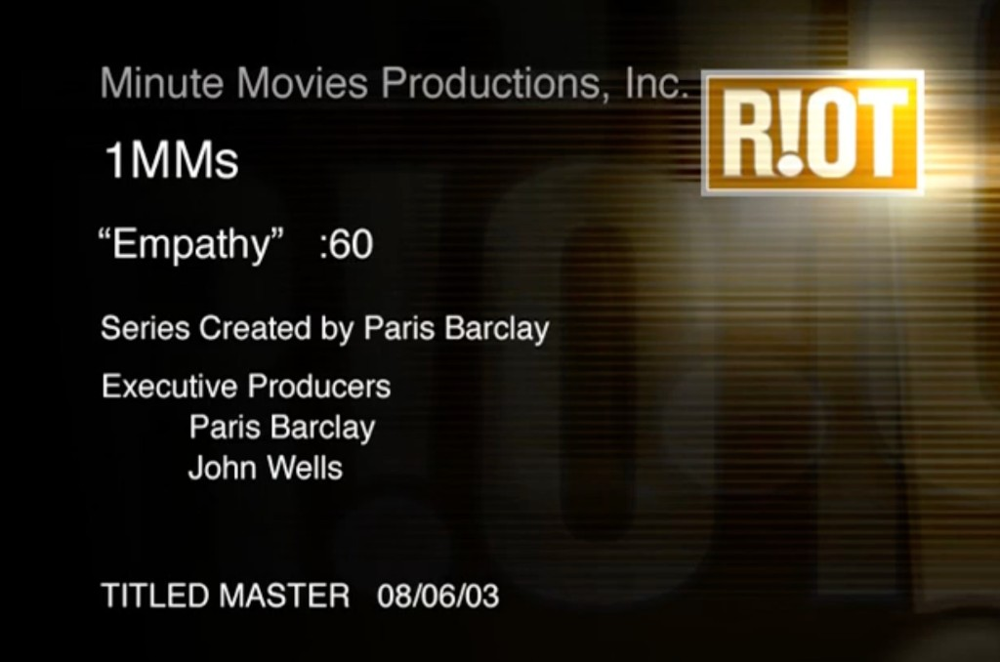

# One Minute Movie — "Empathy"

*Primary source: a real Stupid Fun Club film. The transcript below is the video's complete YouTube
auto-caption track (the whole 1:17 film), lightly punctuated for readability — the auto-captions
carry no speaker labels.*



## Metadata

- **Title:** Empathy (a "1MMs" — One Minute Movie, :60 spot)
- **Premise:** Stupid Fun Club's "Empathy" One Minute Movie about **robot empathy**
- **Robot content — written by:** Will Wright
- **Web + pie-menu teleoperation rig (man behind the curtain):** Don Hopkins
- **Robot studio:** Stupid Fun Club
- **Series:** *One Minute Movies* (1MMs), Minute Movies Productions, Inc.
- **Series created by:** Paris Barclay
- **Executive producers:** Paris Barclay, John Wells
- **Post / VFX:** RIOT
- **Titled master:** Aug 6, 2003 (08/06/03)
- **Video:** https://www.youtube.com/watch?v=KXrbqXPnHvE
- **Channel:** Don Hopkins (YouTube)
- **Posted:** Jan 8, 2016 (film produced 2003)
- **Length:** 1:17
- **Views (as captured):** ~1,738

## Synopsis

A robot has fallen over and pleads for human assistance, insisting it needs "Professor Johnson" and
fumbling a phone number while bystanders try — and largely fail — to help. The joke is the empathy
mismatch: the robot's escalating distress meets confused, half-hearted human concern.

This was a **hidden-camera** piece: a broken-down, "damaged" robot (designed and built by Will
Wright) was planted on a side street in **Oakland, California**. The crew had a street-filming permit
(shown to curious police who stopped by) and hid across the street inside Don's **FMC Motorcoach**,
remote-controlling Slats and filming through its shaded windows — capturing how real passersby
reacted, from apathy to empathy.

## Transcript

```
0:07  Help me — I require Human Assistance. Will you please help me?
0:14  Can you hear me?
0:22  Hello? Excuse me, excuse me — I have fallen over. There has been an accident.
0:30  What's the matter? — I require Human Assistance.
0:41  Can you describe the damage? — No, I can't really describe the damage. I... I need
      Professor Johnson. — You need Professor Johnson? What's the phone number? — 555-12-1 —
0:48  I'm scared. — You scared? We scared of you. — I can't get that, you wait a minute — they
      said your call can't be completed. You sure that's the right number?
1:04  We look him up in the Yellow Pages. — Yes. — Thank you. — You're welcome. — Thank you. —
      You're welcome.
1:12  Come on, so just hang in there, okay.
```

— Source: [YouTube](https://www.youtube.com/watch?v=KXrbqXPnHvE). See the
[One Minute Movies overview](one-minute-movies.md).
