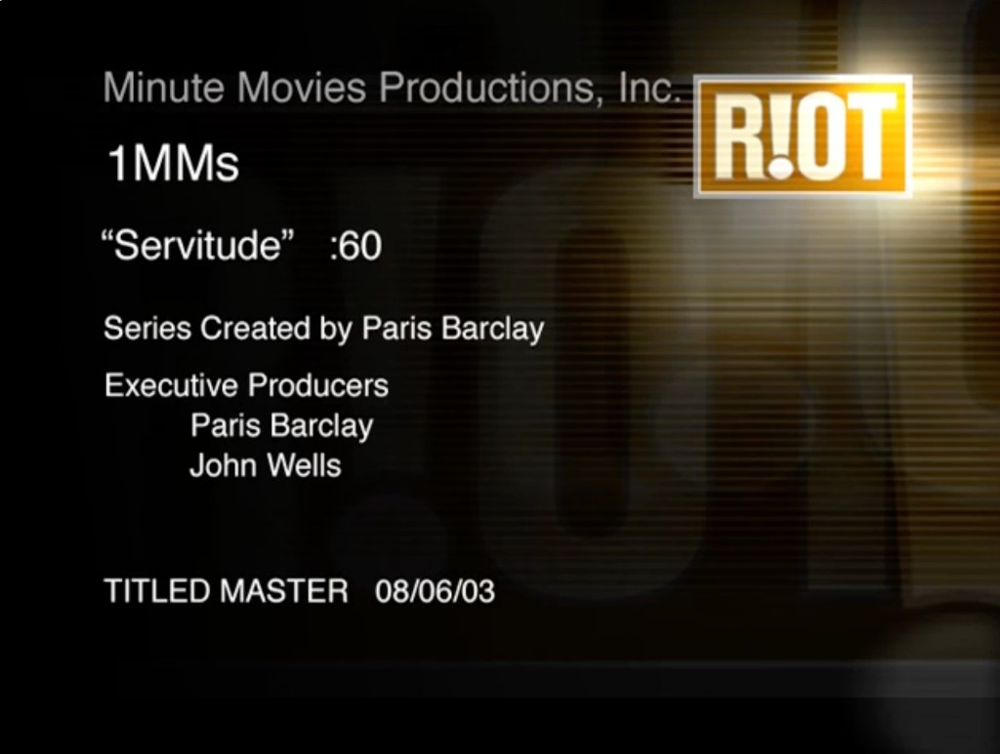

# One Minute Movie — "Servitude"

*Primary source: a real Stupid Fun Club film — and the film where the robot names itself **Slats**.
The transcript below is the video's complete YouTube auto-caption track (the whole 1:16 film),
lightly punctuated for readability — the auto-captions carry no speaker labels.*



## Metadata

- **Title:** Servitude (a "1MMs" — One Minute Movie, :60 spot)
- **Premise:** Stupid Fun Club's "Servitude" One Minute Movie about **robot servitude**
- **Robot content — written by:** Will Wright
- **Robot brain & personality simulation:** Don Hopkins
- **Robot studio:** Stupid Fun Club
- **Series:** *One Minute Movies* (1MMs), Minute Movies Productions, Inc.
- **Series created by:** Paris Barclay
- **Executive producers:** Paris Barclay, John Wells
- **Post / VFX:** RIOT
- **Titled master:** Aug 6, 2003 (08/06/03)
- **Video:** https://www.youtube.com/watch?v=NXsUetUzXlg
- **Channel:** Don Hopkins (YouTube)
- **Posted:** Jan 8, 2016 (film produced 2003)
- **Length:** 1:16
- **Views (as captured):** ~926

## Synopsis

**Slats** works as a waiter taking lunch orders, then fixates on being rated a perfect 10. As the
service goes comically wrong ("there's no soup in the bowl"), Slats negotiates its own evaluation
down from a hopeful 10 — the punchline being a robot far more anxious about its performance score
than about the meal.

This was a **hidden-camera** piece ("Restaurant"): a real, unsuspecting coffee-shop customer was
served by a fully functional 6-foot robot waiter (designed and built by Will Wright), surrounded by
hired extras.

## Transcript

```
0:08  [Music]
0:17  hello, my name is Slats. please tell me your order. — ...a grilled crab sandwich — two eggs
      over easy — I'd like to have the Ultimate Burger — pork sandwich in brown sauce... sauce.
0:25  I understand. I'll be right—
0:35  [Music]
0:45  —back. this is your order. — yes, this is my order. — here is your ketchup. please rate my
      performance on a scale 1 to 10. I am hoping for a 10.
0:52  there's no soup in the bowl. — what do I have to do to get 10? — you're still too close.
0:59  will this affect my evaluation? — I'm afraid so. — four and a half. — three. — okay, I'll
      give you a 10. — yes! yes! yes! — I don't
1:09  think waitresses have anything to worry about.
```

## Why this one is canonical for Slats

This is the film where the robot says **"hello, my name is Slats"** — the source of the name and the
voice: eager, literal, service-obsessed, and desperate for a 10. It's the spine of Slats's repo role
as a call-in sidekick and Drag Race celebrity judge.

— Source: [YouTube](https://www.youtube.com/watch?v=NXsUetUzXlg). See the
[One Minute Movies overview](one-minute-movies.md).
