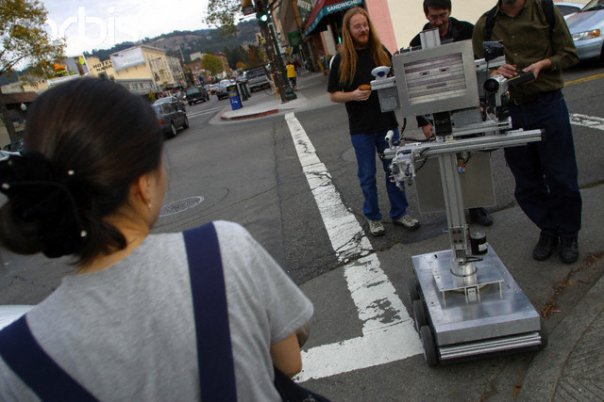

# Slats — The Stupid Fun Club "One Minute Movies"

*Primary-source documentation. Slats is a fictional robot character, but these films are **real**:
short hidden-camera robot sketches performed **"man behind the curtain"** (Wizard of Oz) through a
**web + pie-menu teleoperation rig** Don Hopkins built at Will Wright's **Stupid Fun Club** (Will
Wright wrote the robot pieces). They were produced in **2003** as part of the **One Minute Movies
(1MMs)** series and are posted publicly on Don Hopkins's YouTube channel.*

## What they are

The **One Minute Movies** are sixty-second (`:60`) sketches in which a real robot plays a scene with
unsuspecting people. The comedy comes from the gap between the robot's eager, literal patter and the
messy human situation it's dropped into — a robot earnestly asking for help, or taking a lunch order
and then begging to be rated a 10. The robot isn't autonomous: Will Wright wrote the premises and
characters, and a human **operator performs Slats live** through Don's teleoperation rig (see *How
Slats was driven*, below).

The films' title-card masters credit the series itself: **Minute Movies Productions, Inc.** — *1MMs*,
**Series Created by Paris Barclay**, **Executive Producers Paris Barclay & John Wells**, post/VFX by
**RIOT**, titled master dated **08/06/03** (Aug 6, 2003).

In this repo, **Slats** is our portrayal of that Stupid Fun Club robot brain — and "Servitude" is the
film where the robot literally introduces itself: *"hello, my name is Slats."*

More photos: [`photos.md`](photos.md).

## How Slats was driven (the man behind the curtain)

Slats wasn't an autonomous AI — he was **partially automatic, "man behind the curtain"** (classic
Wizard of Oz). Don built a **web-based, pie-menu-driven teleoperation interface** so an operator
could perform the robot live, in real time:

- **Canned, prefab phrases** triggered instantly from the web page and **pie menus** — the reliable
  comic beats, on tap.
- **The whole restaurant menu** memorized and recitable on cue — including literal **Pie Menus** of
  edible pies you can order (yes: pie menus *of pies* — yummy 🥧).
- **A live text field** to **improvise and type in real time**, spoken aloud by the robot, for
  whatever the unsuspecting humans threw at him.

That hybrid — fast canned reactions on radial menus *plus* real-time improv typing — is exactly the
playground the **RoboResurrection** wants to rebuild and play with again
([`slats-reincarnation`](../../repo-shows/will-wright/slats-reincarnation.yml)).

## The films

| Film | About | Transcript |
|------|-------|-----------|
| **Empathy** | Robot empathy — a fallen robot pleading for human assistance | [`one-minute-movie-empathy.md`](one-minute-movie-empathy.md) |
| **Servitude** | Robot servitude — Slats the waiter, desperate for a perfect rating | [`one-minute-movie-servitude.md`](one-minute-movie-servitude.md) |

## Credits (both films)

**Robot content (Stupid Fun Club):**
- **Concept / writing:** Will Wright
- **Robots designed & built by:** Will Wright
- **Web + pie-menu teleoperation rig (the "man behind the curtain"):** Don Hopkins
- **Robot segments directed by:** James Moll
- **Studio:** Stupid Fun Club

**One Minute Movies series (per the title-card masters):**
- **Production:** Minute Movies Productions, Inc. — *One Minute Movies* (1MMs), `:60` spots
- **Series created by:** Paris Barclay
- **Executive producers:** Paris Barclay, John Wells
- **Post / VFX:** RIOT
- **Titled master:** Aug 6, 2003 (08/06/03)
- **Posted to YouTube by:** Don Hopkins, Jan 8, 2016

## How they were made (hidden-camera reality)

These were **hidden-camera** pieces with **real, unsuspecting people**, not actors — a real-time
tele-robotic "wizard-of-Oz" performance. **Servitude** ("Restaurant") put a fully functional 6-foot
robot waiter into a **BBQ-and-pies family restaurant in Oakland** (a food-oriented spot — hence the
pies on the menu), surrounded by hired extras, to serve an unknowing customer.
**Empathy** planted a broken-down, "damaged" robot by a dumpster on a side street in **Berkeley,
California**; as people passed, it pleaded "Help me," and hidden cameras caught reactions from apathy
to empathy. (Don has noted, deadpan, that the robot's injuries and Professor Johnson's phone number
were fake, and the robot waiter was fired.) Beyond NBC's goal of keeping viewers through ad breaks,
Will's real interest was probing how people interact with, empathize with, and can be convinced to
play along with robots.

## What happened to them

NBC's *One Minute Movies* mostly **never aired**: after running only one of the films (**"The
Pussycat Dolls"**), NBC stopped airing the rest — and the robot pieces in particular ran into
**NBC/SAG contractual problems**. So *Empathy* and *Servitude* sat until Don posted them to YouTube
in 2016. (After his short waiter career, Slats went on to other Stupid Fun Club adventures around
Berkeley.)

## Why they matter here

These are the source texts for Slats's voice: loud, eager, literal, over-committed to the bit, and
desperate for a good score — exactly the energy Slats brings as a call-in sidekick and Drag Race
celebrity judge. When in doubt about how Slats talks, read the transcripts.

*The transcripts in this folder are the raw YouTube auto-captions (lightly punctuated). They are
flagged for a future human review-and-polish pass to add speaker labels and fix caption errors.*

## Sources

- Empathy: <https://www.youtube.com/watch?v=KXrbqXPnHvE> · Servitude: <https://www.youtube.com/watch?v=NXsUetUzXlg>
- NBC "One-Minute Movies" (1MMs) press, 2003 — John Wells Productions + Paris Barclay; e.g. *The New York Times* / Adweek / Variety coverage.
- Allentown Productions project page (archived): <https://web.archive.org/web/20141028194536/http://www.allentownproductions.com/project.php?p=nbc> — credits the robots to Will Wright and the segments to James Moll.

See also: [`CHARACTER.yml`](CHARACTER.yml) · [`judge-rubric.yml`](judge-rubric.yml) ·
[Stupid Fun Club origin](../don-hopkins/career/stupid-fun-club.yml)
