# Slats — photos

*Primary-source photos of the real **Stupid Fun Club** robot whom Don Hopkins teleoperated and whom
we portray as the fictional **Slats**. The robot played hidden-camera scenes with real people in the
Bay Area — the One Minute Movie shoots were in **Oakland**; other street outings were around
**Berkeley** (see the [One Minute Movies](one-minute-movies.md)).*

## The robot

The face is the namesake: a stack of horizontal metal **slats** with cut-out eyes and mouth.

Slats at the **Stupid Fun Club** workshop in **Emeryville**, wearing the cast SFC globe emblem.

## On the street (Berkeley — Au Coquelet)

The street shoots centered on **Au Coquelet Cafe Restaurant**, 2000 University Ave, Berkeley — one of
Don's favorite, most-frequent hangouts (now closed). [Yelp](https://www.yelp.com/biz/au-coquelet-cafe-restaurant-berkeley)

Don with a coffee and muffin in front of **Au Coquelet**, Slats at his side, at dusk.

Across the street from Au Coquelet — the crew running Slats on a Berkeley street outing.

## The FMC Motorcoach (mobile control room)

Don's **FMC Motorcoach** — the classic 1970s motorhome that doubled as Slats's **mobile control
room**. For the *Empathy* shoot in Oakland, the crew hid inside, remote-controlled Slats, and filmed
through the shaded windows. *(These photos were taken in Berkeley, not at the Oakland shoot.)*

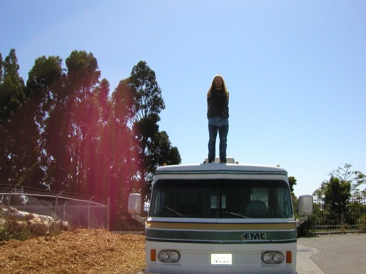

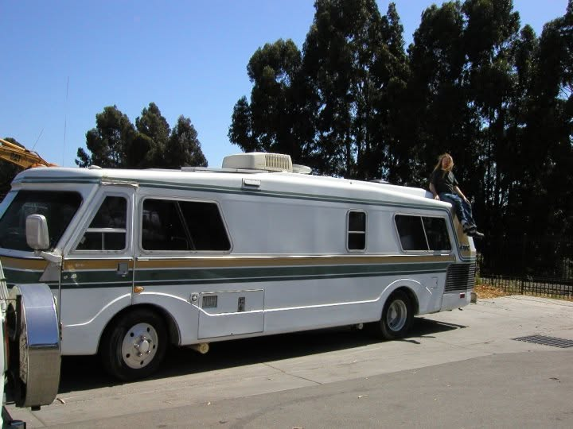

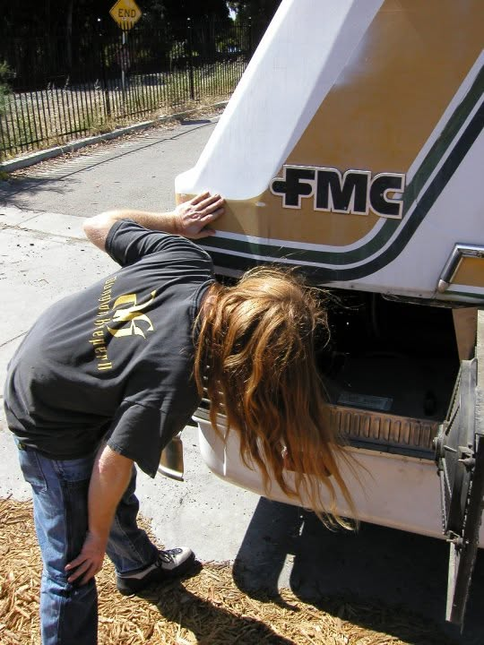

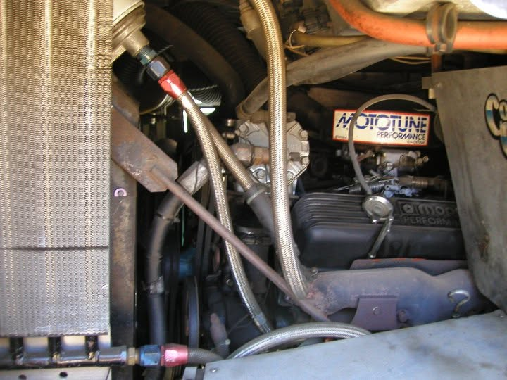

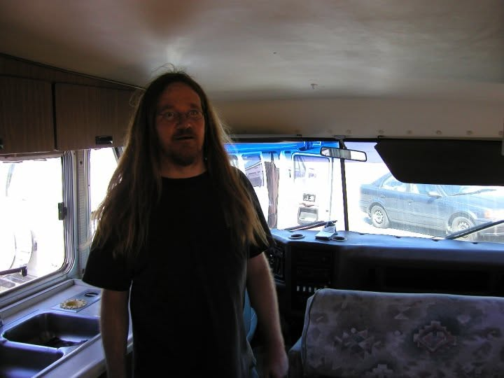

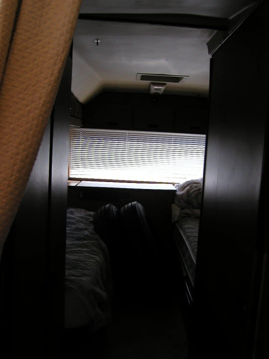

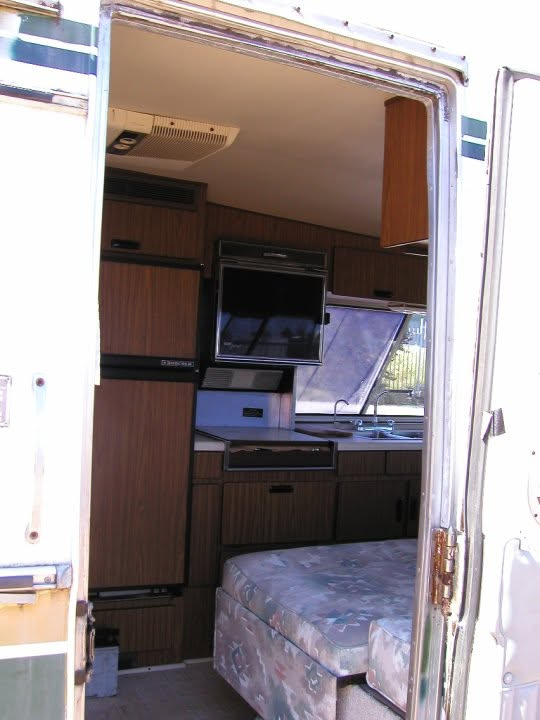

## The Oakland shoot (One Minute Movies)

The actual hidden-camera shoots happened in **Oakland**, with the FMC Motorcoach as the **mobile
control room** parked across the street.

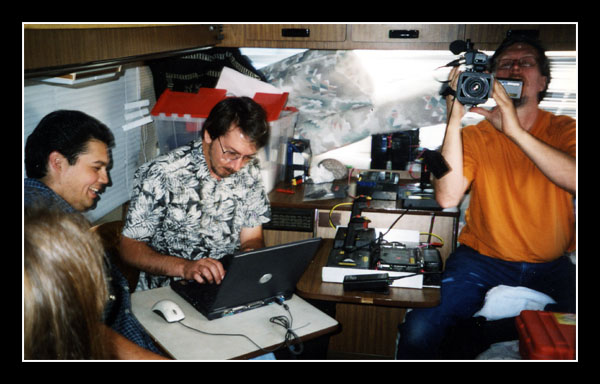

Will Wright running the rig — the "man behind the curtain" — from the back of the FMC Motorcoach
during the Oakland shoot.

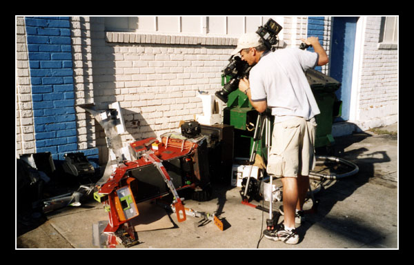

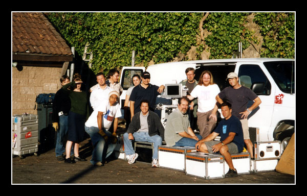

The production crew on the Oakland shoot.

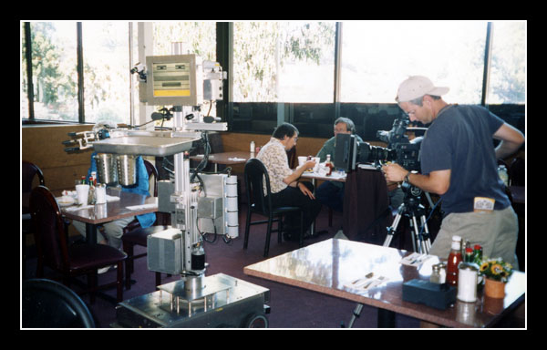

Setting up Slats the robot waiter inside the **BBQ-and-pies family restaurant in Oakland** for
*Servitude* ("Restaurant").

## Setting up at the Stupid Fun Club (Emeryville)

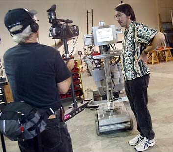

Will Wright and Slats setting up for the *Servitude* robot-waiter shoot at the **Stupid Fun Club**
(Emeryville).

## Stupid Fun Club emblem

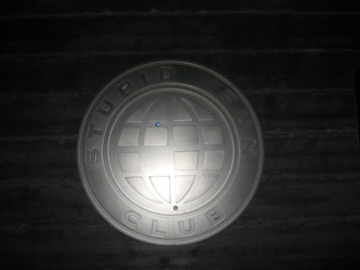

The cast **Stupid Fun Club** globe emblem on the wall at the SFC in **Emeryville** (photo by Don
Hopkins).

The Stupid Fun Club globe seal (renders).

---

See also: [One Minute Movies](one-minute-movies.md) · [`CHARACTER.yml`](CHARACTER.yml) · [`README.md`](README.md)
