# Will Wright — media

*Primary-source images from Will Wright / Maxis history, kept with his portrayal. Captions are
factual; tell me any corrections.*

## SimCity → Nintendo

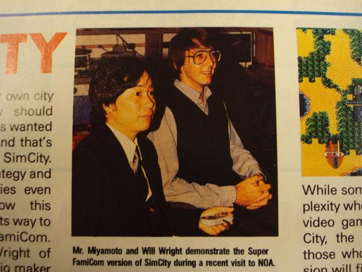

**Will Wright and Shigeru Miyamoto** demonstrating the Super Famicom / SNES version of **SimCity** at
Nintendo.

## The Sims — before it was "The Sims"

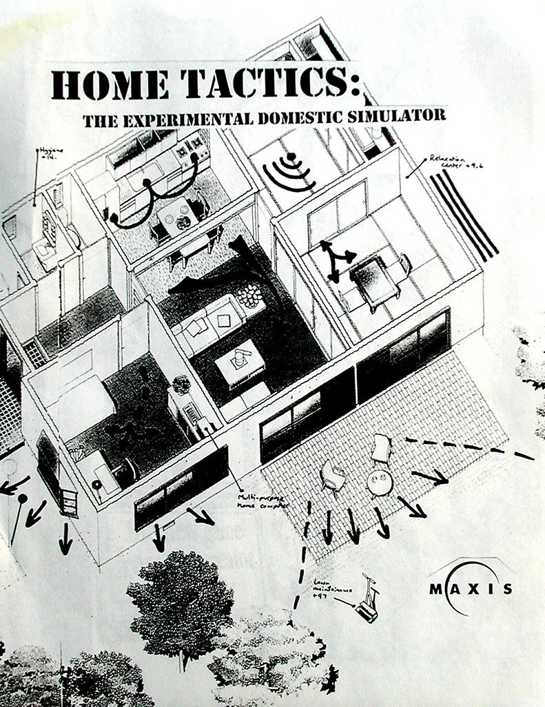

A box-cover mockup from when The Sims was still **"Home Tactics: The Experimental Domestic
Simulator"** (TDS) — one of its working names before launch.

## The Sims — promo

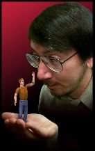

Promo photos: Will Wright with a tiny Sim — holding, picking up, and (of course) pretending to eat
it.

## The Sims — development art & tools

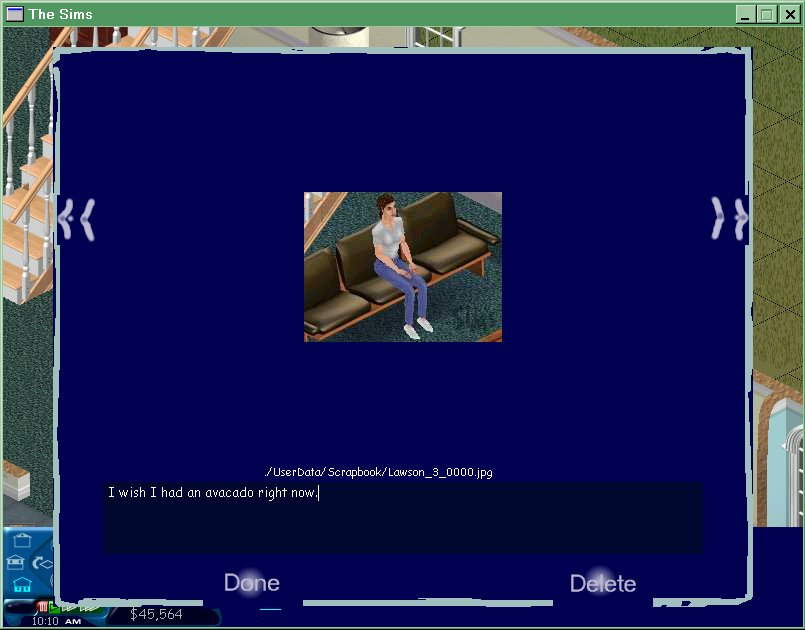

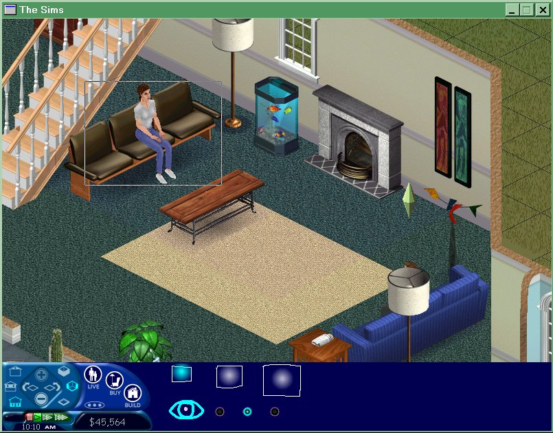

Programmer-art / scrapbook screenshots from development.

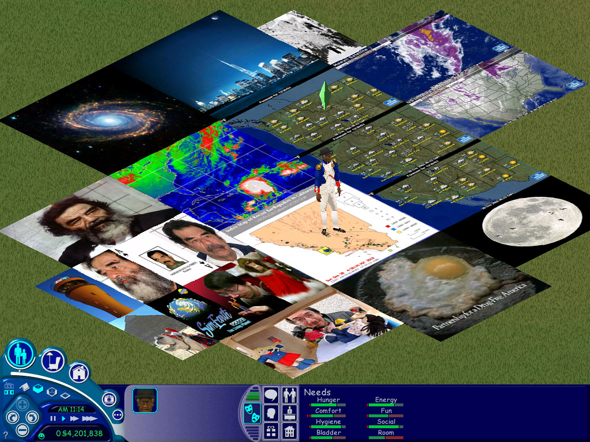

**Rug-O-Matic** samples — Sims floor rugs generated from arbitrary images (a Sims content tool).

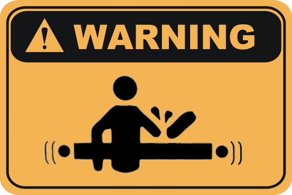

Will's gag **warning sticker**.

## BattleBots (Los Angeles)

Don's photos from a **BattleBots** fight in Los Angeles — **Will Wright's** robot and competitors'
machines. (Will competed in BattleBots, famously with his daughter Cassidy and their "Super Chiabot.")

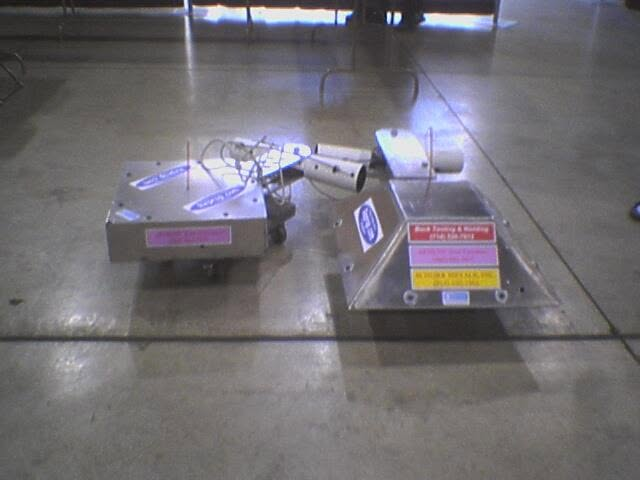

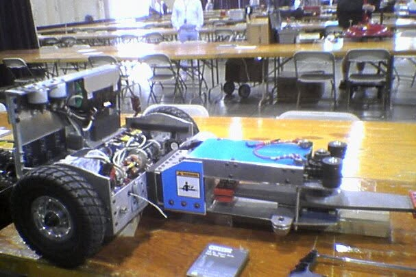

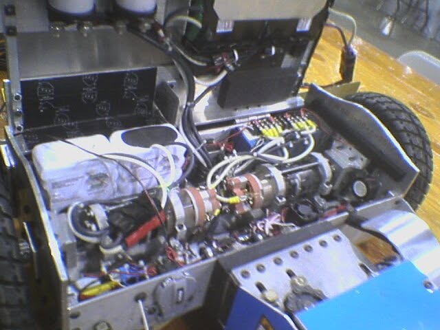

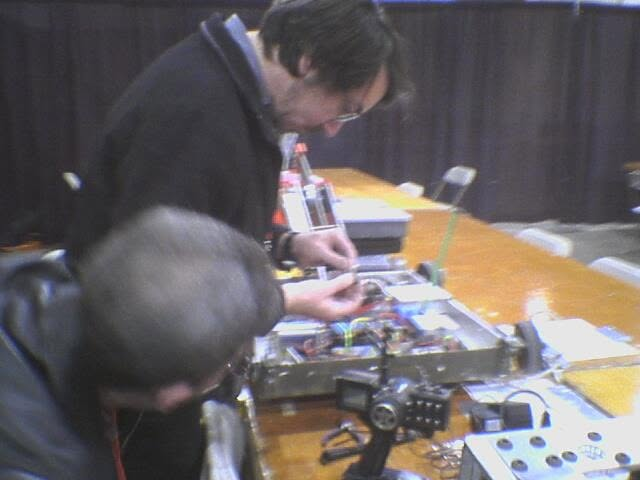

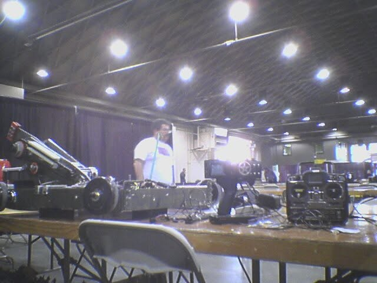

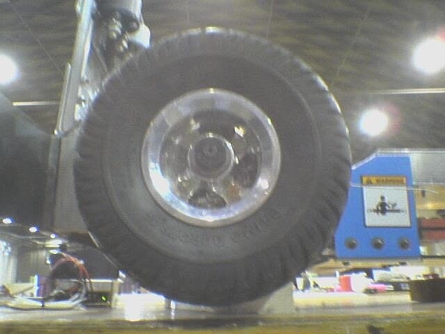

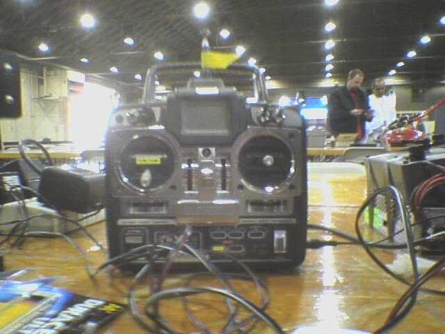

---

See also: [`../README.md`](../README.md) · [`../CHARACTER.yml`](../CHARACTER.yml)
