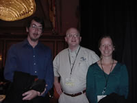
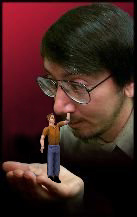
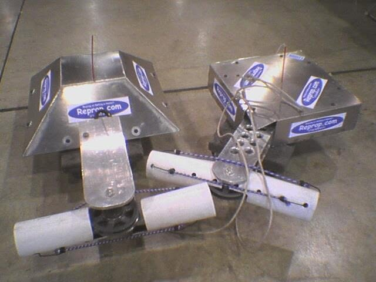

# Will Wright — media

*Sniff:* [`GLANCE.yml`](GLANCE.yml) · [`CARD.yml`](CARD.yml) · *Guest hub:* [`../README.md`](../README.md)

## Navigation

*(Skeleton: [`GLANCE.yml`](GLANCE.yml))*

| Room | → | Why |
|------|---|-----|
| **Up** | [will-wright](../README.md) | Guest portrayal |
| **Sources** | [sources](../sources/README.md) | Primary articles + 1996 gallery |
| **Show** | [flagship show](../../repo-shows/will-wright/README.md) | Flower Child mascot lives here |
| **Catalogs** | [catalogs](../../catalogs/README.md) | Syndicated UCC brands |
| **Sims series** | [sims-series-README.md](sims-series-README.md) | Themed screenshot index |
| **Sub-galleries** | [russian-space-junk.md](russian-space-junk.md) · [artwork.md](artwork.md) | Long-scroll galleries |

| Start here | What |
|------------|------|
| **This page** | SimCity / Sims / robots — scroll below |
| [**Russian Space Junk**](russian-space-junk.md) | Soviet spaceflight hardware (17 photos) |
| [**Artwork**](artwork.md) | Mixed-media relief constructions (10 photos) |
| [1996 Winograd gallery](../sources/1996-04-26-winograd-interfacing-to-microworlds/#image-gallery) | 167 figures from Don's Medium article |
| [Sims series gallery](sims-series-README.md) | Screenshot themes + agitprop (flat filenames) |

---

## SimCity → Nintendo

**Will Wright and Shigeru Miyamoto** demonstrating the Super Famicom / SNES version of **SimCity** at
Nintendo. [`will-wright-and-miyamoto-simcity-snes.png`](will-wright-and-miyamoto-simcity-snes.png)

## Events

Conference photo with colleagues. [`will-wright-conference-photo.png`](will-wright-conference-photo.png)

## The Sims — before it was "The Sims"

**Home Tactics: The Experimental Domestic Simulator** — working name before launch.
[`home-tactics-box-cover-mockup.png`](home-tactics-box-cover-mockup.png)

## The Sims — promo (a sequence)

Original EA promo: Will holding a tiny Sim in his palm. [`will-wright-holding-sim.png`](will-wright-holding-sim.png)

Don Hopkins **photoshop** — the Sim picking Will's nose. [`sim-picking-wills-nose.png`](sim-picking-wills-nose.png)

Payoff photoshop — Will eating the Sim. [`will-wright-eating-sim.png`](will-wright-eating-sim.png)

## The Sims — development art & tools

Programmer-art / scrapbook screenshots. [`sims-programmer-art-1.png`](sims-programmer-art-1.png) ·
[`sims-programmer-art-2.png`](sims-programmer-art-2.png)

**Rug-O-Matic** — floor rugs from arbitrary images. [`rug-o-matic-samples.png`](rug-o-matic-samples.png)

Gag **warning sticker**. [`sims-warning-sticker.png`](sims-warning-sticker.png)

## Robot-combat meetup (Los Angeles)

Don's photos from an informal **robot-combat meetup in Los Angeles** with **Will Wright** and
family (not BattleBots™ TV).

| Photo | File |
|-------|------|
| Wedge robots | [`robot-fight-la-1.png`](robot-fight-la-1.png) · [`robot-fight-la-2.png`](robot-fight-la-2.png) |
| Chassis / internals | [`robot-fight-la-3-chassis.png`](robot-fight-la-3-chassis.png) · [`robot-fight-la-4-internals.png`](robot-fight-la-4-internals.png) |
| Pit / arena | [`robot-fight-la-5-pit.png`](robot-fight-la-5-pit.png) · [`robot-fight-la-6-arena.png`](robot-fight-la-6-arena.png) |
| Wheel / transmitter | [`robot-fight-la-7-wheel.png`](robot-fight-la-7-wheel.png) · [`robot-fight-la-8-controller.png`](robot-fight-la-8-controller.png) |

---

## Sub-galleries (markdown + co-located PNGs)

Longer scrolls with many figures — files sit alongside this README:

| Gallery | Photos | Index |
|---------|--------|-------|
| [**Russian Space Junk**](russian-space-junk.md) | Globus IMP, Cyrillic panels, hatch, ejection seat | 17 × `russian-*.png` |
| [**Artwork**](artwork.md) | Evolution/systems relief, cell division, terrain maps | 10 × `will-artwork-*.png` |

---

## All files in this directory

| Theme | Files |
|-------|-------|
| SimCity / Nintendo | `will-wright-and-miyamoto-simcity-snes.png` |
| Events | `will-wright-conference-photo.png` |
| Pre-Sims naming | `home-tactics-box-cover-mockup.png` |
| Promo sequence | `will-wright-holding-sim.png` · `sim-picking-wills-nose.png` · `will-wright-eating-sim.png` |
| Dev art / tools | `sims-programmer-art-1.png` · `sims-programmer-art-2.png` · `rug-o-matic-samples.png` · `sims-warning-sticker.png` |
| Robot meetup | `robot-fight-la-1.png` … `robot-fight-la-8-controller.png` |
| Space junk | → [`russian-space-junk.md`](russian-space-junk.md) |
| Physical art | → [`artwork.md`](artwork.md) |

---

See also: [`../CHARACTER.yml`](../CHARACTER.yml) · [`../../repo-shows/will-wright/README.md`](../../repo-shows/will-wright/README.md)

---

*Raw directory:* [browse files in this folder](./)
