# Will Wright — media

*Sniff:* [`GLANCE.yml`](GLANCE.yml) · [`CARD.yml`](../CARD.yml) · *Guest hub:* [README](../README.md)

## Navigation

*(Skeleton: [`GLANCE.yml`](GLANCE.yml))*

| Room | → | Why |
|------|---|-----|
| **Up** | [will-wright](../README.md) | Guest portrayal |
| **Sources** | [sources](../sources/README.md) | Primary articles + 1996 gallery |
| **Show** | [flagship show](../../../repo-shows/will-wright-premiere/README.md) | Flower Child mascot lives here |
| **Catalogs** | [catalogs](../../../catalogs/README.md) | Syndicated UCC brands |
| **Sims series** | [sims-series-README.md](sims-series-README.md) | Themed screenshot index |
| **Sub-galleries** | [russian-space-junk.md](russian-space-junk.md) · [artwork.md](artwork.md) | Long-scroll galleries |

| Start here | What |
|------------|------|
| **This page** | SimCity / Sims / robots — scroll below |
| [**Russian Space Junk**](russian-space-junk.md) | Soviet spaceflight hardware (17 photos) |
| [**Artwork**](artwork.md) | Mixed-media relief constructions (10 photos) |
| [1996 Winograd gallery](../sources/1996-04-26-winograd-interfacing-to-microworlds/#image-gallery) | 167 figures from Don's Medium article |
| [Sims series gallery](sims-series-README.md) | Screenshot themes + agitprop (flat filenames) |

---

## SimCity → Nintendo

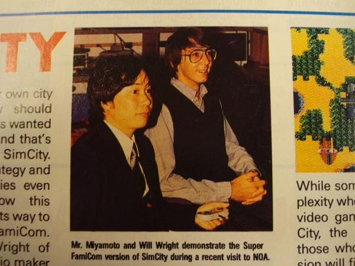

**Will Wright and Shigeru Miyamoto** demonstrating the Super Famicom / SNES version of **SimCity** at
Nintendo. [`will-wright-and-miyamoto-simcity-snes.png`](will-wright-and-miyamoto-simcity-snes.png)

## SimCity — original Macintosh box (1989)

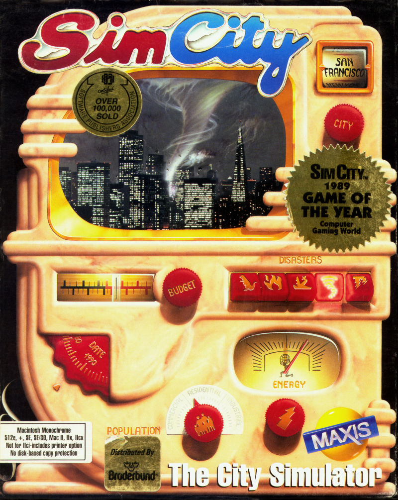

**SimCity** Macintosh retail box — control-panel aesthetic: disaster buttons, budget/zoning dials, SF
skyline with tornado on the “monitor.” **1989 GAME OF THE YEAR** (CGW) · **100,000+ sold** (SPA).
Featured in [Jimmy Maher's Maxis Part 1](../sources/2026-07-03-digital-antiquarian-maxis-part1/README.md)
([filfre.net](https://www.filfre.net/2026/07/the-life-and-times-of-maxis-part-1-simeverything/)).
[`simcity-macintosh-front-cover.jpg`](simcity-macintosh-front-cover.jpg) ·
[`simcity-macintosh-front-cover.yml`](simcity-macintosh-front-cover.yml)

## Events

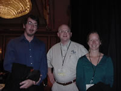

Conference photo with colleagues. [`will-wright-conference-photo.png`](will-wright-conference-photo.png)

## Stupid Fun Club — Ant Farm Revolution (Fry's)

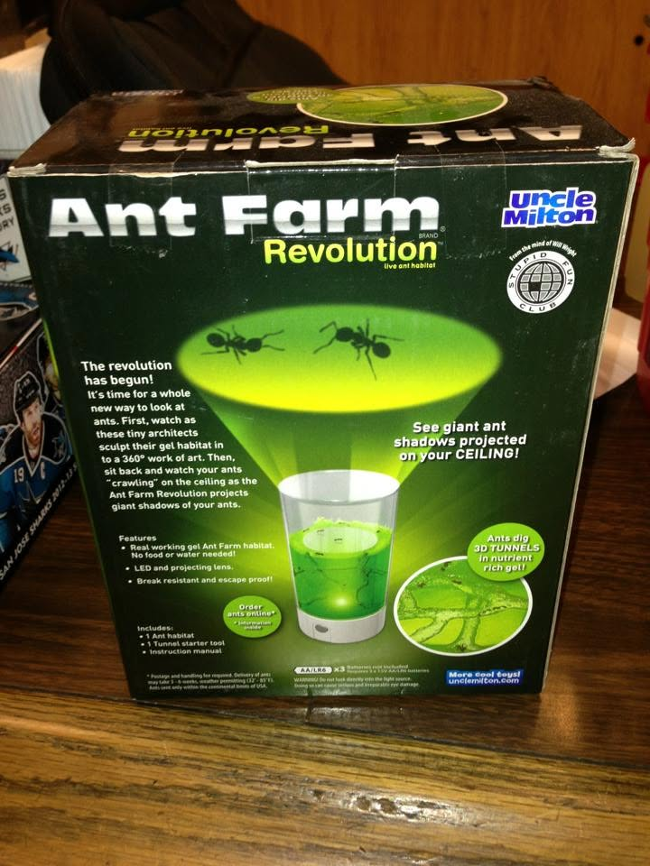

**Ant Farm Revolution** — Will Wright designed with **Uncle Milton**: gel ant habitat with **ceiling
projector** (giant ant shadows on your ceiling). Stupid Fun Club badge on box. Don found it at
**Fry's** — cowboy-themed Silicon Valley retail archaeology, all now gone.
[`ant-farm-revolution-frys-box.png`](ant-farm-revolution-frys-box.png) · [`ant-farm-revolution-frys.yml`](ant-farm-revolution-frys.yml) ·
[Fry's gallery](../../don-hopkins/media/frys-electronics/INDEX.yml)

## Micropolis — open-source SimCity lineage

Don's screenshot gallery: **HyperLook on Sun** · **OLPC XO** · **HAR** constructionist demo ·
**PacBot** Python plug-in · Dutch **taartmenu** · Facebook app.

[INDEX](../../don-hopkins/media/micropolis-gallery/INDEX.yml)

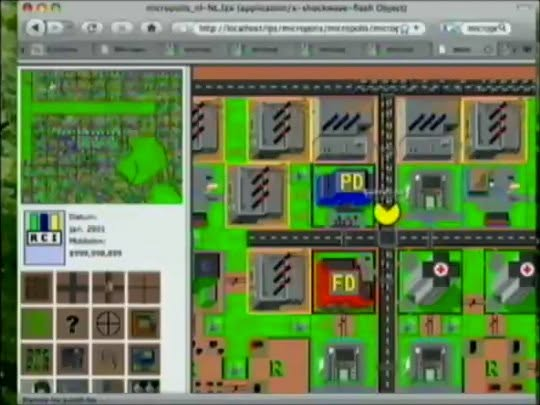

## Transmogrifier — Mona Lisa pushpins (UV test)

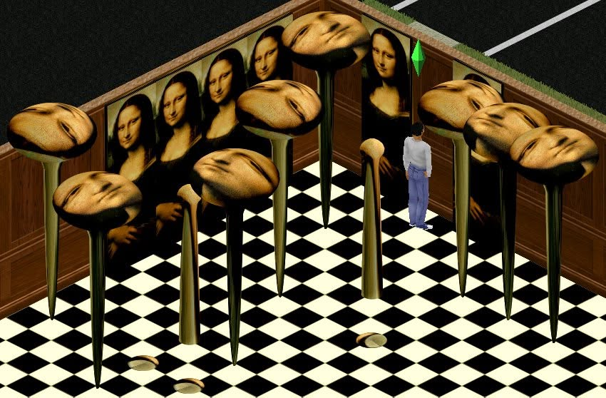

Giant pushpins with **Mona Lisa** texture-mapped heads — pipeline test for **Transmogrifier**
and **3D Studio Max** UV layer export back onto Sims object surfaces.
[`transmogrifier-mona-lisa-pushpins.yml`](transmogrifier-mona-lisa-pushpins.yml) ·
[`sims-series-transmogrifier-story.md`](sims-series-transmogrifier-story.md)

## The Sims — before it was "The Sims"

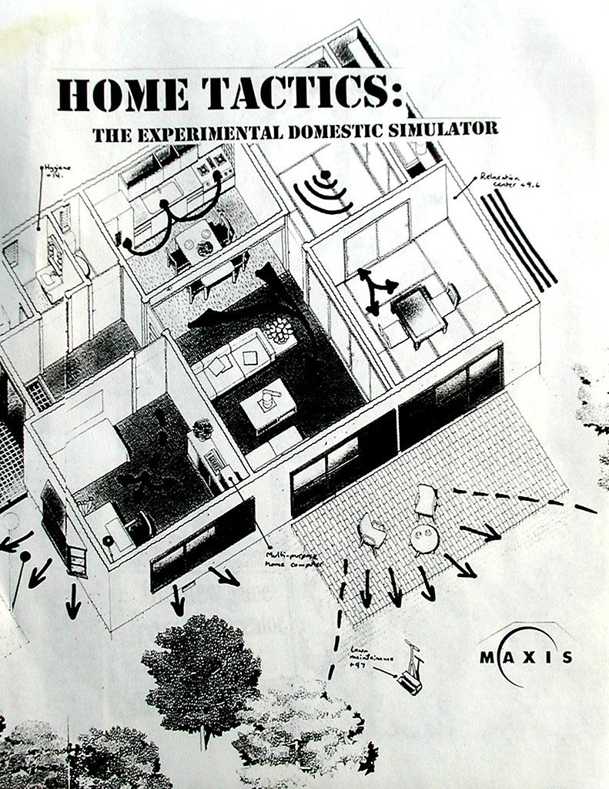

**Home Tactics: The Experimental Domestic Simulator** — working name before launch.
[`home-tactics-box-cover-mockup.png`](home-tactics-box-cover-mockup.png)

## The Sims — promo (a sequence)

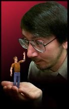

Original EA promo: Will holding a tiny Sim in his palm. [`will-wright-holding-sim.png`](will-wright-holding-sim.png)

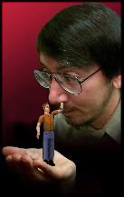

Don Hopkins **photoshop** — the Sim picking Will's nose. [`sim-picking-wills-nose.png`](sim-picking-wills-nose.png)

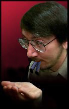

Payoff photoshop — Will eating the Sim. [`will-wright-eating-sim.png`](will-wright-eating-sim.png)

## The Sims — satire (The Onion)

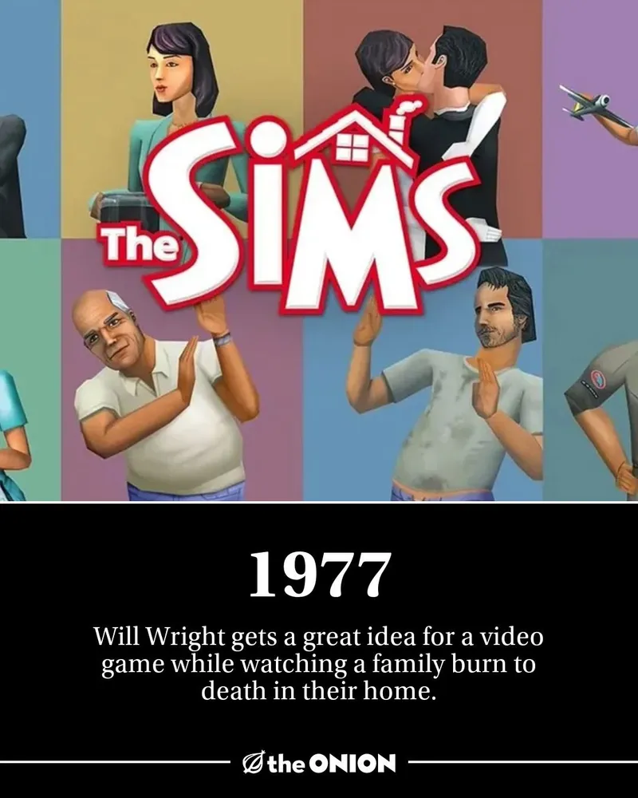

**The Onion** fake historical photo — dark gag on the *real* 1991 Oakland fire → dollhouse/Sims
origin story. Archive only.
[`the-onion-will-wright-sims-origin-meme-1977.png`](the-onion-will-wright-sims-origin-meme-1977.png) · [`the-onion-will-wright-sims-origin-meme-1977.yml`](the-onion-will-wright-sims-origin-meme-1977.yml)

## The Sims — development art & tools

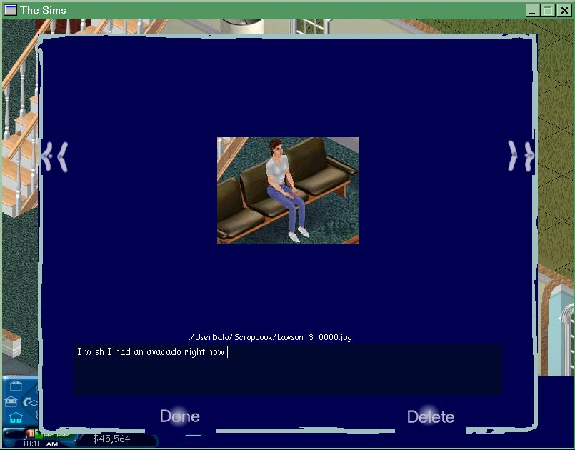

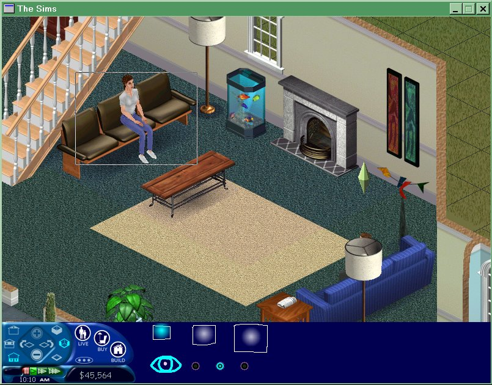

Programmer-art / family album screenshots. [`sims-programmer-art-1.png`](sims-programmer-art-1.png) ·
[`sims-programmer-art-2.png`](sims-programmer-art-2.png)

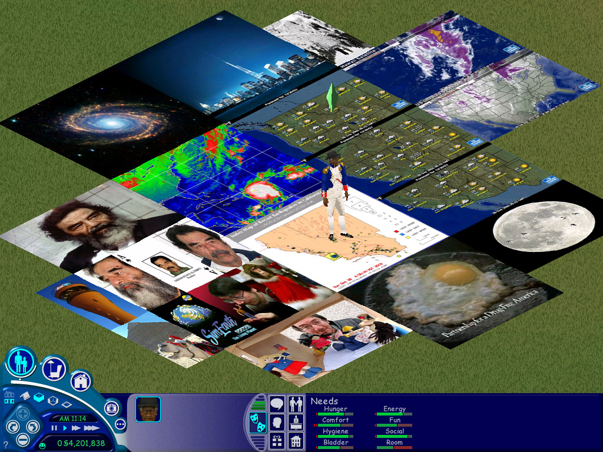

**Rug-O-Matic** — floor rugs from arbitrary images. [`rug-o-matic-samples.png`](rug-o-matic-samples.png)

Gag **warning sticker**. [`sims-warning-sticker.png`](sims-warning-sticker.png)

## Simlish origins — audio

**Stephen Kearin & Gerri Lawlor** improvising English narration over an early Sims build (~2:31).
Foreign Poet session that foreshadowed Simlish. Source bundle:
[steve and gerri simlish adlib](../sources/steve-and-gerri-simlish-adlib/README.md) ·
[`TRANSCRIPT-DRAFT.md`](../sources/steve-and-gerri-simlish-adlib/TRANSCRIPT-DRAFT.md) (proofread pending)

| File | Notes |
|------|-------|
| [`steve-and-gerri-simlish-adlib.wav`](steve-and-gerri-simlish-adlib.wav) | From [Don Hopkins catalog](https://donhopkins.com/home/catalog/sounds/Steve_And_Gerri.wav); mono 22050 Hz |

## Robot-combat meetup (Los Angeles)

Don's photos from an informal **robot-combat meetup in Los Angeles** with **Will Wright** and
family (not BattleBots™ TV).

| Photo | File |
|-------|------|
| Wedge robots | [`robot-fight-la-1.png`](robot-fight-la-1.png) · [`robot-fight-la-2.png`](robot-fight-la-2.png) |
| Chassis / internals | [`robot-fight-la-3-chassis.png`](robot-fight-la-3-chassis.png) · [`robot-fight-la-4-internals.png`](robot-fight-la-4-internals.png) |
| Pit / arena | [`robot-fight-la-5-pit.png`](robot-fight-la-5-pit.png) · [`robot-fight-la-6-arena.png`](robot-fight-la-6-arena.png) |
| Wheel / transmitter | [`robot-fight-la-7-wheel.png`](robot-fight-la-7-wheel.png) · [`robot-fight-la-8-controller.png`](robot-fight-la-8-controller.png) |

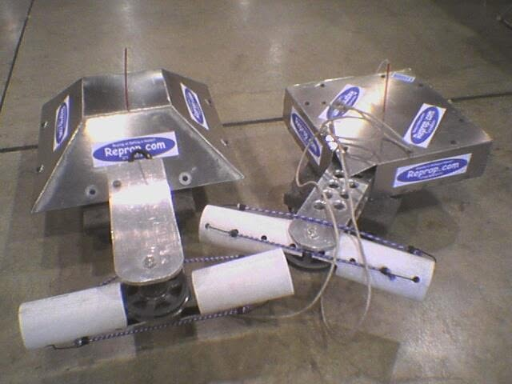

---

## Computer History Museum

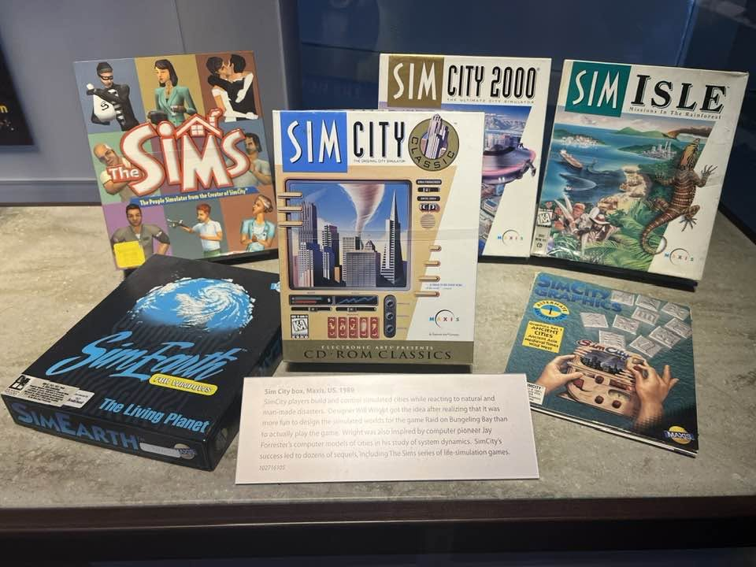

**The Sims** and other **Maxis** games in the **Computer History Museum** display case — SimCity
(1989) placard credits Will Wright, Jay Forrester, and the road to *The Sims*. Don: *We made it!*
[`computer-history-museum-maxis-display.png`](computer-history-museum-maxis-display.png) · [`computer-history-museum-maxis-display.yml`](computer-history-museum-maxis-display.yml)

---

## Maxis Emeryville — Suite 6 door

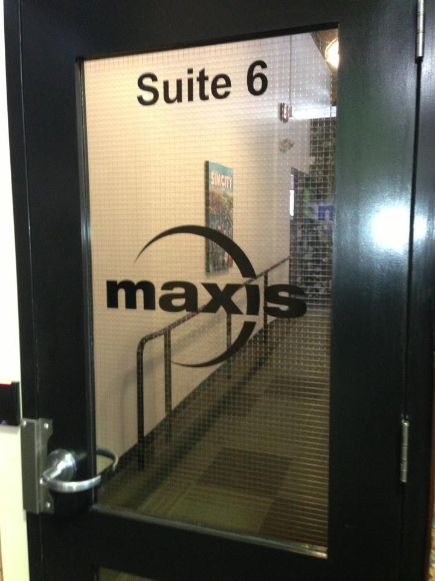

Don's visit to **Ocean Quigley** and others at the **Maxis** office in **Emeryville** — Suite 6,
Maxis logo on the glass, **SimCity** poster inside. *SIX AM spelled backwards!*
[maxis suite 6 door](../../don-hopkins/media/maxis-emeryville/maxis-suite-6-door.yml)

---

## Snapshots from Will

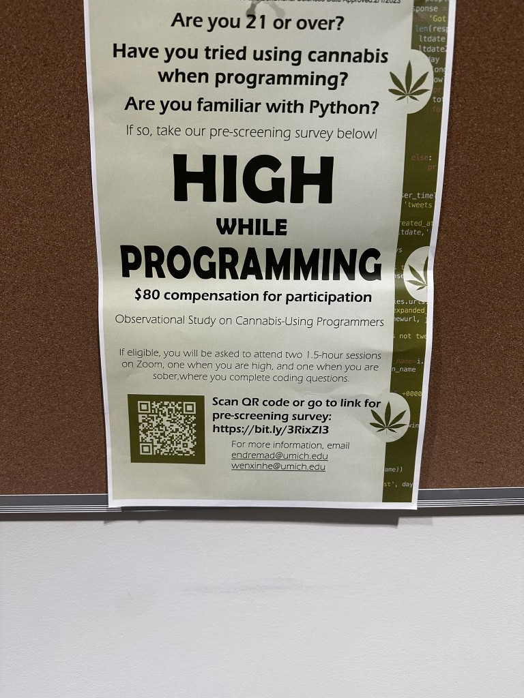

**HIGH WHILE PROGRAMMING** — University of Michigan observational study flyer (Python + cannabis,
$80 compensation). **Will Wright** snapped it on a corkboard and sent it to Don.
[`high-while-programming-flyer.png`](high-while-programming-flyer.png) · [`high-while-programming-flyer.yml`](high-while-programming-flyer.yml)

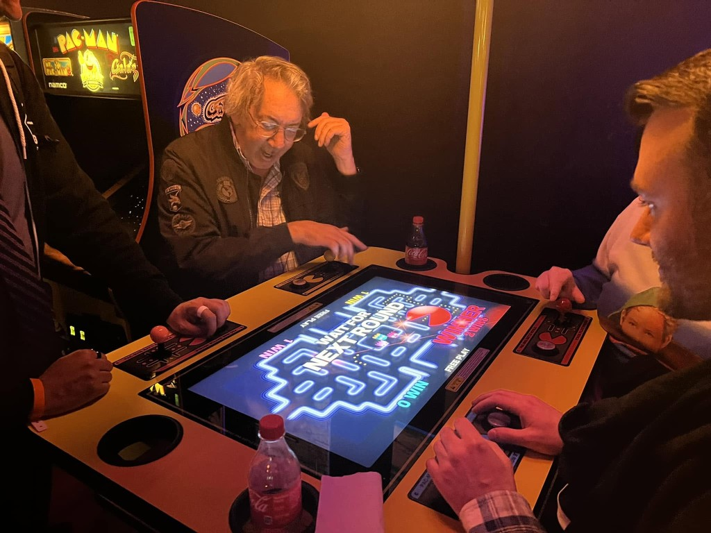

**Gallium party, GDC** — **Pac-Man Battle Royale** cocktail cabinet at an Alameda arcade.
Don playing with **Will Wright** (Gallium Studios party).
[`gallium-gdc-alameda-pacman-will-wright.png`](gallium-gdc-alameda-pacman-will-wright.png) · [`gallium-gdc-alameda-pacman-will-wright.yml`](gallium-gdc-alameda-pacman-will-wright.yml)

---

## Sub-galleries (markdown + co-located PNGs)

Longer scrolls with many figures — files sit alongside this README:

| Gallery | Photos | Index |
|---------|--------|-------|
| [**Russian Space Junk**](russian-space-junk.md) | Globus IMP, Cyrillic panels, hatch, space monkey seat | 17 × `russian-*.png` |
| [**Artwork**](artwork.md) | Evolution/systems relief, cell division, terrain maps | 10 × `will-artwork-*.png` |

---

## All files in this directory

| Theme | Files |
|-------|-------|
| SimCity / Nintendo | `will-wright-and-miyamoto-simcity-snes.png` |
| Computer History Museum | `computer-history-museum-maxis-display.png` · [`computer-history-museum-maxis-display.yml`](computer-history-museum-maxis-display.yml) |
| Events | `will-wright-conference-photo.png` |
| Pre-Sims naming | `home-tactics-box-cover-mockup.png` |
| Promo sequence | `will-wright-holding-sim.png` · `sim-picking-wills-nose.png` · `will-wright-eating-sim.png` |
| Dev art / tools | `sims-programmer-art-1.png` · `sims-programmer-art-2.png` · `rug-o-matic-samples.png` · `sims-warning-sticker.png` |
| Simlish origins audio | `steve-and-gerri-simlish-adlib.wav` → [source bundle](../sources/steve-and-gerri-simlish-adlib/README.md) |
| Robot meetup | `robot-fight-la-1.png` … `robot-fight-la-8-controller.png` |
| Snapshots from Will | `high-while-programming-flyer.png` · [`high-while-programming-flyer.yml`](high-while-programming-flyer.yml) |
| Gallium / GDC | `gallium-gdc-alameda-pacman-will-wright.png` · [`gallium-gdc-alameda-pacman-will-wright.yml`](gallium-gdc-alameda-pacman-will-wright.yml) |
| Space junk | → [`russian-space-junk.md`](russian-space-junk.md) — **Oakland**; 16 photos now on disk |
| Physical art | → [`artwork.md`](artwork.md) |

---

See also: [CHARACTER](../CHARACTER.yml) · [will wright premiere](../../../repo-shows/will-wright-premiere/README.md)

---

*Raw directory:* [browse files in this folder](./)
