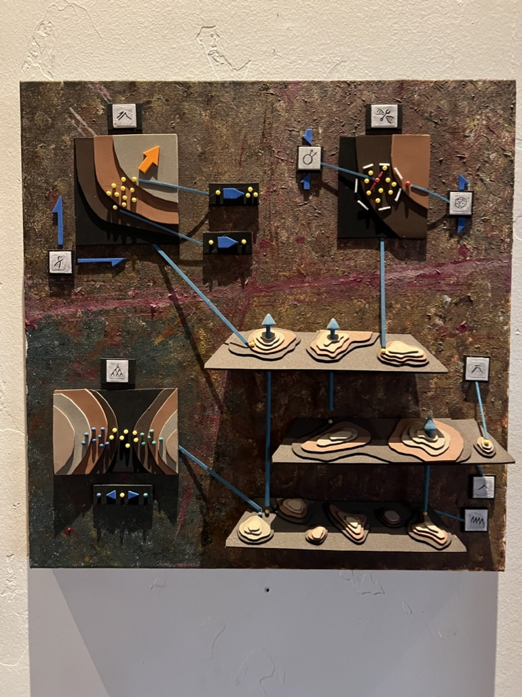
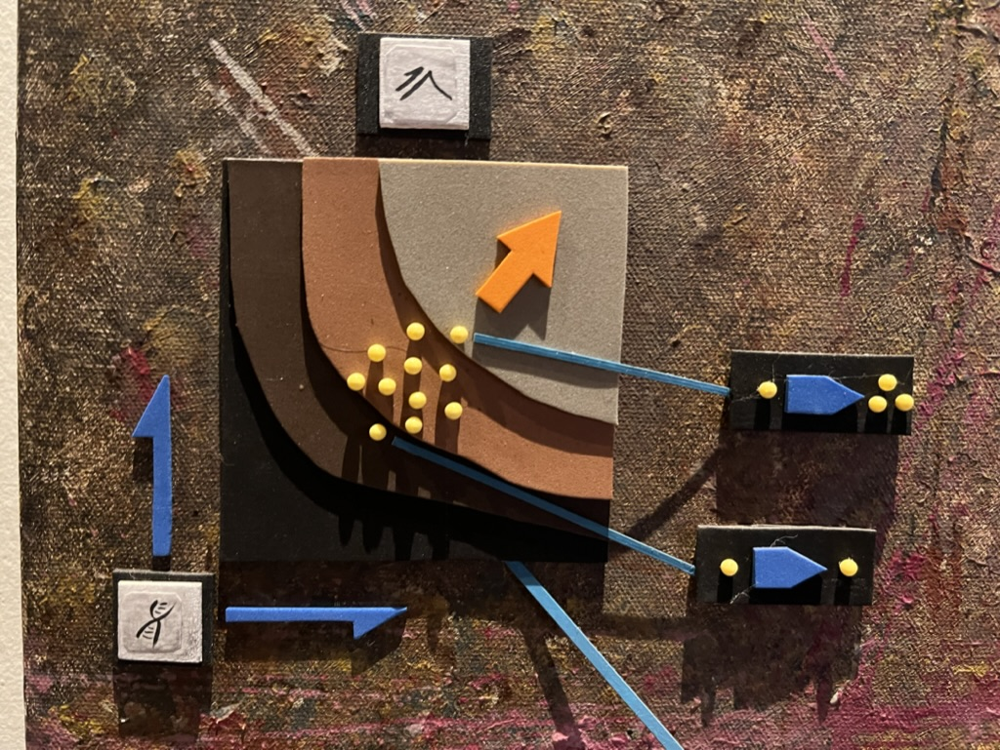
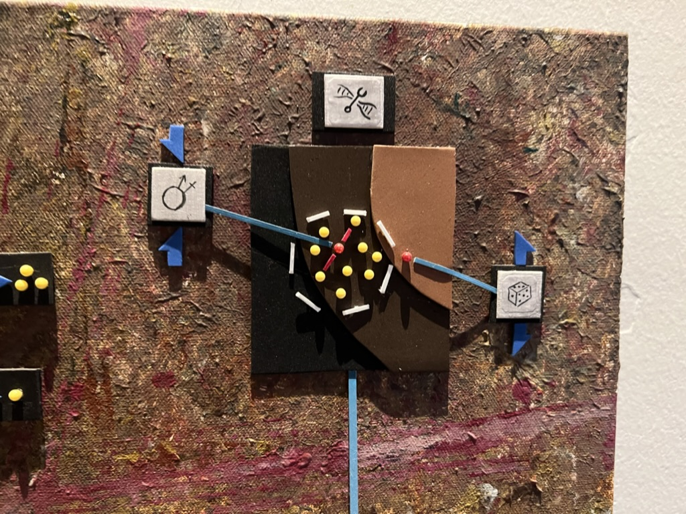
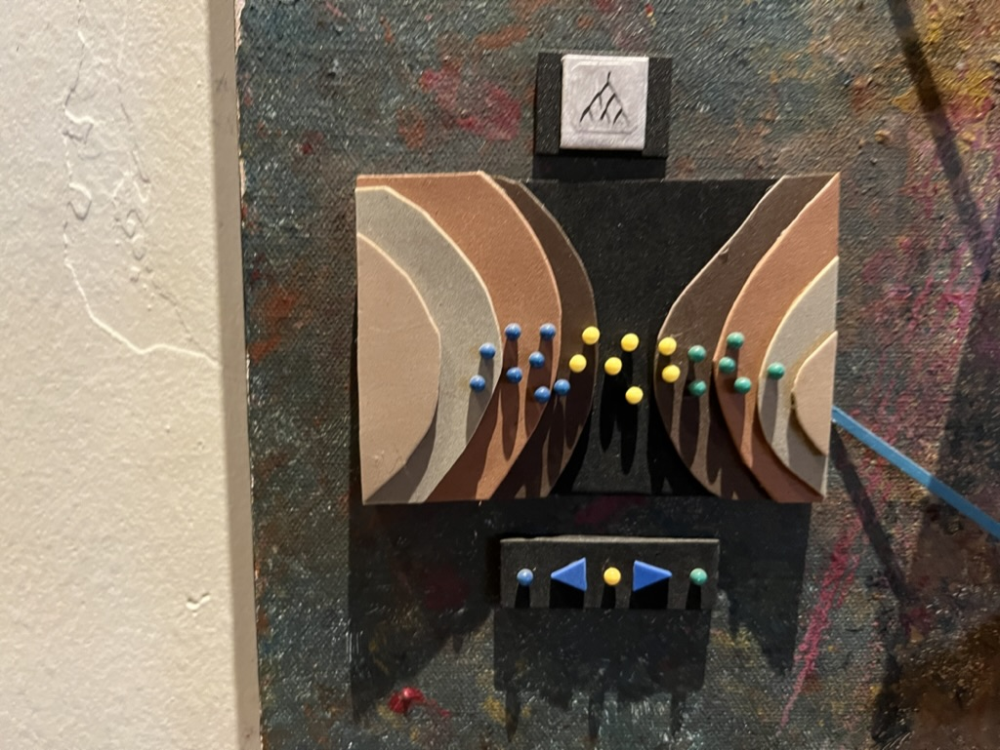
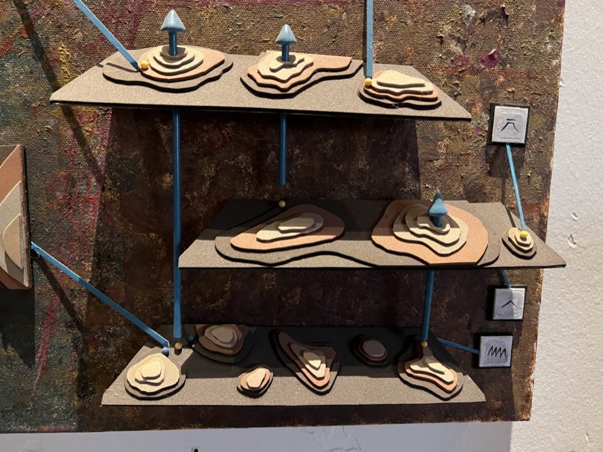
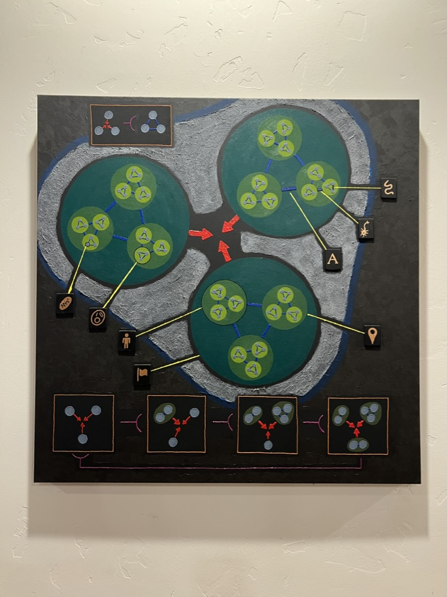
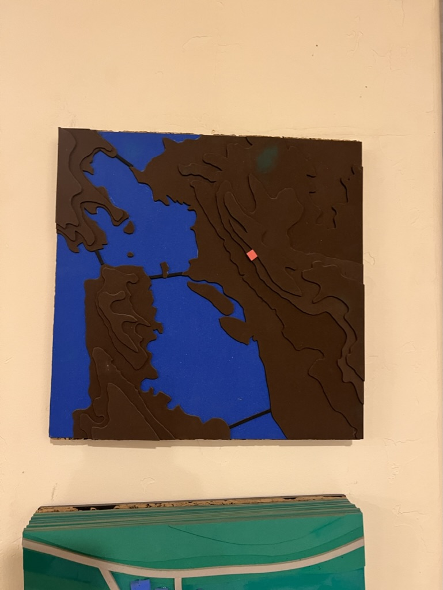
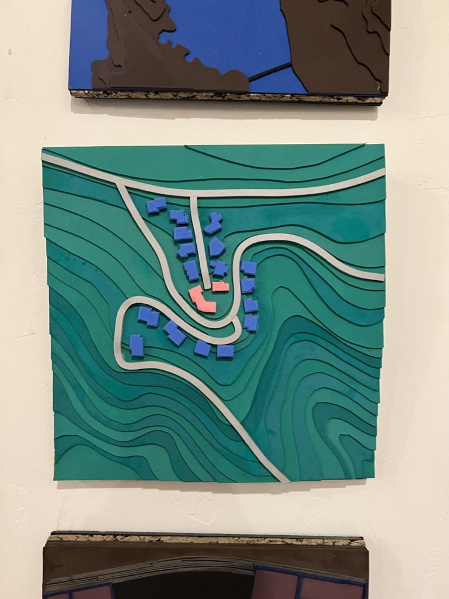
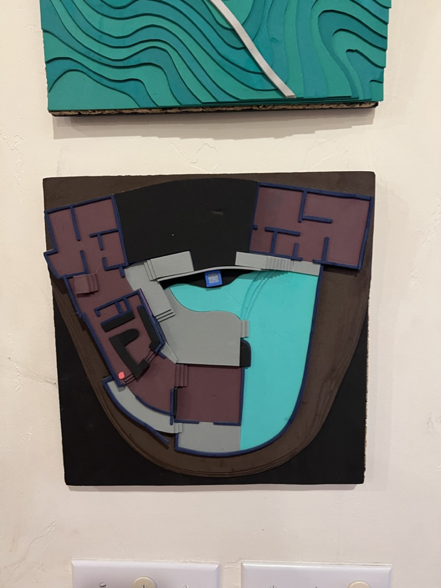

# Will's Artwork

*Will Wright makes physical mixed-media art — layered, relief-style constructions on canvas and
board with cut foam/cork contours, painted symbols, dowel "connectors," and colored pin "nodes."
The pieces below read like his lifelong obsessions made tangible: **systems, evolution, terrain,
and cities**. Captions describe what is visibly in each piece; the readings are tentative and
welcome correction.*

## The systems / evolution piece

A large square canvas with four raised panels linked by blue rods and yellow pin "nodes,"
each tagged with an engraved icon (a mountain, a DNA helix, a male/female symbol, dice, a
branching tree, a waveform). It reads as a **diagram of an evolving system** — selection,
genetics, variation, and lineage feeding into one another.

The whole piece.

Detail: a **fitness-landscape**–style curve with an orange arrow climbing it, tagged with a
mountain and a DNA-helix icon.

Detail: a central cluster of pins crossed by red links, flanked by a **♂/♀** sex symbol and a
**dice** symbol — recombination and chance.

Detail: a symmetric, layered panel under a **branching-tree** (phylogeny) icon, studded with
blue/yellow/green pins.

Detail: stacked contour "shelves" connected by rods — stratified layers, tagged with mountain
and waveform icons.

## The cell-division piece

A dark canvas with three clusters of **green cells** arranged around a central red-arrow hub,
each cell holding smaller subdivided cells; a step-by-step **division/mitosis** sequence runs
along the bottom. Symbol tags ring the edges.

## Terrain & city relief maps

These cut-layer relief pieces are pure Will Wright — **contour terrain** and **urban form**
rendered as stacked, painted topography.

A blue-and-brown contour relief of a **bay and coastline** — strongly reminiscent of the
San Francisco Bay — with a single red marker.

A green contour relief of a **hillside neighborhood**: winding roads with rows of blue houses
and one pink house picked out.

A relief of a **building / floor plan** — rooms in maroon wrapping around a curved teal **pool**,
with one pink marker.

---

See also: [`README.md`](README.md) · [`russian-space-junk.md`](russian-space-junk.md) · [`../README.md`](../README.md)
