# Will's Russian Space Junk

*Will Wright is a longtime collector of real **Soviet/Russian spaceflight hardware** — flown
and ground-test control panels, navigation instruments, hand controllers, hatches, and an
ejection seat. These photos were taken by **Don Hopkins**. Captions describe what is visibly
in each frame; the Cyrillic labels are transcribed/translated where legible. Corrections welcome.*

## The Globus (IMP) navigation instrument

The standout pieces are **Globus IMP** units — the famous electromechanical orbital-position
indicator from Soyuz/Vostok-era spacecraft. A motor-driven globe rotates under a fixed reticle
to show the craft's position over Earth, with dials for orbit **ПЕРИОД** (period), **ВИТКИ**
(orbit count), and **УГОЛ ПОСАДКИ** (landing angle).

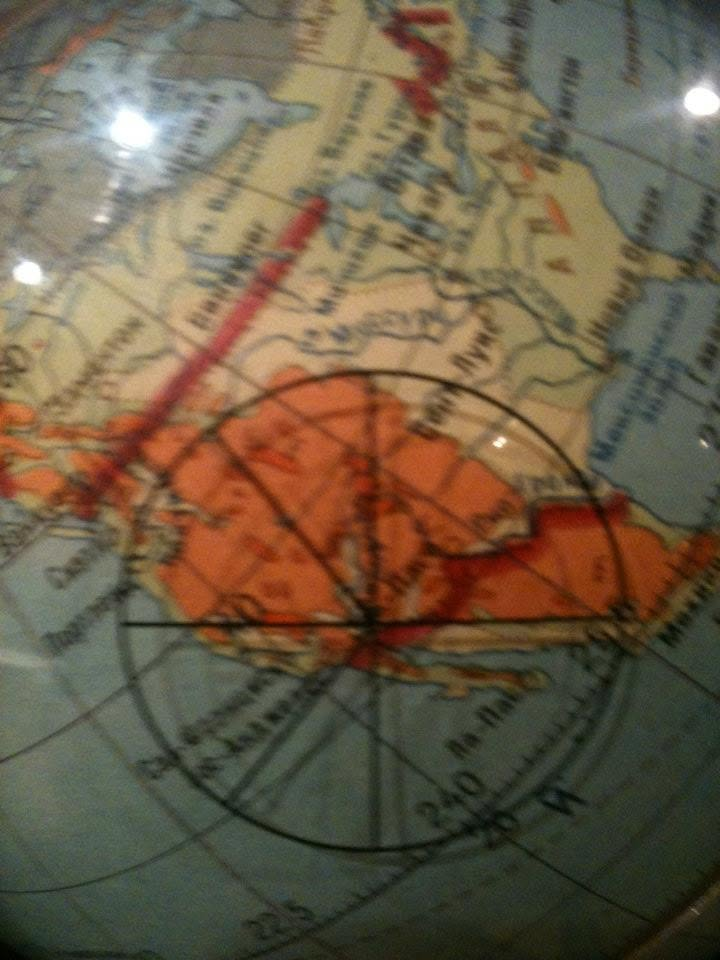

Close-up of the rotating Earth globe under the cross-hair reticle.

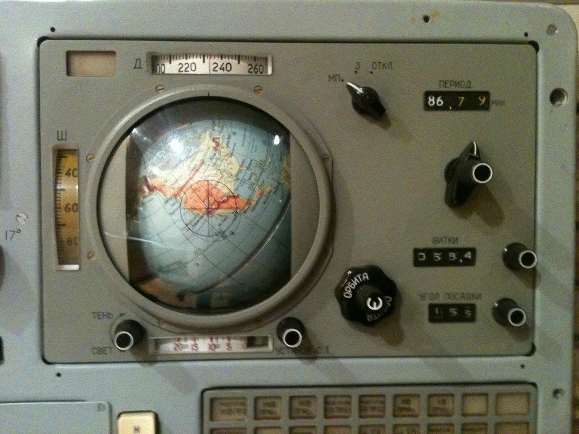

A Globus instrument panel: **ПЕРИОД** (period) **86.79**, latitude/longitude scales (**Ш / Д**),
**ВИТКИ** (orbits), the **ОРБИТА** crank, and **УГОЛ ПОСАДКИ** (landing angle).

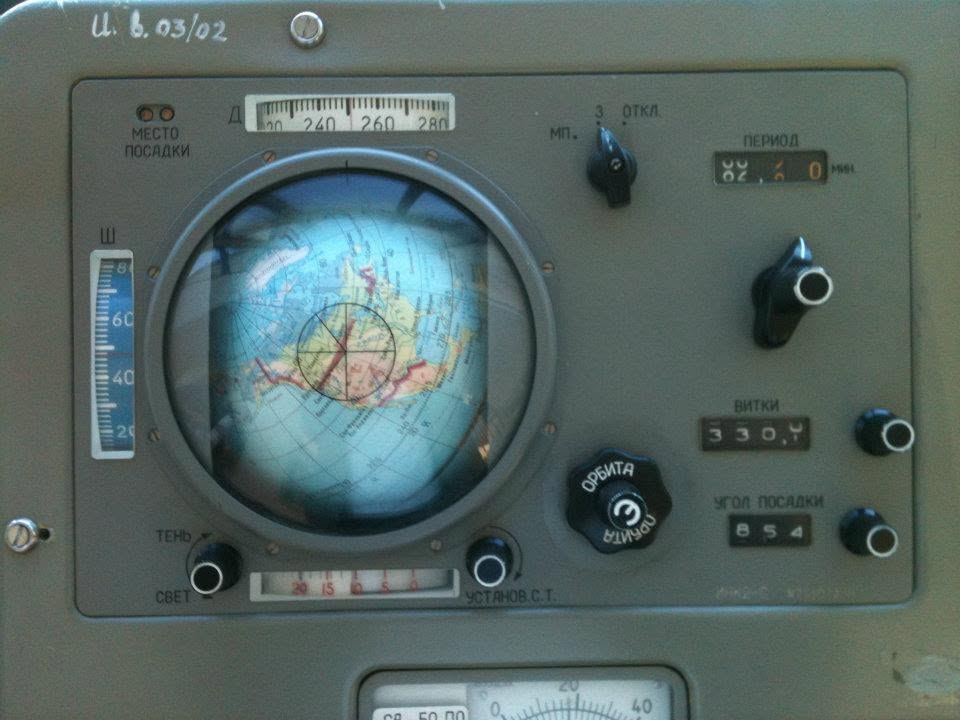

Another Globus panel with the **МЕСТО ПОСАДКИ** (landing site) indicator lit, **ВИТКИ 330.4**.

## Control & command panels

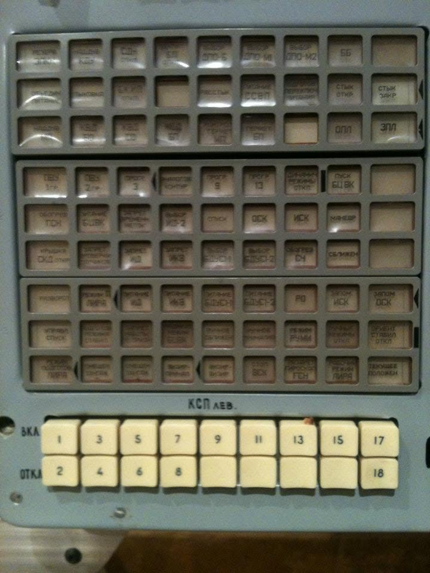

A command panel (**КСП ЛЕВ** — left command signaling panel) with rows of Cyrillic-labeled
function keys over numbered **ВКЛ / ОТКЛ** (on/off) buttons 1–18.

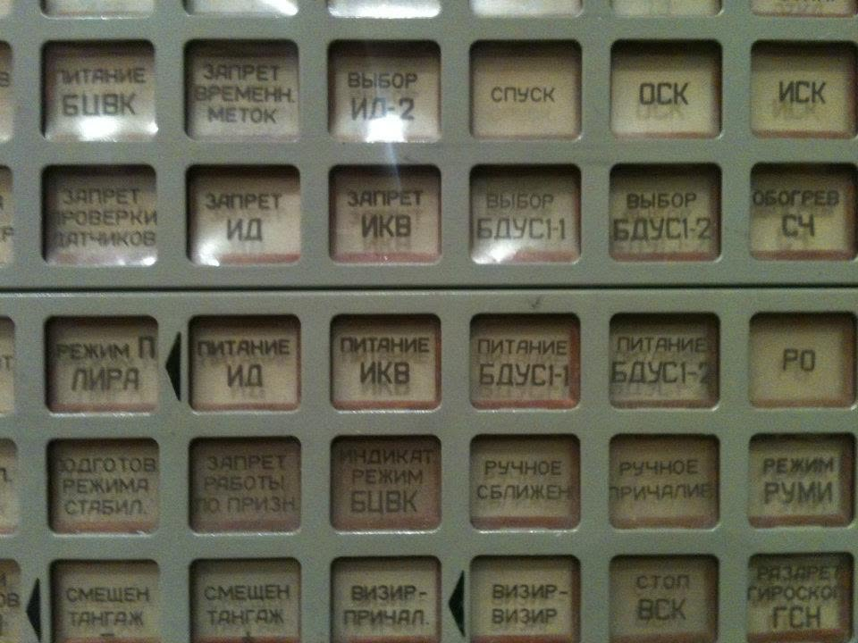

Detail of the labeled buttons — **ПИТАНИЕ** (power), **ЗАПРЕТ** (inhibit), **ВЫБОР** (select),
**СПУСК** (descent), **ОСК**, **ИСК**, **РУЧНОЕ СБЛИЖЕН** (manual rendezvous).

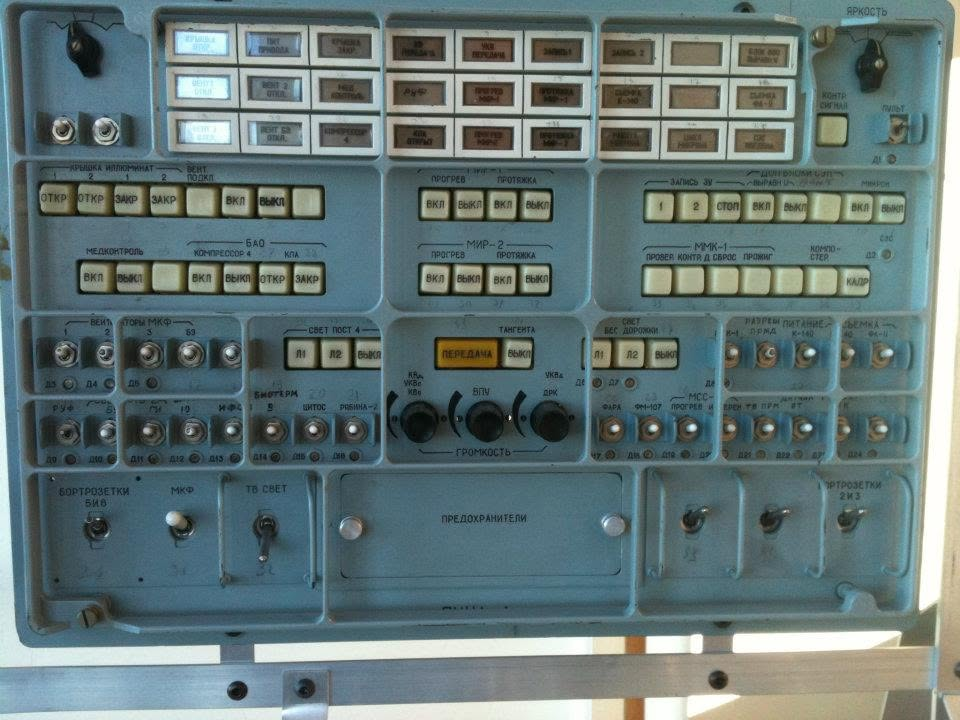

A blue panel of toggle switches and indicator lamps, centered on a **ПЕРЕДАЧА** (transmit) /
**ГРОМКОСТЬ** (volume) communications control.

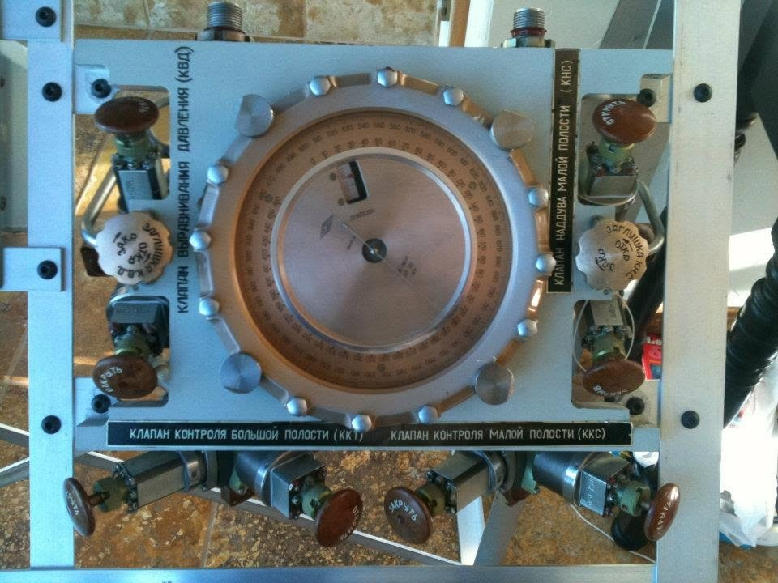

A pressurization panel: a large central gauge ringed by capped hand valves —
**КЛАПАН ВЫРАВНИВАНИЯ ДАВЛЕНИЯ** (pressure-equalization valve), **КЛАПАН НАДДУВА** (pressurization
valve), and **КЛАПАН КОНТРОЛЯ** (control valves).

## Hand controllers

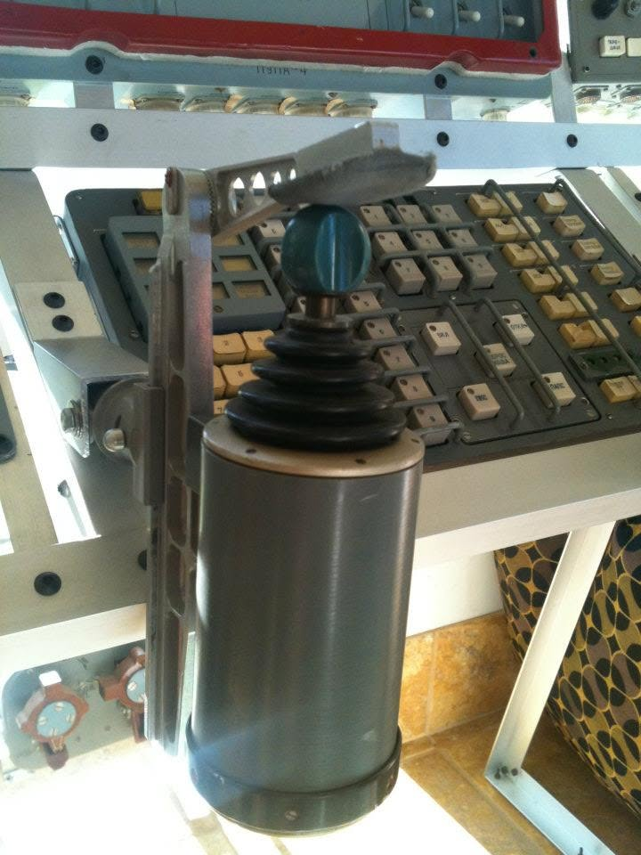

A hand controller with a bellows boot and a blue ball grip, mounted in front of a keypad.

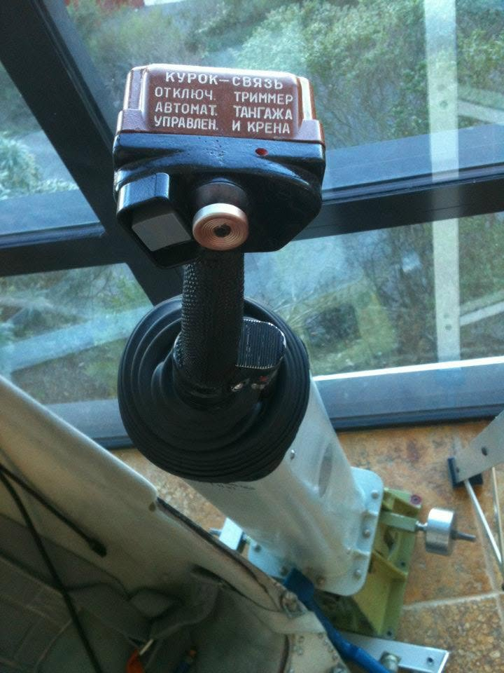

Close-up of a control grip; the head is labeled **КУРОК-СВЯЗЬ** (comm trigger),
**ОТКЛЮЧ. АВТОМАТ. УПРАВЛЕН.** (disable automatic control), **ТРИММЕР ТАНГАЖА И КРЕНА**
(pitch & roll trim).

## Optics, hatch & seat

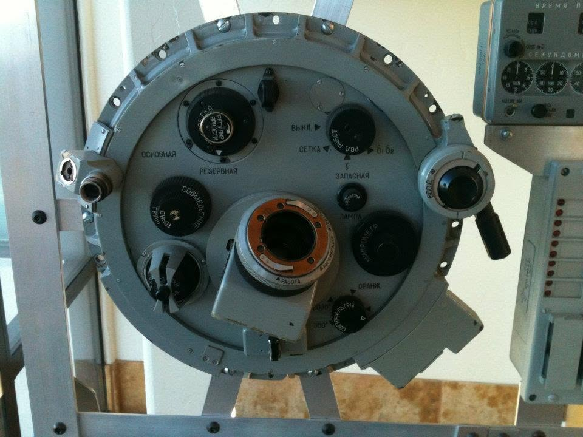

A round optical sight / periscope head with mode selectors **ОСНОВНАЯ** (primary),
**РЕЗЕРВНАЯ** (backup), **ЗАПАСНАЯ** (reserve).

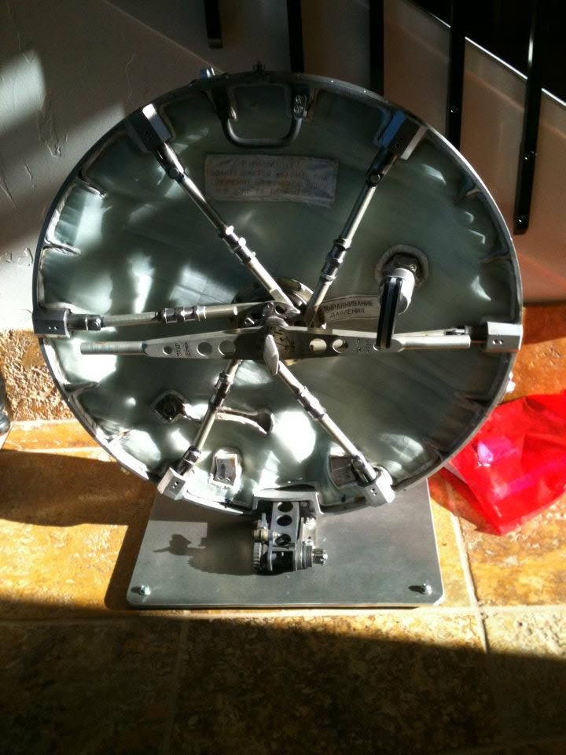

The back of a circular pressure **hatch**, showing the radial locking arms and the
**ВЫРАВНИВАНИЕ ДАВЛЕНИЯ** (pressure equalization) handle.

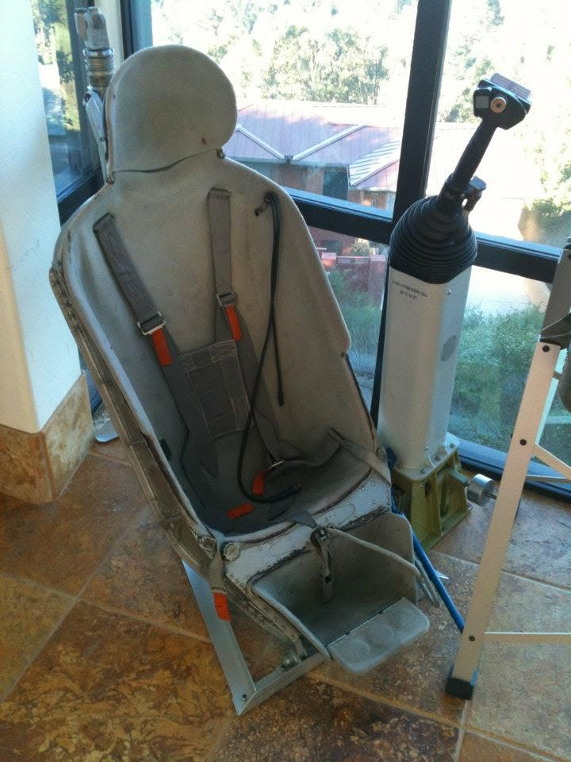

A contoured cosmonaut **seat** with harness, next to a hand-controller column.

## The collection, racked up

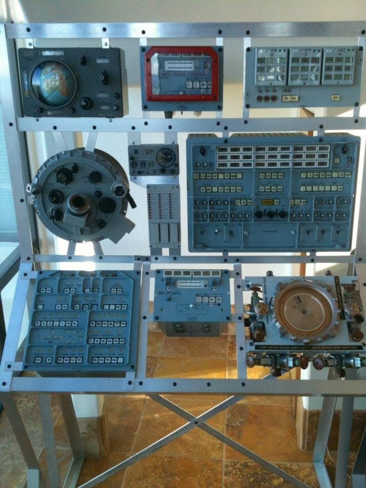

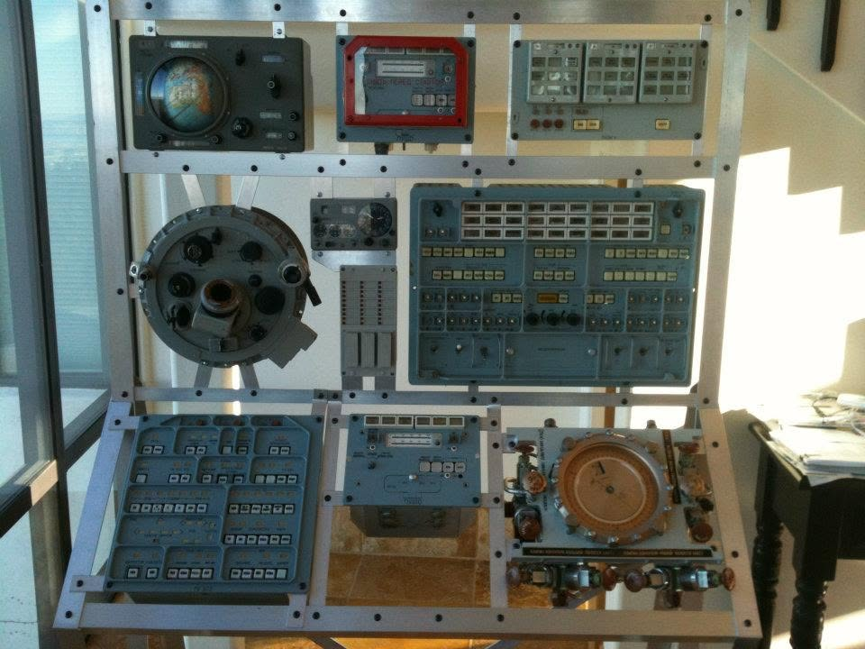

Will's panels mounted on aluminum display frames — Globus instrument, command keyboards, the
circular hatch, and pressurization gauges together.

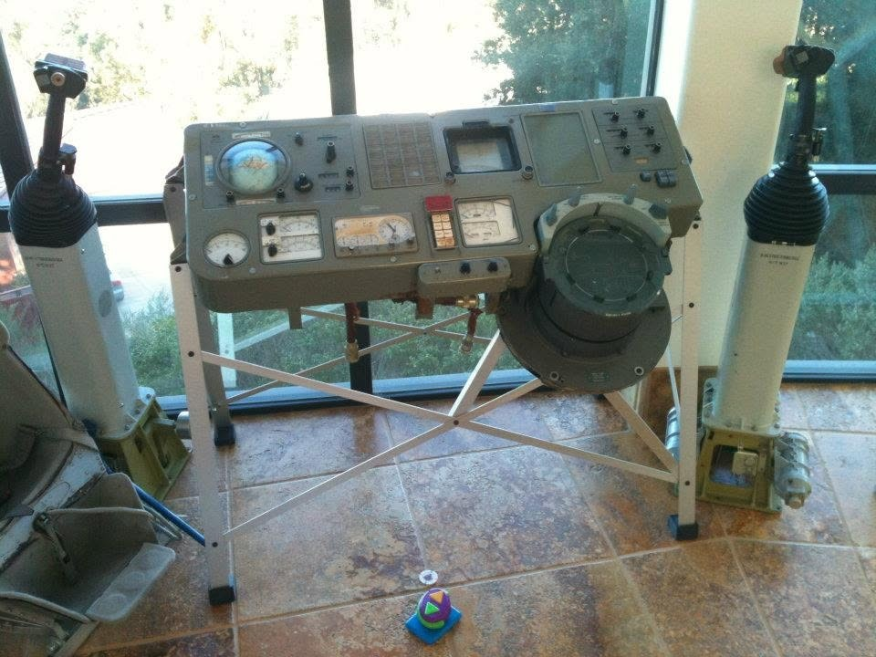

A console section with analog gauges and a large round port — flanked by hand-controller columns.

---

See also: [`README.md`](README.md) · [`artwork.md`](artwork.md) · [`../README.md`](../README.md)
