# Pre-release Sims — Bunker family assets and cut UI

*Source thread:* [`archie-suit.txt` — Whitman in the bone report](../sources/2022-05-18-archie-suit-cmx-whitman/README.md) ·
*Media hub:* [`README.md`](README.md) · *Series gallery:* [`sims-series-README.md`](sims-series-README.md)

Textures and interface art Don posted to **Maxis Alumni on 18 May 2022** alongside the
`archie-suit.txt` discovery, from his surviving 3D Studio Max and Character Studio files. Era: The
Sims while still **Dollhouse**, when the **Bunker family** (*All in the Family*) was the test
household — which is why the animation skeleton in the CMX report is named `archie`.

Don's inventory of what he still has: *"the original max and character studio files and textures for
Archie, Edith, The Colonel, Crazy Larry (was he based on me?!?), The Dutchess, Dunne, Fritz, Gail,
Sigmund, and Pizza Dude."*

Head textures are **UV-unwrapped**, so faces read as flattened and splayed rather than as portraits.

## Faces — the Bunkers and friends

| Image | Original file | Notes |
|---|---|---|
| 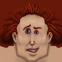 | `CLHeadN2.BMP` | Crazy Larry. Don, in the thread: *"was he based on me?!?"* |
| 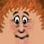 | `eface.BMP` | Edith, neutral — hair painted into the texture all around the face, a different unwrap from Archie's |
| 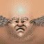 | `aface.BMP` | Archie, neutral — the character the rig is named after. The unwrap splays his scalp into two wing-shaped panels; his baldness is why the layout reads as a cherub |
| 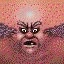 | `amad.BMP` | Archie mad — same unwrap, same bald pate, brow down and eyes wide. Side by side with `aface.BMP` the swap-a-texture method is obvious |
|  | `emad.BMP` | Edith mad |
| 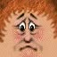 | `esad.BMP` | Edith sad |
|  | `ehappy.BMP` | Edith goofy happy |

These are the **material bitmaps** half of the system. The
[`archie-suit.txt` report](../sources/2022-05-18-archie-suit-cmx-whitman/README.md) shows the other
half: each mood is a **separate suit binding a different head mesh** (`HEAD01`–`HEAD05` for normal,
happy, sad, mad, sleep), paired with its own material — `aface`, `ahappy`, `asad`, `amad`, `asleep`.
So expression swapped **geometry and texture together**, not texture alone. `aface.BMP` and
`amad.BMP` below are two of the eleven materials that report lists for Archie.

## Devils, ducks, and a fishnet undershirt

| Image | Original file | Notes |
|---|---|---|
| 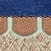 | `afish2.bmp` | Archie's fishnet t-shirt |
| 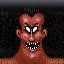 | `dmad.BMP` | *"Some angry devil"* |
|  | `C_devil.bmp` | **Jamie Doornbos's Satan** |
| 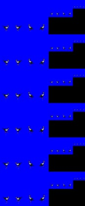 | `Duck.bmp` | The **pet duck** object — sprite frames on blue key |

## Cut and early interface

| Image | Original file | Notes |
|---|---|---|
| 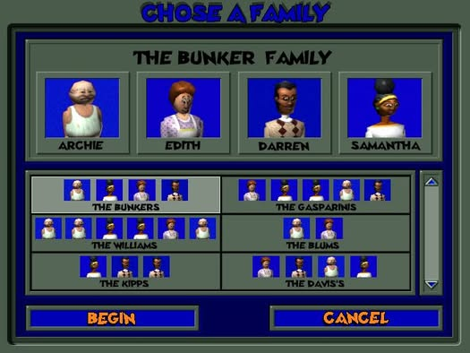 | `FamilyPanel.psd` | An old **Bunker Family Panel**. Households: the Bunkers, Gasparinis, Williams, Blums, Kipps, Davis's. Note the typo shipped in the mock: **"CHOSE A FAMILY"** |
| 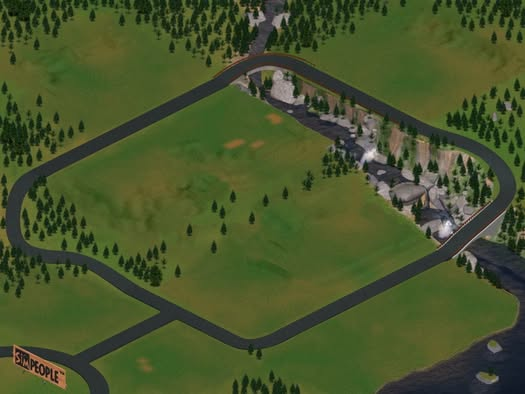 | `simpeople.tga` | **Ocean Quigley's** neighborhood — the `SIMPEOPLE™` sign is the pre-*Sims* working title |
| 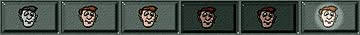 | `modepeople.BMP` | Cut buttons — **People Mode** |
| 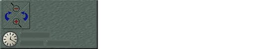 | `mainpanelbck.BMP` | Cut buttons — **Main Panel Background**; analog clock, ± zoom, rotate arrows |

Two working titles are visible in this set: **Dollhouse** era characters, and `SIMPEOPLE™` painted
into the terrain art. The shipped name arrived after both.

## Orbit

- [`archie-suit.txt` source page](../sources/2022-05-18-archie-suit-cmx-whitman/README.md) — the Whitman bone report
- [CMX binary format (2004)](../sources/2004-02-05-sims-character-animation-file-format/article.md)
- [Steering committee demo, June 1998](../sources/1998-06-04-sims-steering-committee-demo/README.md) — this build era, live
- [Sims series galleries](sims-series-README.md)
