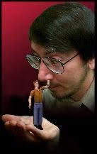

# Will Wright head-shot progression

*Don Hopkins Photoshop composites — late 1990s–early 2000s god-game gags.*

Tiny **Sims** composited into Will portraits — the player-in-the-palm metaphor before it was a slogan.

## Progression

### Sim in palm

Sim waving from Will's open palm.

### Sim touches nose

Sim reaches up to boop Will's nose.

### Legs in mouth

Tiny blue legs sticking out of Will's mouth.

### Early grayscale base

Early grayscale headshot base layer.

### LinkedIn parody

*"Does Will Wright know about Computer Games?"* — LinkedIn endorsement parody.

## Repo Show tie-in

- [Will Wright premiere](../../../../repo-shows/will-wright-premiere/README.md)
- [Player-in-the-Middle](../../../process/crazy-idea-jam.md#player-in-the-middle)

**Machine girder:** [`will-head-shot-progression.yml`](will-head-shot-progression.yml)
