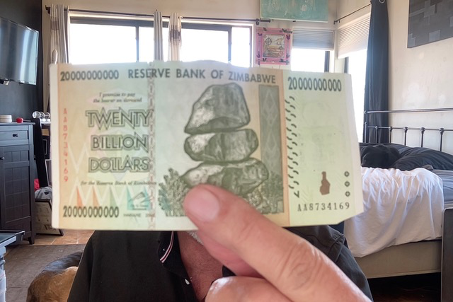
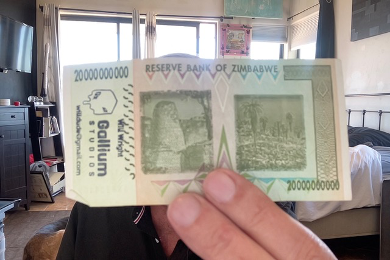

# Will's Zimbabwe twenty-billion-dollar business card

*Will Wright's "business card" is a rubber stamp (Gallium Studios / Will Wright /
willdude@gmail.com) on a demonetized **Zimbabwe Z$20,000,000,000** banknote
(2008, Pick 86). Face value: twenty billion. Street price of the note itself:
about **two to four US dollars**. Photos by Don Hopkins of the card Will gave him.*

## Front

## Back (the stamp)

