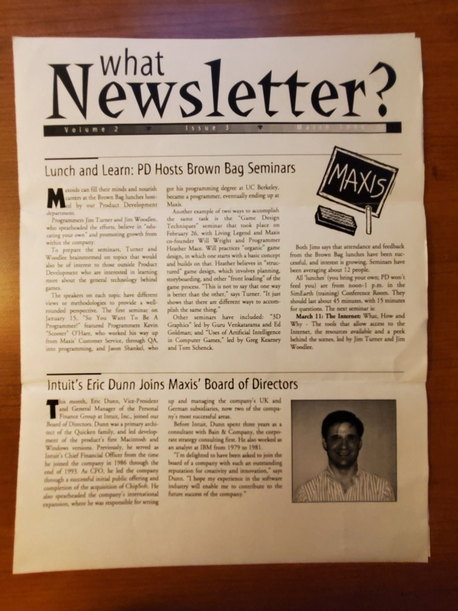
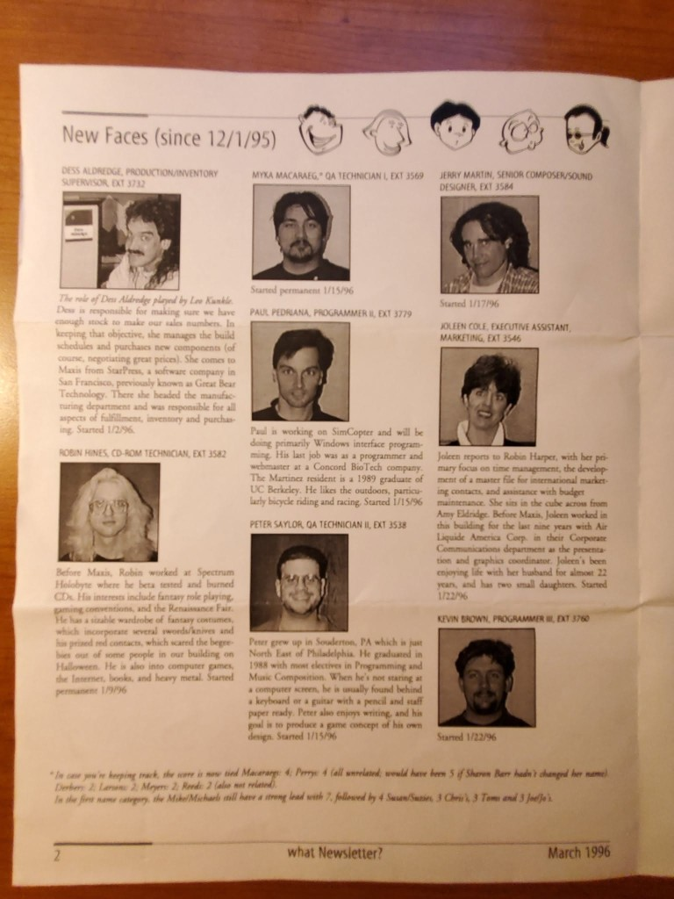
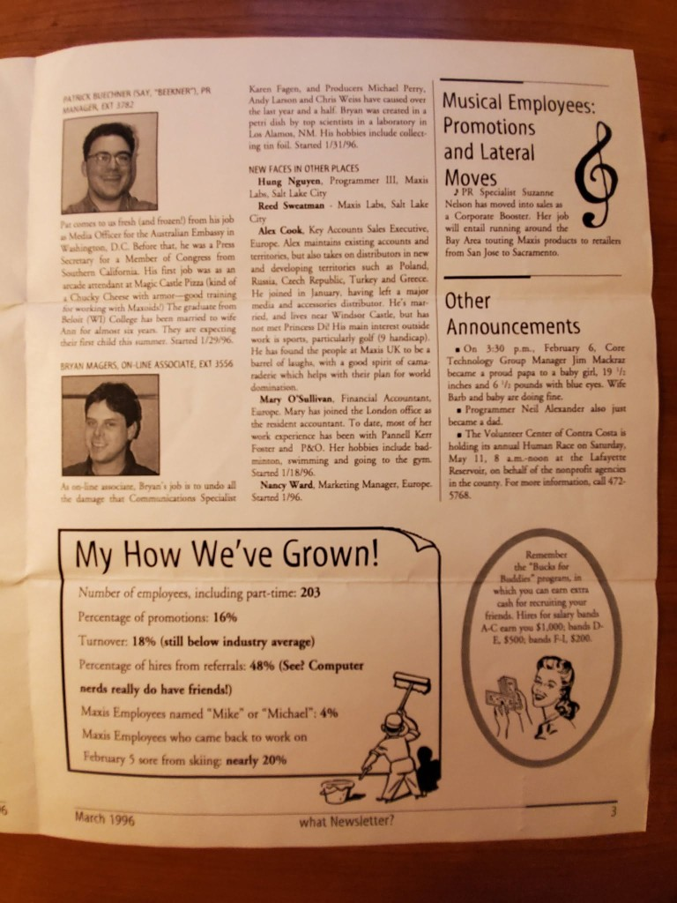
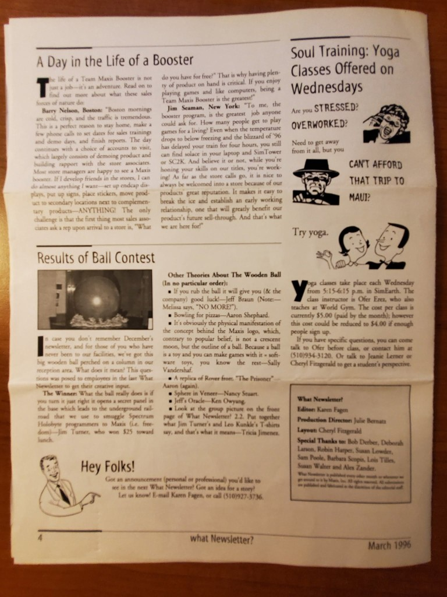

# Source: *what Newsletter?* — Maxis internal newsletter, March 1996

**Volume 2, Issue 3** · four pages · Maxis employee newsletter
*Surfaced by:* [Paul Pedriana on Maxis Alumni, 18 May 2020](2020-05-18-paul-pedriana-facebook-post.jpg) — 15 reactions

> "I discovered this today while going through some old stuff. It dates from when I and a few others
> were hired in early 1996." — Paul Pedriana

An **internal company document** from the month before [Will's Stanford talk](../1996-04-26-winograd-interfacing-to-microworlds/README.md)
(26 April 1996). Masthead: Editor **Karen Fagen**, Production Director **Julie Bernatz**, Layout
**Cheryl Fitzgerald**. This is Maxis as a going concern in the SimCity 2000 / SimCopter era, two
years before Dollhouse had a steering committee.

| Page | Scan | Contents |
|---|---|---|
| 1 | [page 1](what-newsletter-1996-03-page1.jpg) | Brown Bag seminars; Intuit's Eric Dunn joins the board |
| 2 | [page 2](what-newsletter-1996-03-page2-new-faces.jpg) | **New Faces since 12/1/95** — eight hires with photos and bios |
| 3 | [page 3](what-newsletter-1996-03-page3-how-weve-grown.jpg) | More new faces; announcements; **"My How We've Grown!"** statistics |
| 4 | [page 4](what-newsletter-1996-03-page4-ball-contest.jpg) | Team Maxis Boosters; **Results of Ball Contest**; yoga classes |

## Page 1 — "Lunch and Learn: PD Hosts Brown Bag Seminars"

Programmers **Jim Turner** and **Jim Woodlee** ran a brown-bag seminar series so Maxis staff could
*"fill their minds and nourish careers on their own."* Recorded speakers and topics:

- **"So You Want To Be A Programmer"** (15 Jan) — **Kevin "Scooter" O'Hare**, who worked his way up
  from Maxis Customer Service through QA into programming, and **Jason Shankel**
  ([room](../../../jason-shankel/)), who got his degree at UC Berkeley
- **"Game Design Techniques"** (26 Feb) — **Will Wright** with **Heather Mace** of Living Legend.
  Will practices *"organic"* game design, starting from a basic concept and building on it; Heather
  believes in *"structured"* design — planning, storyboarding, *"front loading"* the process.
  Turner's gloss: *"This is not to say that one way is better than the other. It just shows that
  there are different ways to accomplish the same thing."*
- **"3D Graphics"** — Guru Venkatarama and Ed Goldman
- **"Uses of Artificial Intelligence in Computer Games"** — Greg Kearney and Tom Schenck
- Next up, **11 March: "The Internet: What, How and Why"**

Attendance averaged about **12 people**, in the **SimEarth (training) Conference Room**. Rooms named
after the games.

The second article: **Eric Dunn**, VP/GM of Intuit's Personal Finance Group and a primary architect
of Quicken, joins the Maxis **Board of Directors**.

## Page 2–3 — New Faces, and who arrived when

Hiring dates, useful for dating anything else in the archive:

| Name | Role | Started |
|---|---|---|
| Dess Aldredge | Production/Inventory Supervisor | 1/2/96 |
| Robin Hines | CD-ROM Technician | 1/9/96 |
| Myka Macaraeg | QA Technician I | 1/15/96 |
| **Paul Pedriana** | Programmer II | 1/15/96 |
| Peter Saylor | QA Technician II | 1/15/96 |
| **Jerry Martin** ([room](../../../jerry-martin/)) | **Senior Composer/Sound Designer** | **1/17/96** |
| Joleen Cole | Executive Assistant, Marketing | 1/22/96 |
| Kevin Brown | Programmer III | 1/22/96 |

**Jerry Martin's start date is on the record here** — the composer whose Sims soundtrack is a
[separate preservation thread](../2026-e3-1999-prototype-preservation/README.md) joined Maxis in
January 1996. **Paul Pedriana** was *"working on SimCopter and will be doing primarily Windows
interface programming."*

Page 3 continues with **Patrick Buechner** (PR Manager — the newsletter helpfully glosses *say
"BEEKNER"*; his first job was arcade attendant at Magic Castle Pizza, *"kind of a Chucky Cheese with
armor — good training for working with Maxoids!"*), **Bryan Magers** (On-line Associate), and Maxis
Labs / Europe hires: Hung Nguyen and Reed Sweatman (Salt Lake City), Alex Cook, Mary O'Sullivan,
Nancy Ward (Europe).

Bryan's bio contains the only org-chart fact in the issue, delivered as an insult:

> "As on-line associate, Bryan's job is to undo all the damage that Communications Specialist Karen
> Fagen, and **Producers [Michael Perry](../../../mike-perry/README.md), Andy Larson and Chris
> Weiss** have caused over the last year and a half. Bryan was created in a petri dish by top
> scientists in Los Alamos, NM. His hobbies include collecting tin foil."

**That dates Mike Perry at Maxis to roughly late 1994** — and he is the designer of
[LunaSim / Tycho Rising](../../../mike-perry/lunasim-tycho-rising.md), the unreleased lunar colony
simulator he was working on the year this newsletter was printed. Andy Larson and Chris Weiss have
no rooms here yet.

Under **Other Announcements**: *"On 3:30 p.m., February 6, Core Technology Group Manager **Jim
Mackraz** ([room](../../../jim-mackraz/)) became a proud papa to a baby girl, 19½ inches and 6½
pounds with blue eyes. Wife Barb and baby doing fine."* — which also records his 1996 **title**.

### "My How We've Grown!"

Maxis by the numbers, March 1996:

| Metric | Value |
|---|---|
| Employees, including part-time | **203** |
| Percentage of promotions | 16% |
| Turnover | 18% *(still below industry average)* |
| Hires from referrals | 48% — *"See? Computer nerds really do have friends!"* |
| Employees named "Mike" or "Michael" | 4% |
| Came back to work 5 February **sore from skiing** | nearly 20% |

The footnote on page 2 keeps a running tally of duplicate surnames and first names: *"the score is
now tied Macaraeg: 4; Perry: 4 … the Mike/Michaels still have a strong lead with 7, followed by 4
Susan/Suzies, 3 Chris's, 3 Toms and 3 Joelle's."*

## Page 4 — the wooden ball, and yoga in SimEarth

**Results of Ball Contest.** The big wooden ball perched on a column in the Maxis reception area
prompted an employee competition to explain what it means. Entries:

- *"If you rub the ball it will give you (& the company) good luck!"* — Jeff Braun (co-founder), with
  Melissa's note: **"NO MORE!"**
- *"Bowling for pizzas"* — Aaron Shephard
- *"It's obviously the physical manifestation of the concept behind the Maxis logo, which contrary to
  popular belief, is not a crescent moon, but the outline of a ball. Because a ball is a toy and you
  can make games with it — software toys, you know the rest"* — Sally Vanderschaf
- *"A replica of Rover from 'The Prisoner'"* — Aaron again
- *"Sphere in Veneer"* — Nancy Stuart · *"Jeff's Oracle"* — Ken Owyang
- **The winner** — Jim Turner, who won $25 toward lunch: *"What the ball really does is if you turn
  it just right it opens a secret panel in the base which leads to the underground railroad that we
  use to smuggle Spectrum Holobyte programmers to Maxis."*

That Maxis-logo theory is worth flagging: an employee arguing in 1996 that the **crescent is the
outline of a ball, because a ball is a toy, and Maxis made "software toys."** Whether or not it's
the designer's intent, it's a period account of how staff read their own logo — the same logo on the
[reception wall in Patrick's 1998 photos](../../../patrick-j-barrett-iii/media/README.md).

Also on the page: **yoga classes Wednesdays 5:15–6:15 in SimEarth**, $5 a class, taught by Ofer
Erez of World Gym — under the headline **"Soul Training."**

## Why keep this

Company newsletters are the boring documents that answer questions nothing else can: **exact hire
dates, job titles, org structure, room names, headcount, and the texture of the place**. This one
gives Jerry Martin's start date, Jim Mackraz's 1996 title, a Will Wright design-philosophy
statement in his colleagues' words, and the fact that Maxis named its conference rooms after its
games and held yoga in SimEarth.

Paul's thread drew hellos from **Kaye Mason**, **Jim Siefert**, and **Michael Cox** (*"We never met
but your name is familiar for some reason. 🙂"*).

**Note on names:** the *"Jim Turner"* here is a **1996 Maxis programmer**, not
[James Turner the Sims YouTuber](../../../james-turner/README.md) who has a guest room in this repo.
Different people; do not merge. **Heather Mace** (Living Legend) is likewise not
[Heather Castillo](../../../heather-castillo/README.md). **Paul Pedriana**, **Charles London**,
**Karen Fagen**, and **Jim Turner** have no rooms here yet.

## Repo orbit

- [Winograd talk, April 1996](../1996-04-26-winograd-interfacing-to-microworlds/README.md) — one month later
- [Mike Perry — LunaSim / Tycho Rising](../../../mike-perry/lunasim-tycho-rising.md) — what one of the producers named here was designing that year
- [Patrick's Maxis photos, Christmas 1998](../../../patrick-j-barrett-iii/media/README.md) — the same building, the same logo, 203 → Sims era
- [Jerry Martin](../../../jerry-martin/) · [Jason Shankel](../../../jason-shankel/) · [Jim Mackraz](../../../jim-mackraz/)
- [Maxis people gallery](../../media/sims-series-maxis-people.md)
