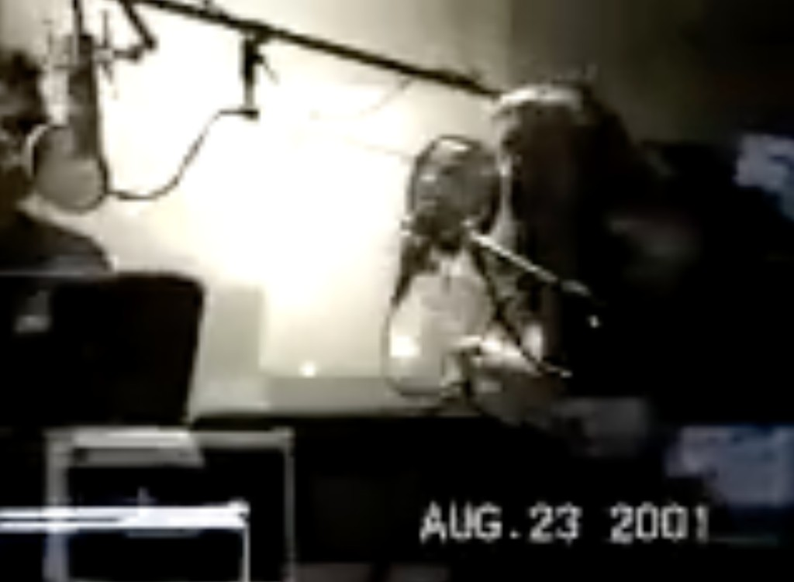
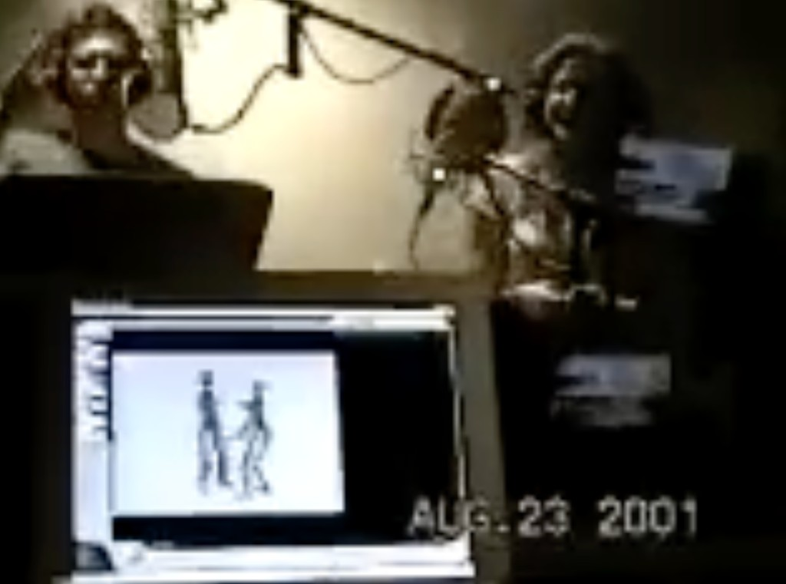

# Source: Simlish voice video — Kearin & Lawlor at the mic, 23 Aug 2001

*Sniff:* [`GLANCE.yml`](GLANCE.yml)

**Stephen Kearin** and **Gerri Lawlor** recording **Simlish** on camera, camcorder-stamped
**AUG. 23 2001**. Seventy-eight seconds of the only widely circulated *video* of the two people who
invented the language of The Sims actually inventing it. Rescued from a 2,531-view YouTube upload.

- **Video:** [Simlish Voice Video (from The Sims 1, Best Quality)](https://www.youtube.com/watch?v=Y_E6026i9tA) · `Y_E6026i9tA`
- **Uploader:** Ella Reed (AKA Rayanna Thompson) · channel `UCieqNqEA8Xd2gUwoj9aJdsQ` · uploaded **24 Jan 2020**
- **Runtime:** 1:18 · **2,531 views · 240 likes · 290 comments** (as of 29 Aug 2026)
- **Local preservation:** `videos/clips/simlish-voice-video-2001/` — mp4, `info.json`, thumbnail, and the
  full 290-comment corpus (gitignored; not committed)
- **Uploader's description:** *"Think speaking 'Simlish' is easy? Gerri Lawlor (Whistling Performer
  And Bird Impressionist) and Stephen Kearin (Animal Impersonations, Prince Of Foley Artist, King Of
  Extras And Comedian) are the two voice actors that have mastered speaking 'Simlish'."*

## Provenance — Don found it in 2022, at 700 views

Don posted this video to the **Maxis Alumni** group on **19 May 2022**:

> "OMG this precious video only has 700 views! RIP Gerri. It's so fun to see Gerri Lawlor and Steve
> Kearin working so playfully together."

In the same thread he attached the English ad-lib audio, and **Jim Mackraz** ([room](../../../jim-mackraz/))
answered:

> "I'm not sure everybody appreciates what a treasure this recording is!"

That was the same day Don cited the wav on
[Hacker News](https://news.ycombinator.com/item?id=31430802) — 19 May 2022, both venues at once.

**Views: 700 (May 2022) → 2,531 (Aug 2026).** Roughly 1,800 views in four years, on the only video
of the invention of Simlish. Mackraz's line is still the correct assessment, and the arithmetic is
the argument for archiving it locally rather than trusting the link.

## Frames

Two performers, two mics, a boom overhead, scripts in hand, and a **CRT facing them with two Sims
on it** — they are watching the characters while voicing them. That monitor is the whole method in
one frame: Simlish was performed *to picture*, improvised against animation, not read off a page.

Fan comments repeatedly identify **Gerri as the performer on the right** ("Rest In Peace Gerri
Lawlor On The Right", "RIP Gerri Lawlor On The Right Side"), which is the basis for the attribution
above.

## Why the date matters

The Sims shipped **31 January 2000**, so an August 2001 session is **expansion-pack era** — Hot Date
(Nov 2001) and Vacation (Mar 2002) were in production. *Inference, not established fact:* the
camcorder stamp is the only dating evidence, and camcorder clocks lie.

This makes it a **different session** from the audio already in the repo:
[Steve & Gerri Simlish ad-lib](../steve-and-gerri-simlish-adlib/README.md), where the two improvise
in **English** over a pre-release build (thought bubbles, kitchen fires, motive meters, ~1998–99).
That page lists "Don's video of the same session" as still-to-acquire — this is *not* that video,
but it is the same pair doing the same act two or three years on, in Simlish rather than English.

## The transcript that hears Simlish as Spanish

YouTube's automatic captions ran an **ASR pass on Simlish and decided it was Spanish**:

| Time | Auto-caption |
|------|--------------|
| 0:00 | `[Música]` |
| 0:05 | `i me miraba` |
| 0:24 | `la manager la más nunca la máxima` |
| 0:35 | `chucky` |
| 0:39 | `y` |
| 0:48 | `y de verdad` |
| 0:54 | `[Risas]` |
| 1:03 | `y además está bien` |
| 1:16 | `[Risas]` |

This is a free experiment nobody designed. Simlish was built to read as emotionally legible but
semantically empty, and a speech recognizer — a machine with no choice but to commit to *some*
language — lands on Romance-language prosody and hallucinates grammatical Spanish out of it. Note
`la máxima` at 0:24: the recognizer arriving, by accident, at **Maxis**. The two `[Risas]`
(laughter) tags are the honest transcription: the recognizer's non-speech classifier is the only
part that got the content right.

Worth a segment. It is the same joke as the language itself, told back to us by a machine.

## The comment section is its own artifact

290 comments on 2,531 views is an absurd ratio, and the corpus explains why. Measured from the
archived comment JSON:

| Pattern | Count | Example |
|---|---|---|
| Total comments | **290** | — |
| **Distinct author accounts** | **290** | every comment from a different account; **zero** repeat authors |
| `N Likes` counter comments | **165** | `44 Likes` … `240 Likes` — narrating the like count upward across ~6 years |
| `I Agree!` | **47** | `I Agree!` |
| `RIP` variants | **47** | `RIP Bird Lady` · `RIP Gerri "Canary Opera" Lawlor` · `RIP Queen Of Hollywood Whistler` |
| Fitting one of those three templates | **259 / 290 (89%)** | — |

One account per comment, Title Case On Every Word, formulaic templates, and a six-year running
commentary on the like counter (`79 Likes! We Did It!` → `No Menopause Only 140 likes!`). *Read as
inference:* this has the signature of sockpuppet or engagement-farm activity rather than organic
fan traffic. It is not proof — I have not checked account histories — but 290 comments from 290
accounts with 89% template compliance is not what a real comment section looks like.

What makes it genuinely strange rather than merely spammy: **the templates include mourning a real
dead woman**. The RIP variants are generative riffs on an epithet — Bird Lady, Nature Singer,
Whistling Girl In The Golden Age, Canary Opera, Queen Of Hollywood Whistler — as if the farm
ingested "whistler + bird impressionist + deceased" and enumerated. Two of them are accurate and
moving anyway: **`Dag Dag Gerri (Bird Girl)`** and **`Dag Dag gerri`**, using the Simlish farewell
she coined. EA's audio director Robi Kauker ended her memorial the same way: *"Dag dag! (Gerri said
it first.)"* One comment also correctly notes the asymmetry the video freezes in place —
**`RIP Whistling Lady And Animal Impersonator Is Still Alive`**.

A memorial ritual performed at scale by probable fake accounts, on a video of a dead performer, in
a language invented to mean nothing. File under procedural rhetoric: the *mechanism* is saying
something nobody wrote down.

## Who these two are

**Gerri Lee Lawlor** (16 May 1969 – 28 Jan 2019) — actress, voice actress, and homeless advocate;
co-creator of Simlish with **Stephen Kearin** and **Marc Gimbel**. Company Player at **BATS Improv**
in San Francisco; voiced Sims across The Sims, Livin' Large, House Party, Superstar, Makin' Magic,
The Sims 2, Life Stories, and SimCity 4; guest vocals for **The Residents**. In 2014 she joined
**Margaret Cho**'s *Be Robin* campaign, busking around San Francisco for the city's homeless
population after Robin Williams' death. She died suddenly in San Francisco, aged 49; cause not
disclosed.
[Wikipedia](https://en.wikipedia.org/wiki/Gerri_Lawlor) ·
[KQED remembrance (Rae Alexandra, 21 Feb 2019)](https://www.kqed.org/pop/109322/remembering-gerri-lawlor-sims-voice-actor-improv-star-and-homeless-advocate) ·
[EA memorial (Robi Kauker)](https://www.ea.com/news/in-memory-gerri-lawlor)

**Stephen Kearin** — improviser, foley artist, animal impersonator; the male Simlish voice. He
proposed the improv game **Foreign Poet** as the method, and he is **alive**, which makes him a
reachable guest for a show about all of this.

**Provenance note worth resolving:** the existing ad-lib page says Kearin brought Lawlor in as his
counterpart; Kauker's EA memorial says *"We were introduced to Gerri by **Claire Curtin**, who
brought her in from the local San Francisco improv scene."* Both can be partly true. Claire Curtin
has a [room here](../../../claire-curtin/) and could settle it. Kauker's memorial also records the
detail that best explains why this video exists at all: their sessions produced *"side-splitting,
deeply painful laughter … to the point of a **rib fracturing** in one session."*

## Ethics

Gerri Lawlor died in January 2019. Cite and discuss with memorial respect; **do not voice her as a
character** on air, and do not synthesize her voice. Her performance is the artifact — play it,
credit it, don't puppet it. See
[`RULES-AND-ETHICS.md`](https://github.com/SimHacker/DonHopkins/blob/main/projects/willwrightshowforfood/strategy/RULES-AND-ETHICS.md).

The comment-farm analysis above is about **accounts**, not about grieving fans. Real people also
mourned her in that thread, and the two are not separable by inspection. Don't use the farm finding
to dismiss the mourning.

## Repo orbit

- [Steve & Gerri Simlish ad-lib (audio, ~1998–99)](../steve-and-gerri-simlish-adlib/README.md) — the English-narration sibling
- [`schemas/language-simlish.yml`](../../../../schemas/language-simlish.yml) — Simlish as a language plugin
- [`sims-play-along-narration`](../../../../repo-shows/will-wright-premiere/sims-play-along-narration.yml) — Foreign Poet as a live segment
- [Performance Space](../../../../process/performance-space/README.md) — where the play-along lives
- [Claire Curtin](../../../claire-curtin/) · [Jerry Martin](../../../jerry-martin/) — audio-side guest arcs
- [Ian Bogost — procedural rhetoric](../../../ian-bogost/roles-not-characters.md) — the frame for reading both the ASR pass and the comment farm
