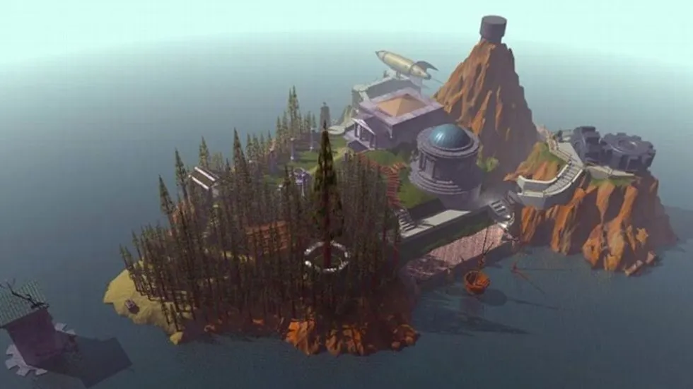
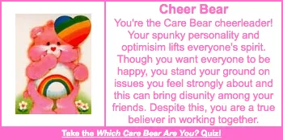
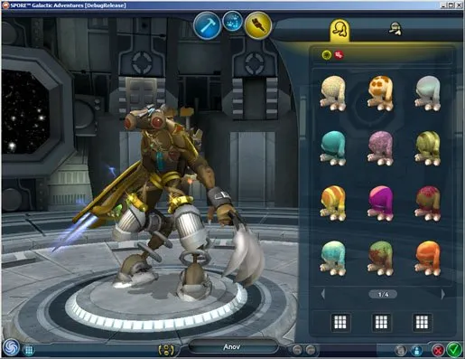
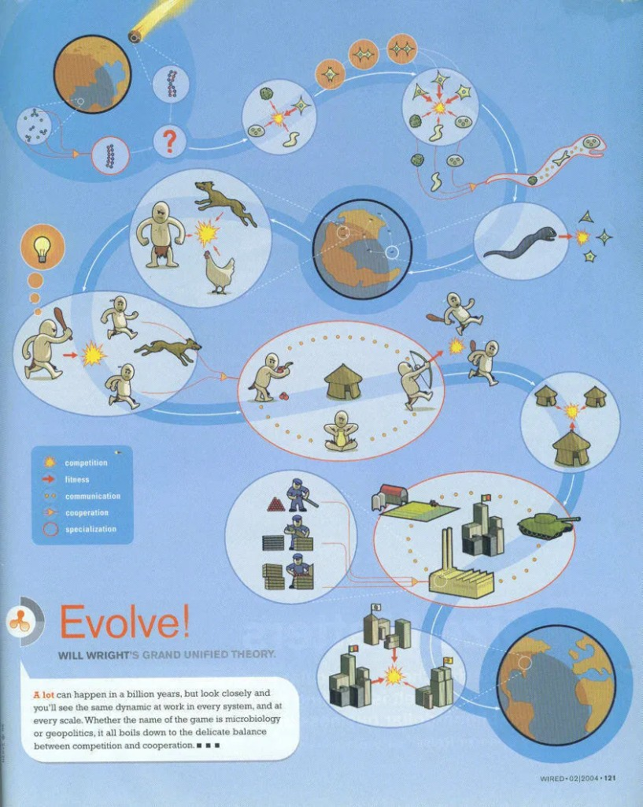

# The Future of Content — Will Wright's Spore Demo at GDC 3/11/2005

*By Don Hopkins · Apr 21, 2018 · [Medium](https://donhopkins.medium.com/the-future-of-content-will-wrights-spore-demo-at-gdc-3-11-2005-9eab0cedc583)*

Based on notes taken by Don Hopkins at the talk, and other discussions and review by Will Wright.

The title of the talk "The Future of Content" was purposefully vague, because Will wanted to show Spore in public for the first time, but he had to flat out lie about the title and send a fake set of slides for the EA executives to review, so they didn't know what he was about to do. A more accurate title for the talk would be "What I Learned About Content from The Sims, and Why it's Driven Me to Procedural Methods, and What I Now Plan to Do With Them".

**Audio:** [GDC Vault — The Future of Content](https://www.gdcvault.com/play/1019981)  
**Video (remaster):** [YouTube — ofA6YWVTURU](https://www.youtube.com/watch?v=ofA6YWVTURU)

---

## Introduction

Will Wright started his talk by saying that he wanted to show this to the game developer community first, before a commercial show like E3.

- Content growing disproportionately to game size.
- Player metrics can be useful.
- Quality / Value / Ownership.
- Ownership adds tremendous amount of value to player quality.
- Ownership translates into much more meaningful player stories.
- Player stories will always be more powerful than scripted stories told to the player.
- Algorithmic compression.

Games consist of a mix of code and data. Computers use code to compress data. The ratio of code to data has changed over time.

Games used to be mostly code and very little content, so compression was important.

**CD-ROM** is the medium that was the death knell for the algorithm.

**Myst** was a very elaborate and beautiful slide show, with a vast amount of data. It looked like they had a great time building this world. Building the world is a fun game in itself.

At the other end of the spectrum from CD-ROMs: **The Demo Scene**. Algorithmic compression of graphics and music.

- Make the editor a toy.
- Make portability of content transparent to the player. Game downloads content automatically, without requiring user to visit a web site or download it themselves.
- Most other evolution games don't make you feel like you own the creature.
- Pokemon, Neopets, Care Bears. Give kids a sense of ownership and mastery over the facts and details of the characters.
- Loved dinosaurs as a kid. Knew the rock-scissors-paper of different species of dinosaurs, which was something his mom didn't know. Mastery of facts.

**Which Care Bear are you?** Care bears started as greeting cards. Web app categorizes your personality. Each care bear has special abilities. Care bear cousins aren't even bears. Care bears live in "Care a Lot". If they fall out of the clouds, they land in the "Forest of Feelings" (Kingdom of Caring). Forest of Feelings is over the earth. So the Earth must be the **"Kingdom of people who don't give a shit"**.

Lead artist **Ocean Quigley** coined the term **"artist in a box"**.

Artwork style is somewhere between Pixar / Giger.

Player manipulates skeletal system, computer generates mesh, textures, animation, behavior. Player or NPC driven behavior. Creative amplification of players efforts. Computer functions as a creative amplifier of what the player has done. **5000:1** ratio from player model to generated content.

DeCompression of 1k source expands to 5 MB content.

Creative leverage, data based, low friction, generative systems.

Giving player leverage over creating their own content is also useful for dynamic content generation, because the computer can tweak the same knobs as players do, to generate dynamic procedural content.

**Genotype => phenotype.**

Player created creatures sent up to the server and categorized. Then content is pulled in from server to the world as needed, to maintain a balanced ecosystem.

Automatic categorization and feedback for player created content in buy mode.

Map player created content parametrically into buy mode based on player style, collecting feedback about how much they were bought, to improve how well they're categorized.

There's a rule that you don't mix genres. Always wanted to break that rule.

Homage to many different games at different levels:

| Level | Homage |
|-------|--------|
| Tidepool | Pac-Man |
| Evolution | Diablo |
| Tribal | Populous |
| City | SimCity |
| Civ | Risk/Civ |

20% of the best of those games. 40% of the game experience is really just aesthetic, appreciating the content.

A different editor associated with each level.

Puts the player in role of Lucas or Tolkien or Dr Seuss, as opposed to the characters. Story is a side effect or property of interesting experiences, not a prerequisite.

Filtering process. Emphasizes causality. Portability, communication. Compression, abstraction.

**Treasure Island:** Robert Lewis Stevenson drew a map of the island first, and wrote stories around that terrain.

---

## Spore Demo

### Tidepool

Start out as a unicellular organism swimming in a two-dimensional world. All content in this world is algorithmically generated.

One organism under your control, other organisms and objects are food and predators.

The player can click to move the organism around, and interact with objects and other organisms. Eat up particles of food. Run away from predators. Kind of like Pac-Man with fewer constraints. Eat enough food and you can lay an egg.

Click on the egg to go into the creature editor. Editor is a combination of Mr. Potato Head, Etch-a-Sketch and Clay.

Drag out parts and attach them to the organism's skeleton. Different types of parts for different functions. Mouth for eating, fronds for filtering, proboscis for sucking. Legs, fins, tails, flagella, jets and wigglers for transportation. Weapons and other kinds of limbs and attachments. Parts can have multiple functions and special abilities. Click on parts to reveal adjustment widgets, to change their size, stretch and bend them around.

### Ocean

Three dimensional animals swimming in an ocean, eating each other.

Skeletons that you can edit, twist and pull around, add legs, tails, and other limbs. Modes and efficiencies of transportation depend on physics of body configuration.

Remove the fins, drag some legs onto the skeleton, adjust the skeleton around so the tail is sticking way up into the air and hanging down over the head. Make it tripedal by adding one leg on the middle of the chest. Wide variety of walking animations, some clumsy and some efficient.

All walking animation is generated by the same script, according to the physics of the user created body.

Showed several different creatures, and made them walk around.

**Ugly buttface.** Huge fat head with high center of gravity and tiny tick-like legs, that takes corners leaning over like a **Ford Explorer**. Extremely multi-legged creature with several sub-legs on each of its four legs. **Carnivorous Care Bear**, most disturbing of all.

### Land

Walks the new triped with a long tail above its head out onto land.

The sea and land are alive with predators and prey.

Attack another small tiger-like animal. Kill it and take bites out of it, to eat and grow.

Combine the biting command with the walking command to pull the carcass across the ground.

Chased by a huge crab-spider-like predator. Evade death by running away faster than the other prey.

### Procedural Mating

Mating calls. Listen for answers. Approach a compatible mate (same type of body you just created) in a nest. Get a good response.

Procedural mating: Animals squawk and crawl over each other in all kinds of ways, then find something that works, and start humping.

Rewarded for mating by laying an egg.

Player rewarded for reproducing: the currency of the game. Go into edit mode to spend currency to buy features and edit the next generation. You have to start saving up for brains, which are expensive. Think of it as a college education fund.

### Village

Buy enough brains to make the animals smart enough to be sentient characters.

Game changes to be more like Populous.

Creatures live together in villages. Now you're in control of a whole group of characters, who act autonomously.

Buy housing for them, and objects. Upgrade house to get higher technologies.

Everybody loves monkeys with weapons. Planet of the Apes. Put down a weapon rack, with spears. Characters run over and grab spears with their tails, and start shaking them fiercely.

Put down a campfire. Characters run around campfire. Put down a drum. Characters start drumming with their long tails and singing.

Characters with spears start dancing around fire.

### City

Advance from villages to cities. Walled city. Stylistic architecture. Looks like **Jim Woodring** architecture. Each city has its own style. Player can create and edit buildings. Many different styles. Very easy to use editor. Drag and drop parts of buildings together. Characters react to architecture with behaviors, animations and sounds. Main feedback if you're doing well is how happy the characters are.

Game now like SimCity.

Visit another city nearby with a very different style. Architectural style is more like industrial star-wars tech. Different cultures. More aggressive.

Advance technology by upgrading City Hall.

You can start building transportation, once you've upgraded City Hall to that level.

### Civilization

Transportation. Tanks start driving out towards the first peaceful city.

Go back to peaceful city and build them Dr. Seuss airplanes to defend themselves.

Drag vehicle parts out and stick them together. Propellers, weapons, wheels, etc.

Sends new airplanes flying out from the first city.

Peaceful cowards fly away instead of attacking. Tanks arrive at peaceful city and start bombing the wall.

Game now like Civilization and Risk.

Pull out from the city view and the flat land curls up into a globe, and you can see a high level view of the cities. Now the game is like Civilization, with a network of transportation linking the cities.

### UFOs and Alien Abductions

At the top of the transportation chain is the ultimate technology: a UFO.

Buy a UFO. Swiss army knife. Very mobile, has all tools in game.

**Mutual of Omaha's Wild Kingdom.** Each episode they would go out and solve a problem in Nature. The solution to the problem almost always involved shooting a high power tranquilizer gun from a helicopter. That's great fun. Make a game out of it.

UFO is a content creation, collection and editing tool. Play the abduction game. Fly around sucking up content, on your own world, as well as from worlds made by other players. Abduct one of the creatures that was chasing us before, to get even. Perform genetic experiments on the life forms you pick up.

Put them back or relocate them to other worlds. Fly further out in the UFO.

### Solar System

Pull out even more to see the solar system. Planets represent little sandboxes for the player to experiment and learn the game.

Bootstrap up to life. Drop the creature we previously abducted onto the planet. **Explosive decompression!** Needs an atmosphere.

**Kid Pix.** Terraforming should feel like KidPix. Lots of different terraforming tools that you earn over time. Makes volcanos that slowly start to create an atmosphere.

Start building a colony before the world is completely terraformed.

Get a bubble over city, that looks like the culture's cities on the home planet. Bubble cities also work underwater to colonize home planet and water worlds. One of the most advanced, expensive terraforming tools is the **Genesis Device**. Creates the atmosphere and biosphere.

### Interstellar Drive

Eventually you earn interstellar drive. You can use the UFO to abduct creatures created by other players, and bring them back to create a stellar zoo.

Astronomy has always been presented as two dimensional. Hubble images aren't given context to size, frequency.

Black holes. Planetary nebula. Blue giants. Terrain to outer space.

**SETI tool.** Move mouse around outer space, hold cursor over star systems and listen to them. Usually hear static, but occasionally hear radio traffic in alien languages.

Overtly browsing other players worlds. Asynchronous multiplayer online game. Because the time scale changes as you zoom in and out in scale, it's not possible to play synchronously with other players. Instead, content created by other players at each scale migrates from game to game asynchronously.

### First Contact

Fly UFO over to star system with radio traffic. Play close encounters game to establish a language to communicate with.

Fight or communicate. Aliens start firing weapons at our UFO. Our close range weapons can't match theirs. So we back away from the planet, and fire a planet-buster missile and explode the whole planet.

There go our friends, and there goes my reputation as a non violent game developer.

### Meta Games

Meta games around different genres of science fiction.

Invasion (War of the Worlds). Adult supervision (Day the Earth Stood Still). Uplift (2001). First contact (Close Encounters).

Abduction cross breeding (X-Files). Diplomacy (Star Trek).

Most of the narrative will come into the game through the space game.

Broad variety of different worlds to visit.

Cross-pollination of content created by different players.

Going to another player's planet.

You can abduct creatures, and go back to populate zoo planet.

### T-shaped game

The base of the T is goal oriented gaming.

The player first goes through a tutorial and sandbox to learn editing tools and game play at each level.

Player can eventually surf down to the lower levels.

Goal oriented game trains you to use all the editors and teaches you the simulation dynamics at every level, from bottom to top.

Once you get to the top you can surf vertically down into the other games, that you've learned to use on the way up.

At the top of the T is a collection of science fiction story genres, that take place on top of all of the lower levels.

Once you make your way all the way up from unicellular life to intergalactic civilization, the storytelling begins.

Pull out to galactics level, 10's of thousands of worlds.

Like the movie **Powers of Ten**.

Always wanted to roll this into a game.

**SETI: Drake's equation:** N = R fs fp ne fl fi fc L.

Each term of the equation correspond to different power of scale.

> "Wright linked Drake's equation, which computes the probability of life occurring in the universe, with the long zoom of Eames' Powers of Ten film." — Chaim Gingold, *A Brief History of Spore*

**Will's Secret Diagram of Spore** published in February 2004 Wired. Wired asked for an illustration to print in the magazine, anything he wanted. So he made a diagram of Spore that Wired published, but he didn't tell them what it was. The design docs for Spore have been out in Wired Magazine for a year now.

**Bacteria to galactic god.** Replay complete history and future of life. Hard to come up with a catchy marketing line.

Hub that it revolves around is **compression**. Leverage gives generative systems to populate huge content libraries. Makes content portable. Build unbounded world.

Prototyping is essential to the development process.

The biggest bottleneck was Will's own imagination, to believe it was doable.

Advice: If you have a weird idea that's so outside of the box, don't forget it. You should go back and revisit your weird ideas later, because you can never know where they might lead to.

---

## Epilogue (Don's links)

- [A Brief History of Spore](https://www.levitylab.com/spore/sporehistory.html) — Chaim Gingold
- [Joystiq interviews Spore's Chaim Gingold and Chris Hecker](https://www.engadget.com/2006-11-16-joystiq-interviews-spores-chaim-gingold-and-chris-he.html)
- [SPORE's Magic Crayons](https://www.gdcvault.com/play/1019982) — Chaim Gingold, GDC

↑ [`README.md`](README.md) · [`summary.md`](summary.md) · [`short-form-clips.yml`](short-form-clips.yml)
