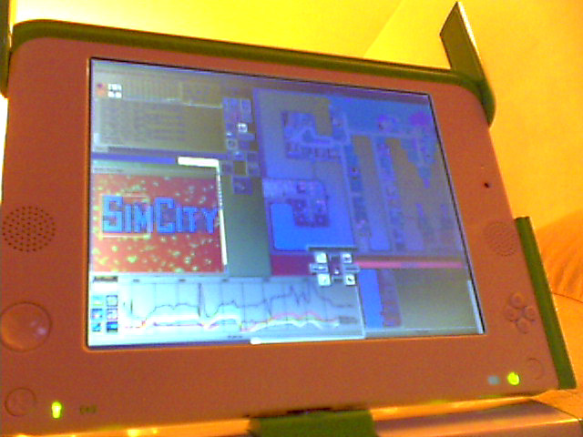
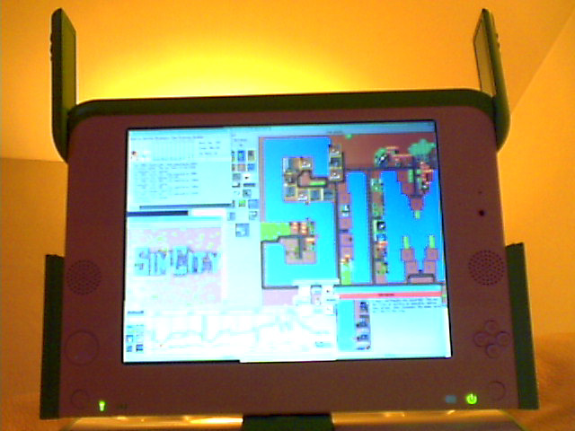
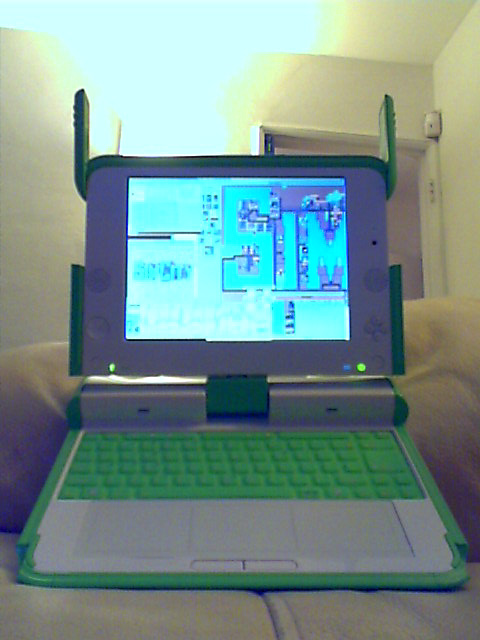
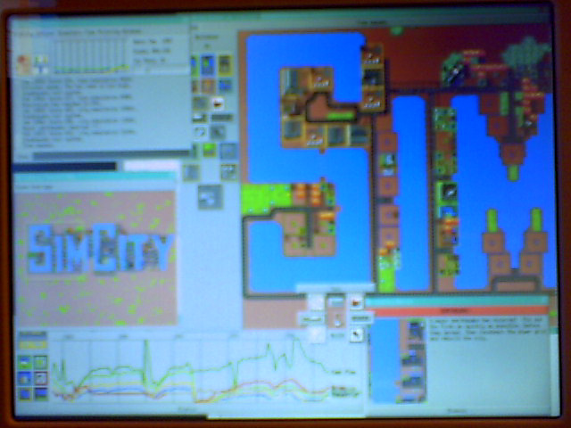
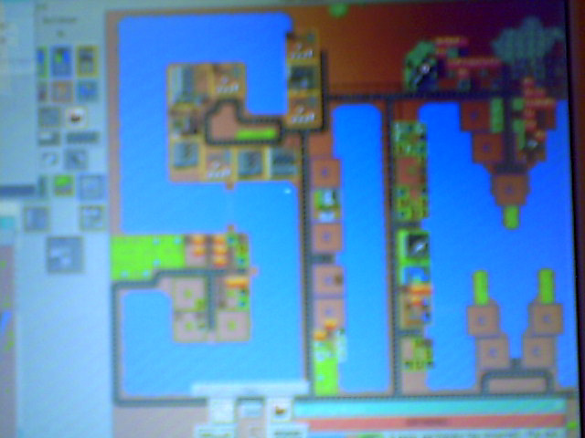

# 🎞️ SimCity on OLPC XO-1

> *"The screen looks really great up close."* — Don Hopkins, 29 Dec 2006

Five webcam photos from Don Hopkins's **29 December 2006** email ([`03-olpc-port-and-sugar-dec-2006.md`](../03-olpc-port-and-sugar-dec-2006.md)). SimCity Classic running on the **OLPC XO-1 B1** laptop, streamed over wireless from Fedora Core in VMware on Don's main machine.

**Scroll down** — each shot is a full-width slide with caption and context. Works on mobile GitHub and in any markdown viewer.

Machine-readable metadata: [`SLIDESHOW.yml`](SLIDESHOW.yml)

---

## 📍 Shot 1 — Tablet mode, network display

### *Multi-window Tcl/Tk over the wire*

**What you're seeing:** The XO in tablet configuration — screen folded flat, green antennas out. Classic multi-window SimCity UI: logo splash, city map, statistics graph. Not running locally yet; displayed from Don's VMware session.

**Technical notes:** Licensing key lock removed. Fonts patched for the OLPC X server. Don killed Sugar and ran plain **twm** to manage overlapping windows while debugging.

| Field | Value |
|-------|-------|
| Device | OLPC XO-1 B1 |
| Capture | ~29 Dec 2006, webcam |
| Rotation | Upright (no EXIF in original) |

---

## 📍 Shot 2 — SIM spelled in the map

### *Logo window + water typography*

**What you're seeing:** SimCity logo window beside a city map where land and water spell **SIM**. Memory statistics window visible. Warm indoor lighting on the XO bezel.

**Context:** Don's proof that the port was playable over the network — "quite playable over the net, even without shared-memory acceleration."

---

## 📍 Shot 3 — Full laptop, clamshell

### *Keyboard, trackpad, and the green machine*

**What you're seeing:** The whole XO-1 in normal laptop posture — green keyboard, white trackpad, screen up. SimCity UI on the display (the on-screen rotation reflects how Don was holding the device / XO screen modes).

**Context:** Walter Bender had shipped Don a B1 unit (DHL **19400248055**, arrived ~28 Dec). This is the hardware Don thanked the list for: *"It's very cute, and works well."*

---

## 📍 Shot 4 — Earthquake + SIMCITY letters

### *Disaster dialog and terrain art*

**What you're seeing:** Large **SIMCITY** letterforms built into the terrain. History/budget window, line graphs, tool palettes. An **EARTHQUAKE!** dialog open — Don noted you can still trigger the cellular-automata city melt via the Clipper disaster.

**Easter egg:** *"Although you can still trigger the cellular automata city melting effect by selecting Clipper from the disasters menu."*

---

## 📍 Shot 5 — Venice layout

### *Water channels and zoning tools*

**What you're seeing:** Gameplay close-up — blue water channels, roads, R/C/I zones, tool palette. Blurry webcam depth-of-field typical of LCD photos in 2006.

**Next steps (from same email):** Single-window rework for Sugar/Matchbox; Python/GTK/Cairo rewrite "in the longer term."

---

## 📊 Quick reference

| # | File | Highlight |
|---|------|-----------|
| 1 | `olpc-simcity-01.png` | Tablet mode, multi-window UI |
| 2 | `olpc-simcity-02.png` | SIM in map + logo |
| 3 | `olpc-simcity-03.png` | Full clamshell hardware |
| 4 | `olpc-simcity-04.png` | Terrain letters + earthquake |
| 5 | `olpc-simcity-05.png` | Canal city gameplay |

---

## 🔗 Related

- Email thread: [README](../README.md)
- Don's pitch: [don pitch letter 2006 12 02](../don-pitch-letter-2006-12-02.md)
- Saga hub: [simcity open source saga](../../simcity-open-source-saga/README.md)
- Released as **Micropolis**, Jan 2008

---

*"In the longer term I would like to ditch the ancient TCL/Tk stuff and rewrite the user interface and scripting engine using Python, GTK and Cairo."*

🟢💻
