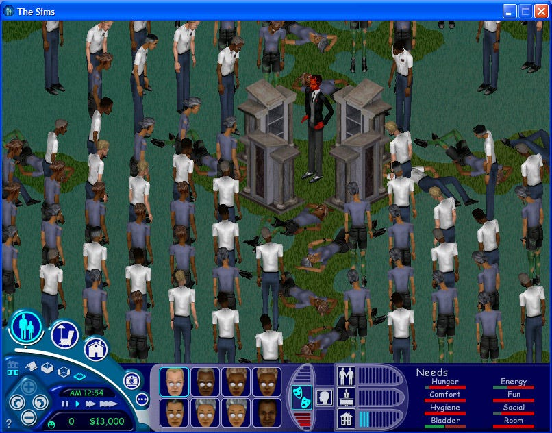

# The Sims 1 Crowd Sitter

*By Don Hopkins · 5 min read · 2018-04-23*
*Source: <https://donhopkins.medium.com/the-sims-1-crowd-sitter-1f478b645148>*
*Illustrated — 10 images in [`images/`](../README.md) (browse `images/`).*

---

It turns out you can get a whole lot of The Sims 1 characters on the screen at once! But then you need some crowd control and coordination.

Here’s an object that I’m developing for The Sims 1 as part of the Simprov wedding playset, and some screen shots of what it does.

This is the new “Crowd Sitter” object for The Sims 1. Donna and I came up with an idea for an icon to represent this magical crowd control object, which will only be visible in build mode. But for now it looks like an altar.

I named it “Crowd Sitter”, like “baby sitter” but it’s for all ages and lots of people at once, and it can also make them stand. It’s an essential tool for orchestrating weddings, but it’s useful for other purposes like parties and concerts and boxing matches.

When in play mode, you can turn a Crowd Sitter on and off with a pie menu, and it directs all people to sit down in front of it, or stand up facing it if there aren’t any seats left. It has an effective radius of about 7 tiles (more now), with a quarter pie slice shaped footprint. You can strategically deploy as many sitters as you need, to cover all the seats you want people to sit in or areas you want them to stand (like rows of pews in a church or a circle of benches in a stadium). I made a special routing slot that has a maximum size 54 tile footprint (more now), based on the TV set’s routing slot, but on steroids.

I stress tested it by making four of these Crowd Sitter objects, and facing them in different directions, to make people gather around the center in a circular crowd.

Then I made at least 8 * 20 = 160 people (Sim clones), and turned on all the sitters at once facing outwards, to make them all gather around the center! But of course if there are no seats to sit in, the poor people have to stand.

In the following scene, I’m cheating by using the faith based initiative “placebo field”, which is a special effect built into the altar, that supernaturally makes everybody always happy, fills their tummies, drains their bladders, keeps them clean, etc, so they’re willing to stand around tirelessly without complaining, for as long as I tell them to, and not questioning anything they’re told.

But what happens when we deprive all these people of the placebo field? Let’s find out! Now I’ll turn off the placebo field and make them stand around for a long time.

Now it’s night, and everyone has fallen asleep on the floor or standing in their own blue urine.

Now that so many people are unhappy, Satan arrives!

There’s a bumper crop of lost souls to harvest!

I’ve been playing around with crowd control, and I increased the range of the people magnets and added more routing slot options (sitting, standing, sitting or standing)! This is much more fun now! Kinda like magnets and iron filings! The fan of my laptop turns on and whines since it takes so long to draw each frame and the cpu starts sweating, and it gets sluggish, but it still works perfectly! Just wait for the evil hedge mazes…
