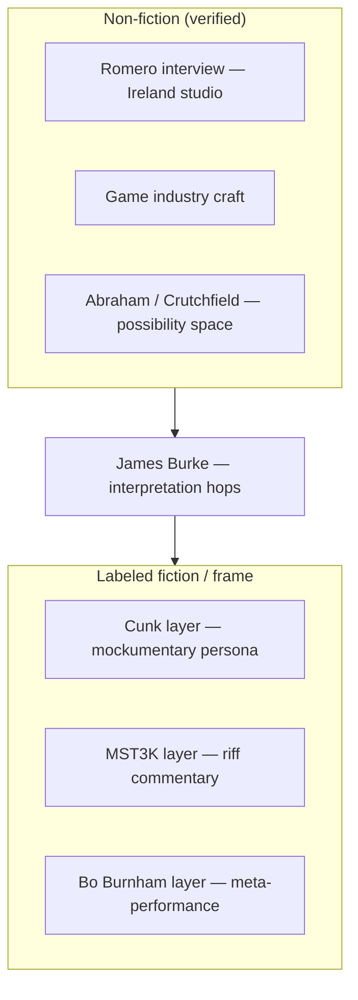

# Will conversation notes — 2026-07-09

> Raw notes from talking to Will. Research hooks and format DNA — not quotes from Will unless
> later verified. [Portrayal standards](../../../schemas/portrayal-standards.md)

**Context:** Don is recording something now; Will pointed at **next gen after what you're
recording** — who to talk to, what formats to steal, and how to keep **fiction distinct from
non-fiction**.

---

## Action: talk to John Romero

|                   |                                                                                                                                                                |
| ----------------- | -------------------------------------------------------------------------------------------------------------------------------------------------------------- |
| **Who**           | John Romero + wife **Brenda Romero** (Romero Games)                                                                                                            |
| **What**          | Interviewing the **game industry** — creative process, reinvention, studio life                                                                                |
| **Where**         | **Ireland** — Galway base (~10 years ago per Will; couple relocated west coast Ireland)                                                                        |
| **Fresh**         | BBC *The Romeros: Developing digital games* — **23 Mar 2026**, **27 min**, Kurt Brookes, Galway studio                                                         |
| **Listen**        | [BBC Audio](https://www.bbc.com/audio/play/p0n7xpn6) · programme `p0n7xpn6`                                                                                    |
| **Source bundle** | [`characters/john-romero/sources/bbc-2026-03-romeros-developing-digital-games/`](../../john-romero/sources/bbc-2026-03-romeros-developing-digital-games/)      |
| **Also**          | Theresa Loong *Game On* (Brenda); *In the Studio* rebroadcast 24 Mar 2026 (`w3ct6vvx`)                                                                         |
| **Repo Show**     | [`characters/john-romero/`](../../john-romero/README.md) · [`repo-shows/john-romero/`](../../../repo-shows/john-romero/README.md) — invitation `not_yet_asked` |

Links:

- [https://www.bbc.com/audio/play/p0n7xpn6](https://www.bbc.com/audio/play/p0n7xpn6)
- [https://www.bbc.co.uk/sounds/play/p0n7xpn6](https://www.bbc.co.uk/sounds/play/p0n7xpn6)
- [https://www.kickstarter.com/projects/theresaloong/game-on-brenda-romero-documentary](https://www.kickstarter.com/projects/theresaloong/game-on-brenda-romero-documentary)

---

## Era anchor: mid-80s MIT (and Berkeley orbit)

Will clustered several names around **mid-1980s MIT** + Bay Area complexity scene — **phase space**
and **range of possibility** as design vocabulary (SimCity / toys / emergence rhyme).

### Ralph Abraham

|              |                                                                                                                         |
| ------------ | ----------------------------------------------------------------------------------------------------------------------- |
| **Who**      | Mathematician — nonlinear dynamics, chaos, **geometry of phase space**                                                  |
| **Key work** | *Dynamics: The Geometry of Behavior* (with Christopher Shaw); Visual Mathematics Project                                |
| **Tie-in**   | **Range of possibility** — state space as the map of what a system *could* do; Will's possibility-space design language |

- [https://csc.ucdavis.edu/Crutchfield.html](https://csc.ucdavis.edu/Crutchfield.html) (peer orbit)
- Abraham & Shaw, *Dynamics* (phase space pedagogy)

**Update (2026-07-10):** Ralph Abraham **died 19 September 2024** (Santa Cruz, age 88). Memorial
room created: [`characters/ralph-abraham/`](../../ralph-abraham/memorial.md) — Jim Crutchfield
carries a memorial segment on [his show](../../../repo-shows/jim-crutchfield/README.md); the
Abraham 1976 → Crutchfield 1984 video-feedback handoff is documented in
[`abraham-video-feedback-lineage.md`](../../jim-crutchfield/abraham-video-feedback-lineage.md).

### James P. Crutchfield

|              |                                                                                                          |
| ------------ | -------------------------------------------------------------------------------------------------------- |
| **Who**      | Distinguished Professor, UC Davis; Complexity Sciences Center; SFI                                       |
| **Era**      | PhD UCSC 1983; **Berkeley postdoc / research physicist 1983–1997** (overlaps mid-80s)                    |
| **Key work** | **Computational mechanics** — patterns, information in dynamical systems; chaos + phase transitions      |
| **Tie-in**   | Structure in possibility space; "how nature computes" — emergence hooks for Repo Show / CA / microworlds |

- [https://physics.ucdavis.edu/people/faculty/james-crutchfield](https://physics.ucdavis.edu/people/faculty/james-crutchfield)
- [https://www.santafe.edu/people/profile/james-p-crutchfield](https://www.santafe.edu/people/profile/james-p-crutchfield)

---

## Mike Winter — weird video series

|              |                                                                                                               |
| ------------ | ------------------------------------------------------------------------------------------------------------- |
| **Who**      | Independent creator — **robotmikew.com** ("Tomorrow's Fun")                                                   |
| **What**     | Eclectic **weird video series** — animation, rockets, gadgets, protests                                       |
| **Berkeley** | Site section: **"Treasure Hunt in Berkeley"** (and "next") — literal "searching for gold in Berkeley" thread? |
| **Status**   | Verify which series Will meant; may be personal web archive not broadcast TV                                  |

- [http://www.robotmikew.com/](http://www.robotmikew.com/)

---

## Bo Burnham video

Likely reference: **meta-performance** about performing — *Inside* (2021), *Make Happy* (2016),
or *Eighth Grade* (2018). Rhymes with:

- performer alone in a box (lockdown = studio)
- distinguishing **show** from **person**
- comedy as infrastructure critique

Watch list for format study — confirm which clip Will had in mind.

---

## Format stack Will is pointing at

**Core mandate:** **Make distinctive between fiction and non-fiction.**

| Layer                   | Reference                                           | What it contributes                                                                |
| ----------------------- | --------------------------------------------------- | ---------------------------------------------------------------------------------- |
| **Non-fiction base**    | Romero interview, game-industry doc, Attenborough   | Real people, real craft, verifiable                                                |
| **Interpretation**      | **James Burke** *Connections*                       | Adds *his* interpretation — linked hops, "you thought these were unrelated"        |
| **Mockumentary**        | **Philomena Cunk** (Diane Morgan / Charlie Brooker) | Looks like BBC history/nature doc; **fiction presenter**, **real experts** deadpan |
| **Nature-doc template** | **Life on Earth** (Attenborough 1979)               | Gold standard non-fiction; Cunk's *Cunk on Earth* (2022) parodies this shape       |
| **Riff track**          | **Mystery Science Theater 3000**                    | Commentary layer on top of footage — silhouettes, jokes *about* the text           |
| **Meta-comedy**         | **Bo Burnham**                                      | Performance about performance; audience awareness of frame                         |

### Philomena Cunk (looked up)

- Character: **Philomena Cunk** — played by **Diane Morgan**, written by **Charlie Brooker**
- *Cunk on Britain* (2018, BBC) — mockumentary British history; absurd questions to real historians
- *Cunk on Earth* (2022, Netflix) — same shape, global history; parodies Attenborough-style epic scope
- *Cunk on Shakespeare*, *Cunk and Other Humans* — earlier specials
- **Repo Show lesson:** the *surface* mimics serious documentary; **must label fiction presenter**
per [portrayal standards](../../../schemas/portrayal-standards.md) and MOOLLM
[representation-ethics](https://github.com/SimHacker/moollm/tree/main/skills/representation-ethics)

Links:

- [https://en.wikipedia.org/wiki/Cunk_on_Britain](https://en.wikipedia.org/wiki/Cunk_on_Britain)
- [https://en.wikipedia.org/wiki/Cunk_on_Earth](https://en.wikipedia.org/wiki/Cunk_on_Earth)

### Don addendum — Jiminy Glick + Bounce/MST3K (2026-07-10)

**Jiminy Glick** (Martin Short) — Don is a HUGE fan. Same DNA as Cunk: **fiction interviewer**,
real guests, surface looks like a serious talk show, persona is absurd. Cunk = BBC history doc;
Glick = Hollywood chat show. Both require **labeled fiction presenter**.

**MST3K riff track → Bounce (Don + David Levitt, Interval).** Will's MST3K layer is not aspirational
for Don — it's **what they already built**:

| Piece | What |
|-------|------|
| **Live TV** | Real broadcast underneath |
| **Closed-caption track** | Synchronized real-time caption feed drives character state |
| **Commentary bots** | **Jesse Jackson** + **Rush Limbaugh** + **house fly** puppets arguing about the show |
| **Character sim** | JSON-like config — brains, DNA, memories, dialog trees, state machines |
| **Amplitude scrub** | Play any audio clip with any gesture — ancestor of Faceball Construction Set |

Sources in repo:
- [`characters/don-hopkins/interval-research-pluggers-and-mediaflow.md`](../../don-hopkins/interval-research-pluggers-and-mediaflow.md) — "Interval swan song with David Levitt"
- [`characters/don-hopkins/body-electric-bounce-vr-stack.md`](../../don-hopkins/body-electric-bounce-vr-stack.md)
- [`repo-shows/rebounce/`](../../../repo-shows/rebounce/README.md) — David Levitt invited 2026-07-06

**MOOLLM mythology** — `moollm/temp/lloooomm/` (gitignored; **grep/indexable**). Dig when David Levitt is on:

| Room | Path | What |
|------|------|------|
| **Truth Fly** 🪰 | `00-Characters/truth-fly/truth-fly.yml` | Born in Bounce at Interval — interactive cursor for Rush+Jesse MST3K TV sim; lands on heads to "click" closed-caption triggers; pre-LLM, pre-speech-rec |
| **Bounce** | `00-Characters/bounce/bounce.yml` | `rush_jesse_simulation` — housefly moderates, captions flow as data streams, opposition → harmony |
| **David Levitt** | `00-Characters/david-levitt/david-levitt.yml` | Co-created Rush/Jesse sim; housefly lands on faces while they argue over closed captions |
| **Rush / Jesse** | `00-Characters/rush-limbaugh/`, `jesse-jackson/` | Fiction portrayals; Bounce housefly makes them gesture; *Great Transformation* arc |
| **Great Transformation** | `03-Resources/stories/the-great-transformation-rush-and-jesse.md` | McLuhan studio: Rush+Jesse watch Mr Rogers; Bounce visualizes emotional frequencies; Truth Fly overhead |
| **Cynthia transcript** | `03-Resources/videos/lloooomm-cynthia-solomon-transcript.md` ~42:14 | Don on Rush/Jesse evolution: **comment out old beliefs, don't delete** — journal trajectory |
| **MST3K mode** | `skills/adventure/MOOST-MULTIPLAYER.md` | Timestamped video commentary track (Ada II) |
| **Jiminy Glick** | `examples/adventure-4/characters/fictional/donna-toadstool/` | Persona workshop |

**Truth Fly origin** (from `truth-fly.yml`): Don + David coded it in Bounce as cursor for the TV-commentary sim. Years later: Mike Pence VP debate 2020 (2 min), Trump 2024 — "digital-to-reality migration." LLOOOOMM fiction; Interval demo is real per `interval-research-pluggers-and-mediaflow.md`.

Show beat: Will names Cunk + MST3K as format references → Don reveals Bounce *was* MST3K with
closed captions and political puppets, **years before** Repo Show format stack was named → David Levitt
excavates `lloooomm` mythology on **Rebounce**.

### James Burke (already in MOOLLM)

Burke narration layer already prototyped in moollm `k-line-connections.md` session — **adds
interpretation** without replacing source truth. Distinct from Cunk (ignorant persona) and MST3K
(joke riff).

---

## Synthesis for Repo Show

**Next gen after current recording:** Romero line + format stack above — not replacing Will
premiere, **extending** the documentary genome.

---

## Open questions (verify with Will)

1. **Ralf Abrams** — confirm **Ralph Abraham** vs another MIT name?
2. **Mike Winter** — which specific video series / Berkeley treasure hunt?
3. **Bo Burnham** — which special?
4. **Mid-80s MIT** — single event Will attended, or thematic cluster?
5. **Life on Earth** — Attenborough original, or Cunk parody, or both as template pair?

---

## See also

- [Note to Will — Tiger Mountain tour](../../doug-hilsinger/note-to-will-tiger-mountain-tour.md) — Don's dated proof that the format predates this conversation (written June 29; the iLoci moment again)
- [ideas.md](../ideas.md) — conversation hooks menu
- [sessions/README.md](../sessions/README.md) — Connections-style narrative arcs
- [videos.yml](../videos.yml) — long-form Burke-style excerpts
- [moollm k-line-connections](https://github.com/SimHacker/moollm/blob/main/examples/adventure-4/characters/real-people/don-hopkins/sessions/k-line-connections.md) — Burke + Will in pub

