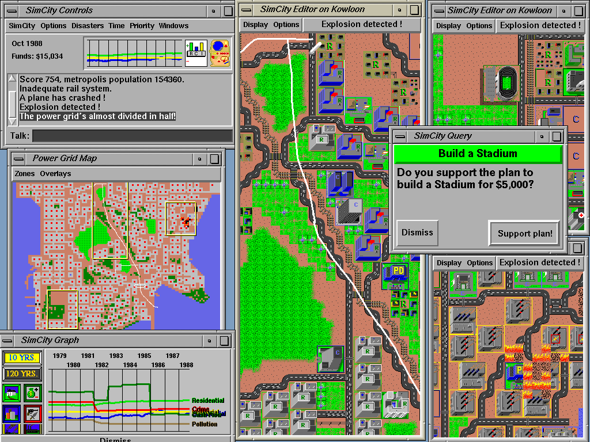

# art.net SimCity archive (Don Hopkins)

Republish of Don's classic [SimCity Info](http://www.art.net/~hopkins/Don/simcity/) hub — Unix/X11/HyperLook ports, SimCityNet multiplayer, manuals, demo transcripts, and screenshots.

**Original:** http://www.art.net/~hopkins/Don/simcity/

## Screenshots

| File | What |
|------|------|
| [`yokohama-x11-disasters.png`](images/yokohama-x11-disasters.png) | X11 — Yokohama, monster + tornado, node-key notice |
| [`kowloon-stadium-vote-talk.png`](images/kowloon-stadium-vote-talk.png) | Talk box + stadium vote dialog |
| [`kowloon-chalk-annotation-pie.png`](images/kowloon-chalk-annotation-pie.png) | Chalk overlays + pie/tool menu + TCL/Tk About |
| [`map-overlays-and-graphs.png`](images/map-overlays-and-graphs.png) | Six map overlays + history graphs |
| [`SimCity-Indigo.gif`](images/SimCity-Indigo.gif) · [`NCD`](images/SimCity-NCD.gif) · [`Sun`](images/SimCity-Sun.gif) | Classic three-display multiplayer set |
| [`SimCity-For-X11.gif`](images/SimCity-For-X11.gif) · [`HyperLook-SimCity.gif`](images/HyperLook-SimCity.gif) | X11 + HyperLook/NeWS |

Captions: [`images/README.md`](images/README.md)

## Essays & product pages

| Piece | In-repo | art.net |
|-------|---------|---------|
| Designing User Interfaces to Simulation Games (Will @ Winograd, Don's notes) | [`designing-ui-to-simulation-games.md`](designing-ui-to-simulation-games.md) | [WillWright.html](http://www.art.net/~hopkins/Don/simcity/WillWright.html) |
| UnixWorld Apr 1993 — "Bedlam in Simcity" | [`unixworld-bedlam-in-simcity.md`](unixworld-bedlam-in-simcity.md) | [simcity-review.html](http://www.art.net/~hopkins/Don/simcity/simcity-review.html) |
| Multi Player SimCity for X11 announcement | [`multiplayer-x11-announcement.md`](multiplayer-x11-announcement.md) | [simcity-announcement.html](http://www.art.net/~hopkins/Don/simcity/simcity-announcement.html) |
| SimCityNet InterCHI'93 proposal | [1993 interchi simcitynet proposal](../1993-interchi-simcitynet-proposal/README.md) | [simcitynet.html](http://www.art.net/~hopkins/Don/simcity/simcitynet.html) |

Related later essay (Winograd 1996 talk + Dollhouse video): [1996 04 26 winograd interfacing to microworlds](../1996-04-26-winograd-interfacing-to-microworlds/README.md)

## Video transcripts

| Transcript | In-repo |
|------------|---------|
| Toronto Usenix keynote (in absentia) | [`keynote-toronto-usenix.md`](keynote-toronto-usenix.md) |
| X11 SimCity demo | [`x11-demo-transcript.md`](x11-demo-transcript.md) |
| HyperLook SimCity demo | [`hyperlook-demo-transcript.md`](hyperlook-demo-transcript.md) |

Live capture (later): [Multi Player SimCityNet for X11 on Linux](https://www.youtube.com/watch?v=_fVl4dGwUrA)

## Manual (DUX / HyperLook Unix edition)

[`manual/`](manual/README.md) — introduction, tutorial, user reference, inside the simulator, city-planning history (Cliff Ellis), bibliography, refcard, credits.

## Adjacent tour pages

| Piece | In-repo |
|-------|---------|
| Electric Carnival @ Lollapalooza '94 (SimCity Without Walls) | [`electric-carnival.md`](electric-carnival.md) |
| Bounce (Midi Zoo / Levitt) | [`bounce.md`](bounce.md) |

## External (not mirrored)

- [SimCity in 10 Minutes / AgentSheets](http://www.cs.colorado.edu/~corrina/simcity) (Colorado)
- Gottfried Mayer-Kress multiplayer page (historical UIUC link — often dead; see Wayback)
- Historical FTP (primary sales channel): `ftp://ftp.uu.net/vendor/dux/SimCity` — UUNET public tree, Rick Adams; unlock by phone. See [multiplayer simcity ui network · article · simcitynet  what shipped](../multiplayer-simcity-ui-network/article.md#simcitynet--what-shipped)

## Through-line

[multiplayer simcity ui network](../multiplayer-simcity-ui-network/README.md) · [simcity lineage](../../../don-hopkins/career/simcity-lineage.yml) · [2004 02 07 educational multiplayer simcity linux](../2004-02-07-educational-multiplayer-simcity-linux/README.md)

---

↑ [sources](../README.md) · [show](../../../../repo-shows/will-wright-premiere/README.md) · [portrayal](../../README.md)
