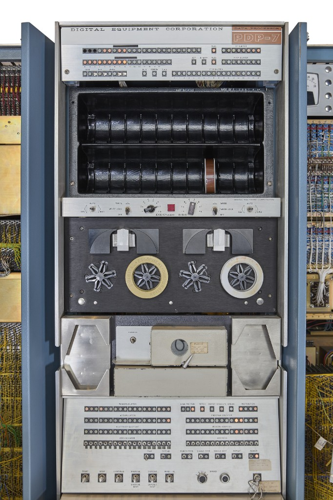

# @wwsff/cabinet

An **emulator**: a stand-in for a cabinet, so the original program can run.
Not a simulator. Not SIMH. PDP-7 is the first plug-in instruction set,
for PIXIE — Type 340 on a canvas, light pen as a hit-test.

```ts
import { Cabinet, Pdp7, Type340, LightPen } from "@wwsff/cabinet";

const cpu = new Pdp7({ coreWords: 8192 });
const pen = new LightPen({ aperture: 12, name: "pointer" });
const crt = new Type340({
	fetch: (a) => cpu.read(a),
	store: (a, w) => cpu.write(a, w),
	pens: [pen],
});
const box = new Cabinet({ cpu, devices: [crt] });
box.step();
```

## Simulation vs emulation

**Emulation** reproduces the *interface* of a machine so software written
for the iron runs. The test is: does Heinz's listing behave. The guest
does not care that the accumulator is a JavaScript number.

**Simulation** models a *process* at a chosen fidelity. Weather, traffic,
phosphor decay. It can be looser or more physical than the original
program ever saw.

SIMH calls itself a simulator because that was DEC/academic English in
the 1990s — *SIMulator for Historical computers*, Bob Supnik. What it
mostly *does* is emulate instruction sets so historic binaries run. We
keep the useful distinction: this package emulates cabinets; a P7
afterglow on the canvas would be a simulation *inside* the emulator.
We do not use "sim" in the name. SIMH already owns that word, and in
this shop it also means SimCity.

## Why cabinet

DEC sold instruction sets in cabinets. Plug in a device, its IOTs start
existing; unplug it, they become no-ops. That *is* the extension point.
A later ISA is another cabinet on the same backplane, not a fork.

Runners-up we did not pick: *backplane* (the wiring, not the thing on
the floor), *afterglow* (the tube, not the CPU), *understudy* (Repo Show
cute, opaque on npm).

## The iron has a face



The two DECtape 555 reels are eyes; the console's bit rows are the
mouth; the maintenance panel's lights are the brow. This one is
[serial no. 113](https://onlineonly.christies.com/s/firsts-history-computing-paul-g-allen-collection/pdp-7a-minicomputer-117/230055) —
five decades counting isotopes at the University of Oregon's nuclear
accelerator lab before landing in the Allen collection. Provenance in
[reference/iron/SOURCES.yml](reference/iron/SOURCES.yml). The web bench
keeps the face: the bezel is a portrait of a machine that looks back,
not a rack drawing. The full 3D build plan — live duty-cycle lamps,
phosphor on curved glass, and sim-Heinz whose pen tip *is* the light
pen input — is [PORTRAIT.md](PORTRAIT.md).

## The corpus rule, and Minsky's receipt

This cabinet implements only what its corpus executes — PIXIE's listing
decides which instructions exist, and an unknown IOT no-ops. The founding
case of that method is one shelf over:
[tiny-teco](../tiny-teco/README.md) runs Minsky's 1981 TECO Universal
Turing Machine, where the corpus is a single program *chosen universal*,
so the emulator was provably complete after its first entry. No such
theorem covers a PDP-7 — SYMELEC can always demand one more instruction —
but the bet is the same: the corpus, not the databook, is the
specification. The databook is the oracle for what the corpus means.

## What we lift from SIMH, and thank

Full inventory and mapping: [SIMH-MAP.md](SIMH-MAP.md).
Browser precedents and API decisions: [WEB-BENCH.md](WEB-BENCH.md).

[Open SIMH](https://github.com/open-simh/simh) is the reference bench.
Bob Supnik built the 18-bit family. Lars Brinkhoff wrote the Type 340
glue (`PDP18B/pdp18b_dpy.c`). Philip Budne and Douglas Gwyn wrote the
XY display core (`display/`) — pen-on-beam as a hit against the last
intensified point. We steal those ideas on purpose.

One act of recovery deserves its own paragraph. The Type 342 character
generator's letterforms survive nowhere on paper — so **Lars Brinkhoff
recovered the glyph shapes from MIT AI Lab film footage**, frame by
frame, filling the gaps from the Knight TV font. The `chars[]` table in
SIMH's `display/type340.c` is annotated per glyph: `Source: AI film
75`, `Source: AI film 104`, `Source: Knight TV`. That table is the only
existing answer to "what did a 342's lowercase `g` look like," and it
was read off celluloid. When PIXIE draws text (it uses the 342), our
character stroke tables descend from that archaeology — the same
method this repo runs on OCR'd listings and 1969 films, done first and
done heroically.

We shed the rest: SDL / X11 / Win32 / Carbon backends, remote telnet
console, one tree for fifty architectures, pthreads, `dlopen`, every
DEC option PIXIE never had. Graphic-2 is the wrong tube. Unknown IOT
= no-op, as SIMH's `stop_inst = 0` already does — that one we keep.

When a stepped instruction disagrees, SIMH is right until a DEC manual
says otherwise.

## Extension points (do not grow them until a plugin needs them)

| Knob | Now | Later |
|------|-----|-------|
| `wordBits` | 18 | another CPU plugin sets its own |
| `coreWords` | 8192 | 16384 if the floor machine had it |
| `unknownIot` | `noop` | never "trap" unless a diagnostic says so |
| `Device.iot` | claimed select codes only | Titan link is a device, not a new bus |
| `Type340.segments` | the picture | canvas / WebGPU / dump consume this |
| `LightPen` | hit-test aperture | Type 370 IOTs when PIXIE points |
| `TitanPort` | in-process `BlockletHost` | same five calls behind a WebSocket |

A plugin must not mention another plugin's architecture. The CPU
issues `{ device, pulse, ac }`. The 340 returns segments. The pen
reads segments and a pointer. tiny-titan claims devs 22–23 and talks
to a `TitanPort`. That is the whole backplane.

## What this is not yet

The full PDP-7 card, 340 DMA, Wiseman's link beyond the stub, the
browser bench itself. What *is* met, each with an acceptance test:
**Rung 1** — SYMELEC boots, deposits `JMP INT` at 1, turns interrupts
on, issues `IDLA` (the catch was the 1972 assembler's literal pool,
listing pages 105–106, absent from the `.oct`;
`scripts/extract-literals.mjs` derives `symelec-literals.oct`).
**Rung 2** — the 340 executes SYMELEC's own boot display file: mode
machine, 347 subroutines, 342 characters from Lars's glyphs, segments
with provenance, SVG/YAML export
([snapshots/symelec-boot.svg](snapshots/symelec-boot.svg)).
**Rung 3** — the 1972 tracking loop tracks a virtual pen: acquire,
drag, and lose the cross, with `TRCR`/`POSCR` patching core
([TRACKING.md](TRACKING.md)).
**Rung 4** — type `TITAN` on the teletype and SYMELEC phones
[tiny-titan](src/plugins/tiny-titan.ts): headers, checksum, `PXID`
first word on the wire, its own ring file streamed and recorded
(the command language and the transport-agnostic `TitanPort` seam are
in [DESIGN.md](DESIGN.md#tiny-titan)). Next rung: draw with the
lightbuttons; serve a structure *back* over the link. SIMH stays on
the desk as the oracle.

↑ [packages](../README.md)
