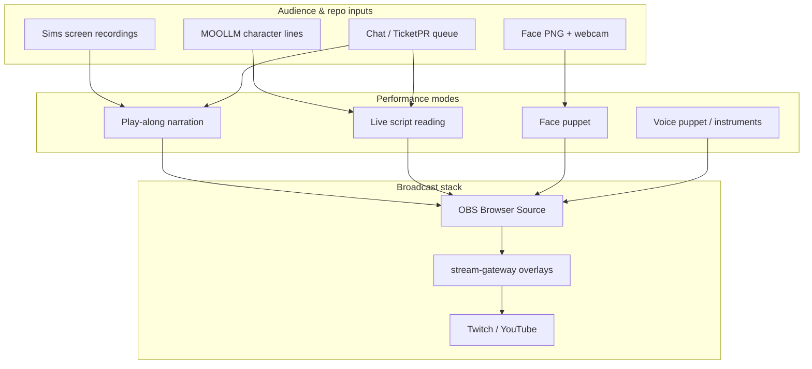

# Performance Space — design document

*Sniff:* [`GLANCE.yml`](GLANCE.yml) · [`CARD.yml`](CARD.yml) · *Girder:* [`../performance-space.yml`](../performance-space.yml)

**One performance space** for the Repo Show and its web toys: mute Sims footage with improvised
voice-over, live table-reads of generated character lines, Conan-style face-hole puppetry, vocal-tract
instruments, and audience participation over Twitch chat / OBS / webcam. Human voices only — no clones.

---

## The convergence

Several lineages that look different on paper are the **same bit**:

| Thread | What happens | Prompt |
|--------|----------------|--------|
| **Foreign Poet on tape** | Kearin & Lawlor narrate over early *Sims* | Game UI + motives |
| **Drew Carey in *The Sims*** | TV segment built in-game; guest riffs | Maxis scene or fan recording |
| **Script reading** | Performers voice MOOLLM character lines | Generated text |
| **Conan face-hole** | Photo with mouth cut out; lips behind it | Celebrity / character face PNG |
| **Amplitude puppet** | Video scrubbed by mic level | Short character clip |

Shared rule from Simlish's birth: **icons carry meaning; the voice carries feeling.** Thought
bubbles and plumbobs are icons. A script is an icon. A face with a hole in it is an icon. The
performer supplies emotion, emphasis, and lies.

---

## Primary sources & examples (link here first)

### Simlish origins — Kearin & Lawlor ad-lib

The literal ancestor of play-along narration: voice actors improvising **English** over an early
*Sims* build while thought bubbles, kitchen fires, and motive meters prompt the riff.

| Asset | Link |
|-------|------|
| Source bundle | [`characters/will-wright/sources/steve-and-gerri-simlish-adlib/`](../../characters/will-wright/sources/steve-and-gerri-simlish-adlib/README.md) |
| Audio | [`characters/will-wright/media/steve-and-gerri-simlish-adlib.wav`](../../characters/will-wright/media/steve-and-gerri-simlish-adlib.wav) |
| Transcript (draft) | [`TRANSCRIPT-DRAFT.md`](../../characters/will-wright/sources/steve-and-gerri-simlish-adlib/TRANSCRIPT-DRAFT.md) |
| Simlish schema | [`schemas/language-simlish.yml`](../../schemas/language-simlish.yml) `#origins` |
| HN citation | [Don Hopkins — NaturalSpeech thread](https://news.ycombinator.com/item?id=31430802) |

### Drew Carey — Sims on network TV

Maxis built a scene for *The Drew Carey Show*; the bit also ran as live-action parody (speech
bubbles, "blah blah blah"). *House Party* later shipped the limo cameo to every player.

| Clip | YouTube |
|------|---------|
| Gameplay segment (Maxis-built) | https://www.youtube.com/watch?v=5wr04-WmWkg |
| S6E01 Sims parody cold open | https://www.youtube.com/watch?v=X6wQxEWkh6U |
| House Party Drew limo cameo | https://www.youtube.com/watch?v=Stgk80dcnH8 |

- Format spec: [`process/sims-play-along-narration.yml`](../sims-play-along-narration.yml)
- Drew show seed: [`repo-shows/drew-carey/SHOW.yml`](../../repo-shows/drew-carey/SHOW.yml)
- Reference still: [`sims-people-and-events-drew-carey-house-party-crowd-fraps.png`](../../characters/will-wright/media/sims-people-and-events-drew-carey-house-party-crowd-fraps.png)

### Conan — face-hole puppet (homage)

Late-night tradition: a **still photo of a face with the mouth cut out**; the performer's real
mouth shows through while they do the voice (Arnold, etc.). We call this **`conan-face-puppet`**
in the repo — affectionate homage, not affiliation.

- Spec: [`performance-and-culture.yml#puppet_kinds.face_puppet`](../../repo-shows/will-wright/performance-and-culture.yml)
- Web toy (P0): [`apps/performance-space/conan-face-puppet.yml`](../../apps/performance-space/conan-face-puppet.yml)
- Curate canonical Conan clips into `lineage_index` in [`performance-space.yml`](../performance-space.yml) as we pick proof episodes.

### Script reading — the Repo Show as table read

Performers stream (or hide) and **voice live-generated character speech** — table-read energy,
rotating pantheon (Sad Clown, Death, Bob, Bella, Slats). See
[`performance-and-culture.yml#the_reading`](../../repo-shows/will-wright/performance-and-culture.yml).

### Vocal-tract instruments

- **Pink Trombone** — https://dood.al/pinktrombone
- **Phoneloper** — Don's SFC expressive-speech toy; show seed: [`repo-shows/phoneloper/SHOW.yml`](../../repo-shows/phoneloper/SHOW.yml)
- **Slats robopoetry loop** — speech synth ↔ recognition feedback; audience steers by voice: [`performance-and-culture.yml#speech_feedback_loop_instrument`](../../repo-shows/will-wright/performance-and-culture.yml)

---

## Performance modes (pick per segment)

Detailed definitions live in [`performance-space.yml`](../performance-space.yml). Short names:

| Mode | Emoji | One line |
|------|-------|----------|
| Play-along narration | 🎬🗣️ | Mute Sims footage + guest invents the plot |
| Live script reading | 📜🎭 | MOOLLM lines read aloud — no prep |
| Face puppet | 🕳️👄 | Webcam through face-hole PNG |
| Voice puppet | 🎤👻 | Off-screen voice; optional instrument |
| Amplitude puppet | 📈🤡 | Mic level scrubs a short video clip |
| Audience chorus | 🎛️👥 | Chat voice streams steer a feedback loop |

Show-level culture (Rocky Horror cues, TicketPR economy, third space): still in
[`repo-shows/will-wright/performance-and-culture.yml`](../../repo-shows/will-wright/performance-and-culture.yml) — this document is the **cross-show** umbrella.

---

## Stack — Twitch, OBS, webcam, repo

| Layer | Where |
|-------|--------|
| **OBS** | Browser Source overlays (alpha); NDI from Mac; NVENC Legion — [`rigs/brain-stream-dual-laptop.SETUP.md`](../../rigs/brain-stream-dual-laptop.SETUP.md) |
| **stream-gateway** | Overlays, brain stream, session sqlite — [`apps/stream-gateway/`](../../apps/stream-gateway/) |
| **Web toys** | Browser pages composited in OBS — [`apps/performance-space/`](../../apps/performance-space/) |
| **Audience ingress** | TicketPR, GitHub issues, clip URLs — [`process/ticket-pr.yml`](../ticket-pr.yml) |
| **Artifacts back to repo** | Transcripts, sealed sessions, harvested segments |

**v1:** Browser Source + `obs-websocket` scene cues (no native OBS plugin required).  
**v2:** Optional OBS filter/source module if browser latency isn't enough.

---

## Proof-of-concept roadmap (do a few on air)

| P0 | What | Proves |
|----|------|--------|
| **Steve & Gerri clip** | 60–90s WAV + scrolling transcript | Simlish origins are play-along narration |
| **One play-along clip** | Audience Sims recording + guest VO live | Drew format without Maxis custom build |
| **Conan-face browser toy** | Webcam + face PNG in OBS | Face puppet in 5 minutes |
| **Script reading block** | Two performers, 10 min, rotate roles | MOOLLM + human puppetry |

Episode seeds: [`performance-space.yml#episode_ideas`](../performance-space.yml).

---

## Ethics (non-negotiable)

- **Human puppetry** — no TTS clones of guests or audience members.
- **Portrayal vs impersonation** — [`schemas/portrayal-standards.yml`](../../schemas/portrayal-standards.yml)
- **Gerri Lawlor** (d. 2019) — cite and honor; never voice her as a character.
- **Living celebrities** — face-hole *impressions* of real people need consent; game-character faces are the default on-air.
- **Homage bits** (Conan, Drew, Kimmel unnecessary censorship) — label and credit the tradition.
- **Planted audience** — disclosed in git: [`ticket-pr.yml#planted_audience`](../ticket-pr.yml)

---

## Navigation

| Up | [`process/`](../README.md) |
|----|-----|
| Girder | [`performance-space.yml`](../performance-space.yml) |
| Play-along format | [`sims-play-along-narration.yml`](../sims-play-along-narration.yml) |
| Will show culture | [`performance-and-culture.yml`](../../repo-shows/will-wright/performance-and-culture.yml) |
| Web toys | [`apps/performance-space/`](../../apps/performance-space/) |
| Trail | [`cross-links.yml`](../cross-links.yml) `#performance_space` |
