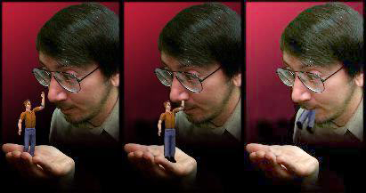

# Will Wright on Designing User Interfaces to Simulation Games (1996) (2023 Video Update)

*By Don Hopkins · ~29 min read · originally Apr 21, 2018; video update 2023.*
*Source: <https://donhopkins.medium.com/designing-user-interfaces-to-simulation-games-bd7a9d81e62d>*
*Full text capture from Medium. All 167 article images downloaded locally — see the illustrated, article-ordered gallery in [`images/INDEX.md`](images/INDEX.md) (files in `images/`, caption map in `images/map.tsv`). Embedded YouTube links collected in [`videos.md`](videos.md).*

---

A summary of Will Wright's talk to Terry Winograd's User Interface Class at Stanford, written in 1996 by Don Hopkins, before they worked together on The Sims at Maxis. Now including a video and snapshots of the original talk!

> 📸 **Illustrated version:** every figure from the article is mirrored locally, in order, in [`images/INDEX.md`](images/INDEX.md).

## Introduction

> You can pick your friends, and you can pick your nose, but you can't pick your friend's nose.

Will Wright, the designer of SimCity, SimEarth, SimAnt, and other popular games from Maxis, gave a talk at Terry Winograd's user interface class at Stanford, in 1996 (before the release of The Sims in 2000).

At the end of the talk, he demonstrated an early version of The Sims, called Dollhouse at the time. I attended the talk and took notes, which this article elaborates on. [More recent notes in bracketed italics.]

> Good news, everyone!

## 2023-01-27 Update: Stanford Video

Stanford University has published Terry Winograd's HCI Group CS547 Seminar video recording: **Will Wright, Maxis, "Interfacing to Microworlds", 1996-04-26**.

Video: <https://www.youtube.com/watch?v=nsxoZXaYJSk> · Archive: <https://searchworks.stanford.edu/view/yj113jt5999>

Video of Will Wright's talk about "Interfacing to Microworlds" presented to Terry Winograd's user interface class at Stanford University, April 26, 1996.

He demonstrates and gives postmortems for SimEarth, SimAnt, and SimCity 2000, then previews an extremely early pre-release prototype version of Dollhouse (which eventually became The Sims), describing how the AI models personalities and behavior, and is distributed throughout extensible plug-in programmable objects in the environment, and he thoughtfully answers many interesting questions from the audience.

Use and reproduction: The materials are open for research use and may be used freely for non-commercial purposes with an attribution. For commercial permission requests, please contact the Stanford University Archives (universityarchives@stanford.edu).

I was fascinated by Dollhouse, and subsequently went to work with Will Wright at Maxis (then EA) for three years. We finally released it as The Sims in 2000, after several name changes: TDS (Tactical Domestic Simulator), Project-X (everybody has one of those), Jefferson (after the president, not the sitcom), happy fun house (or some other forgettable Japanese whimsy).

At the talk, he reflected on the design of simulators and user interfaces in SimCity, SimEarth, and SimAnt. He demonstrated several of his games, including his current project, Dollhouse.

Here are some important points Will Wright made, at this and other talks. I've elaborated on some of his ideas with my own comments and links, based on my experience playing lots of SimCity, talking with Will, studying the source code and porting it to Unix, reworking the user interface, adding multi player support, and developing an open source constructionist educational version of SimCity.

## The Anatomy of a Simulation Game

There are several tightly coupled parts of a simulation game that must be designed closely together: the simulation model, the game play, the user interface, and the user's model.

In order for a game to be realizable, all of those different parts must be tractable. There are games that might have a great user interface, be fun to play, easy to understand, but involve processes that are currently impossible to simulate on a computer.

There are also games that are possible to simulate, fun to play, easy to understand, but that don't afford a useable interface: Will has designed a great game called "Sim Thunder Storm", but he hasn't been able to think of a user interface that would make any sense.

## On the User Model

The digital models running on a computer are only compilers for the mental models users construct in their heads.

The actual end product of SimCity is not the shallow model of the city running in the computer.

More importantly, it's the deeper model of the real world, and the intuitive understanding of complex dynamic systems, that people learn from playing it, in the context of everything else about a city that they already know.

In that sense, SimCity, SimEarth, and SimAnt are quite educational, since they implant useful models in their users minds.

## On the Simulation Model

### Reverse Over-Engineering

Many geeks have spent their time trying to reverse engineer the simulator by performing experiments to determine how it works, just for fun. This would be a great exercise for a programming class.

When I first started playing SimCity, I constructed elaborate fantasies about how it was implemented, which turned out to be quite inaccurate. But the exercise of coming up with elaborate fantasies about how to simulate a city was very educational, because it's a hard problem!

The actual simulation is much less idealistically general purpose that I would have thought, epitomizing the Nike "just do it" slogan. In SimCity classic, the representation of the city is low level and distilled down compactly enough that a small home computer can push it around.

The city is represented by tiles, indexed by numbers that are literally scattered throughout the code, which is hardly general purpose or modular, but runs fast. It sacrifices expandability and modularity for speed and size, just the right trade-off for the wonderful game that it is.

Some educators have asked Maxis to make SimCity expose more about the actual simulation itself, instead of hiding its inner workings from the user. They want to see how it works and what it depends on, so it is less of a game, and more educational.

But what's really going on inside is not as realistic as they would want to believe: because of its nature as a game, and the constraint that it must run on low end home computers, it tries to fool people into thinking it's doing more than it really is, by taking advantage of the knowledge and expectations people already have about how a city is supposed to work. **Implication is more efficient than simulation.**

People naturally attribute cause and effect relationships to events in SimCity that Will as the programmer knows are not actually related. Perhaps it is more educational for SimCity players to integrate what they already know to fill in the gaps, than letting them in on the secret of how simple and discrete it really is.

As an educational game, SimCity stimulates students to learn more about the real world, without revealing the internals of its artificial simulation. The implementation details of SimCity are quite interesting for a programmer or game designer to study, but not your average high school social studies class.

Educators who want to expose the internals of SimCity to students may not realize how brittle and shallow it really is. I don't mean that as criticism of Will, SimCity, or the educators who are seeking open, realistic, general purpose simulators for use in teaching.

### Snap! Build Your Own Blocks

[Snap! Community](https://snap.berkeley.edu/) — blocks-based programming language from UC Berkeley.

SimCity does what it was designed to and much more, but it's not that. Their goals are noble, but the software's not there yet. Once kids master SimCity, they could learn Logo, or some high level visual programming language like KidSim or Snap!, and write their own simulations and games!

Other people wanted to use SimCity for the less noble goal of teaching people what to think, instead of just teaching them to think.

Everyone notices the obvious built-in political bias, whatever that is. But everyone sees it from a different perspective, so nobody agrees what its real political agenda actually is. I don't think it's all that important, since SimCity's political agenda pales in comparison to the political agenda in the eye of the beholder.

Some muckety-muck architecture magazine was interviewing Will Wright about SimCity, and they asked him a question something like "which ontological urban paradigm most influenced your design of the simulator, the Exo-Hamiltonian Pattern Language Movement, or the Intra-Urban Deconstructionist Sub-Culture Hypothesis?" He replied, "**I just kind of optimized for game play.**"

Then there was the oil company who wanted "Sim Refinery", so you could use it to lay out oil tanker ports and petroleum storage and piping systems, because they thought that it would give their employees useful experience in toxic waste disaster management, in the same way SimCity gives kids useful experience in being the mayor of a city.

### SimRefinery was recovered by an Ars Technica reader and an anonymous chemical engineer, and analyzed by Phil Salvador

[SimRefinery recovered](https://obscuritory.com/sim-refinery/) — *The Obscuritory*

They didn't realize that the real lessons of SimCity are much more subtle than teaching people how to be good mayors. But the oil company hoped they could use it to teach any other lessons on their agenda just by plugging in a new set of graphics, a few rules, and a bunch of disasters.

And there was the X-Terminal vendor who wanted to adapt the simulator in SimCity into a game called "Sim MIS", that they would distribute for free to Managers of Information Systems, whose job it is to decide what hardware to buy!

The idea was that the poor overworked MIS would have fun playing this game in which they could build networks with PCs, X-Terminals, and servers (instead of roads with residential, commercial, and industrial buildings), that had disasters like "viruses" infecting the network of PC's, and "upgrades" forcing you to reinstall Windows on every PC, and business charts that would graphically highlight the high maintenance cost of PCs versus X-Terminals.

Their idea was to use a fun game to subtly influence people into buying their product, by making them lose if they didn't. Unlike the oil company, they certainly realized the potential to exploit the indirect ways in which a game like SimCity can influence the user's mind, but they had no grip on the concept of subtlety or game design.

## On the Gameplay

Usually the game is separate from the simulation. Games can be based on conflicts and goals, that are external to the simulation itself. The simulation goes on doing its thing, and the user can play different games with their own sets of goals.

The simulation does not consider fires spreading between buildings to be an error condition or a source of conflict — that's just the way the simulator's supposed to behave. But the user might, unless the game they're playing is pyromaniacal.

The design of the game play has a lot to do with the user's model of the system, and SimCity elegantly supports a number of different user models, games, and toys in one program.

You can use the terraforming tools and natural features to play with it like a sandbox or landscaping toy, without even starting the city simulation phase of the game.

You can even use it as a painting tool, drawing colorful designs and cartoons with land, water, roads and buildings.

SimCity comes with several scenarios with different conflicts and goals, and has a menu of disasters you can invoke to destroy your city, or challenge yourself to recover.

You can start your own city from scratch, and develop it in any direction you want.

A satisfying feature of SimCity 2000 is the ability to put signs in your city, to name roads and buildings and parts of town. How else could you personalize a simulated city?

There was some interesting discussion about using SimCity as a medium for story telling: encouraging people to imagine far beyond the bounds of what the computer is able to simulate.

You can build cities to empathize with, and tell stories about them, about their people, culture, buildings, and history.

A class of students could label different parts of a city, and each person could tell a story about a different part, that interacted with the stories going on in neighboring parts of the city.

Then they could make a web site with the downloadable city, and an image map of the whole city, linking to all the stories on web pages, with screen snapshots of their neighborhoods, and lots of hypertext links between each story.

This way each student could collaborate with several others to write a web of interconnected stories, all about the same city!

## On the User Interface

Will demonstrated the close up and overall views in SimEarth, and showed how SimCity 2000 integrated these with zooming in one window. He talked about information density and screen size.

## Post Morta

After designing SimCity Classic, then SimEarth, then SimAnt, then SimCity 2000, here's one way Will compares them: With SimCity Classic as the standard against which to measure, **SimEarth was too complex, SimAnt was too simple, and SimCity 2000 was just right.**

## SimEarth

SimEarth and SimAnt did not support the same level of creativity and personal imprinting that SimCity does.

With SimEarth, anything you do is quickly wiped out by continental drift, erosion, and evolution; you can walk away from it for a while, come back later, and it will have evolved life or shriveled up and died without you, looking pretty much the same as if you had slaved over it for hours.

It was too complex a simulation for people to grasp or effect in a satisfying way.

The time scale slows down as the game progresses, from geological time, to when life appears, to when intelligence appears, to when technology is developed. There was some trouble conveying this to the users.

One thing that supported the notion of time scale is how the view controls along the bottom of the global map were ordered in a temporal progression, in the order you'd need to use them, from the continental drift display, to the technology display.

## SimAnt

SimAnt had just the opposite problem — it was too simple, but that made it popular with younger kids.

Like SimEarth, it didn't support creative personal imprinting as well as SimCity, since one ant farm looks pretty much like any other, and ants are quite disposable and devoid of personality…

The educational point of SimAnt is to teach about the emergent behavior of multi-cellular organisms like ant colonies. I think SimAnt would make a fascinating large scale multi player game.

## SimCity Classic

Unfortunately I didn't type the notes from this part of the talk in, but it's been well covered elsewhere, which I will link to.

LGR has the most comprehensive and entertaining retrospective of SimCity:

[SimCity 30 Years Later: A Retrospective](https://www.youtube.com/watch?v=MaZ4L9Vsa64)

### SimCity Reverse Diagrams

Chaim Gingold's PhD dissertation on ["Play Design"](https://www.proquest.com/docview/1808087898) has some excellent in-depth analysis of SimCity as a cultural artifact, its code, algorithms and design, the story of open sourcing SimCity, his SimCity Reverse Diagrams, and many interesting quotes from interviews with Will Wright and other game designers.

It also includes a fascinating chapter about Doreen Nelson (who wrote the original SimCity Teacher's Guide) and her lifelong work on Design Based Learning (formerly City Building Education):

> "I did my Ph.D. research on play and the history of computing. My thesis argues that it is productive to consider playthings, playmates, playgrounds, and play practices as constituting a set with shared design characteristics.
>
> SimCity, a software plaything that confounds game-centric approaches (e.g. game studies and game design), is the keystone in an arch of case studies that takes us from some of the earliest examples of computer simulation all the way to model cities enacted with children, cardboard, and costumes, and unusual playgrounds made of junk."
>
> — Chaim Gingold

Gingold, Chaim. "Play Design." Ph.D. thesis, University of California Santa Cruz, 2016. Committee: Michael Mateas (advisor), Nancy Chen, Henry Lowood, Janet Murray, Noah Wardrip-Fruin.

[Play Design — ProQuest](https://www.proquest.com/docview/1808087898)

### Open Sourcing SimCity

Another topic that Chaim Gingold researched and wrote about in his "Play Design" PhD thesis was the story behind talking EA into relicensing the original source code to SimCity Classic under the GPL-v3 free software license, so the One Laptop Per Child could include it with the XO-1 Children's Computer as constructionist educational software.

[Open Sourcing SimCity, by Chaim Gingold](https://donhopkins.medium.com/open-sourcing-simcity-by-chaim-gingold-9e034e02a5f4)

### Micropolis: Constructionist Educational Open Source SimCity

Once the original SimCity source code was freely available (under the provision that if you made any modifications, you could not use the product name "SimCity"), by Will's suggestion I made a fork of it called "Micropolis", which was the original name before it was called SimCity. I collaborated with other open source programmers to refactor, clean up, and document the code, integrate it and make it scriptable with Python, implemented a Cairo rendering engine and GTK user interface using PyGTK, and a web based interface using Python, TurboGears, OpenLaszlo, Flash and AMF.

### HAR 2009 Lightning Talk Transcript and Video

[Micropolis: Constructionist Educational Open Source SimCity](https://donhopkins.medium.com/har-2009-lightning-talk-transcript-constructionist-educational-open-source-simcity-by-don-3a9e010bf305)

## SimCity 2000

I didn't type the notes from this part of the talk in, either. But SimCity 2000 was a timeless masterpiece — what else is there to say? The screen snapshots speak for themselves, and in the video Will demonstrates and explains its user interface, simulation, successes and failures:

When I typed up my notes in 1996, I skipped over SimCity stuff because I wanted to get to writing up the following unbelievable demo I had just witnessed, while it was still fresh in my mind.

## Dollhouse (aka Project X, Jefferson, Tactical Domestic Simulator, Total Dollhouse Simulation, Happy Fun House, and The Sims)

Will's talk started out with live demos of SimEarth, SimAnt, and SimCity 2000, for each he gave a postmortum describing the user interfaces, simulations, successes and failures.

Then there was an interactive question and answer peroid. Terry Winograd's students asked excellent questions that Will answered in detailed.

Finally one of the students asked the $5 billion question, to which Will was taken aback and amused by the directness, answered "Oh, God…" then said he would back up and give "more of an answer than you were looking for" by showing Dollhouse:

> Student: What projects are you working on now, and if you'd rather not talk about that, what projects or models had you considered before that were kind of interesting that you didn't do?
> Will Wright: You mean like what systems have I considered modeling?
> Student: Right.
> Will Wright: Oh, God...
> Student: And also what systems are you currently working on, if you if you can talk about them?
> Will Wright: Okay, well one thing we're working on, is a — we've been kind of interested in our company for a long time about the idea of data portability.
Really, let me back up just a little bit here, and this might be a little bit more of an answer than you were looking for, but…

Most of the game industry right now is built on kind of the movie model.

So you spend a lot of money developing one big title, you come out with it, you advertise it, either it goes or it dies, and then you do the next one separate.

Except for sequels.

There's the one consistent genre that does better than any other genre in the game industry, it's sequels.

Now what we've tried to do, and we're kind of working on slowly over time, is to build our games more as a hobby model.

Where people buy and collect things, but they relate to the last things they collected.

It's like a train set.

You build this train set, and some people get into the building the hills, and the cliffs, and the mountains, and the trees, really detailed.

They could care less about the train.

Other people get into the village, or the track switching, and the scheduling.

Everybody can kind of come into that, take their particular slant on it, their interest, and focus in that area in great detail.

I'd like to see the game industry kind of evolve that way, and part of that is I want the games to actually be able to have persistent data that can move from one game to another, or have a large data set that I can reuse in different ways.

Let me show you something real quick here which is kind of along those lines.

Imagine zooming into SimCity 2000, all the way down to the street level, and seeing little people walking around, waving at each other, asking for spare change, jumping up and down, gesturing, interacting with each other, living and playing in rooms with furniture and active objects, and you're one of them!

A couple of years before seeing this demo [1994], Will dropped by my office at Kaleida Labs, plugged his hard drive into my Mac, and gave me a demo of an early version of Dollhouse that I couldn't believe was remotely possible on the regular old computer I used every day.

It was amazing then in 1994, and even more so now [1996 at the time of this demo] what he was demonstrating to Terry Winograd's user interface class at Stanford, in response to one of his student's question about what he was working on.

What I was about to see in 1996 had evolved a long way in two years, and many of the important parts were in place, but had no idea how much further it would go, or that Will would soon get the go-ahead to make it into a product, and invite me to work on it.

I've added screen snapshots from the talk, as well as later versions of The Sims, and slides from Will's more recent talks, to illustrate what he was talking about.

This is just a kind of a little — this is one of the things I'm working on, by the way.

But it'll give you some sense of what I'm talking about.

This is a game I call Dollhouse.

And if this looks familiar, it's because I've just loaded a SimCity file into here.

Okay, so what we're seeing is a SimCity file, but now at this point I can actually zoom down to the street level.

This, zoom in here, this little area right there by the street is what I'm zooming into.

I can keep zooming in,

and now I can get a little person.

This is me.

I'm actually controlling this person like a puppet.

I can wave, and walk around, and do things.

I can actually walk anywhere in the city here.

We don't have a full database in this, but I have a database for all the roads and the terrain.

It's very feasible for us to put a database in for every building in SimCity, so that I could actually walk anywhere in the city I've created, and into any building.

So the tools in this game are more architectural tools.

So I can, let's see, real quickly I'll build a foundation here.

Oops, yeah there we go.

This is a wall tool, I have different wall styles.

So what we're trying to do here is we're designing kind of like a little CAD program that a 10 year old could use, for instance.

So very simple tools, kind of like you would build a little dollhouse.

So I'll just make a really quick little, quick and dirty architecture here.

We also have landscaping tools, so part of this game is planting my yard.

We've played around with some L-systems for generating the plants in real time, which is a little too slow actually.

So these are windows.

I can zoom into the house.

So this right now is not much of a defined game, but this is almost more of what I would consider a hobby.

I could take a city that I built in SimCity and now I can come live in it.

I can actually stake a claim, I can build my house, and I can decorate it, and invite my friends over.

We're looking at actually having like a little family model inside of here.

So that there will be little personality models for these guys.

There's behavior embedded in some of these objects.

So for instance I click on an object.

(Sim sits down on toilet — more laughter!)

Now what's interesting here is that that person, in the person's data structure, **there's no knowledge of any objects in this environment whatsoever. The object itself contains the descriptions of how a person interacts with it**, and why, what the animation sequence would be, and the scheduling.

### Sims developer Jamie Doornbos explains how The Sims visual programming language "SimAntics" works at GDC 2001

[Those Darned Sims: What Makes Them Tick?](https://www.gdcvault.com/play/1014624/Those-Darned-Sims-What-Makes) — Jamie Doornbos, GDC 2001

So this is my person, this is my little avatar.

I can also add, pop in some simulated people that'll walk around and do things right now.

They they're kind of ghosts, because they don't know about the walls.

They'll walk around, they'll have conversations, some of them will panhandle each other.

Well what's cool is that the behavior is entirely distributed in the environment.

So a person's in a room, they have certain motivations, needs, they might be hungry, sleepy, lonely, angry.

They scan the room for people and objects, and the objects are all kind of advertising: **"If you're angry, pick up me and throw me!", "If you're hungry, eat me!"**.

And there's a communication there.

It's all data driven.

And even the animations.

So the animation of these people is done through this kind of component driven geometry.

So they don't have to know how to ride a bike, or sit on the toilet.

The object tells them how to, when they come up and say, "okay, you're gonna make me less hungry, I'm gonna interact with you, what do I do?".

The object tells it what to do.

The cool thing about this is that we can drop new objects in later.

Maybe it's network based, or maybe it's something else.

We can even have tools where the users build these objects.

Maybe one person is totally into designing furniture, or designing exercise equipment, I don't know what, exercise videos.

But if we had a tool to where the user could build these things, they could then post them on the net, and other people could download them, and then the environment gets more rich.

### SimShow, IFFPencil2, FreeTheSims, Transmogrifier, and RugOMatic

A few of many tools that enable users to create their own content in The Sims:

<https://www.youtube.com/watch?v=Nzz0cFSmgiM>
<https://www.youtube.com/watch?v=Ohdm8T7X-zs>
<https://www.youtube.com/watch?v=Imu1v3GecB8>

### SimFreaks, SimSlice, and SimBabes are some of the many extremely talented Sims fans who created their own beautiful Sims content using these and other tools

<http://www.simfreaks.com/>
<http://simslice.com/>
<http://www.simfreaks.com/simbabes/index.php>

[SimFreaks.com](http://www.simfreaks.com/)

[Simslice](http://simslice.com/)

[ZombieSim](https://zombiesims.com/)

And so to me, this is what I want to move towards.

More of the hobbyist kind of a thing, distributed environment, with objects that can move from one game to another.

So this might be one game I'm playing here.

This is actually a very similar data structure to Doom.

I could be in here in a 3D point of view, shooting the person on the toilet if I wanted to.

Maybe it's a different game player in a different game, but still running off the same server.

So in a way you can think of this as a graphic MUD or something like that.

### Don Hopkins' Notes from the 1996 Talk

It's not a product yet [but now it is], but he's been working on solving some very hard problems. He's trying to give the people who walk around the world seemingly rational behavior. [While The Sims Online gave the people who walk around the world totally irrational behavior because they were real people!]

Dollhouse takes the third person view (looking down on your character from above), instead of the first person view (looking out of the eyes of your characters).

You view your character from above, with a 45 degree orthographic view like SimCity 2000 uses to display buildings.

Will has found that it works quite well, since you can see yourself as others see you, as well as seeing other people around you.

If there are a bunch of people gathering around some interesting person or place, it's easy to tell what's going on, and navigation is simple and direct.

It doesn't suffer from the disorienting navigational problems that a first-person view like Doom imposes.

Being able to see yourself as others see you seems to make interpersonal interactions involving body gestures much easier.

## Epilogue

Since I originally wrote this in 1996, Maxis released Dollhouse as The Sims in 2000, and it quickly became much more popular than anyone expected. But in the context in which this was written in 1996, Dollhouse was so drastically different than the first-person-shooters that dominated the market, that it wasn't obvious it would ever be successful.

It questioned and reformulated many of the widely-held assumptions about virtual reality games: the audience (all ages, genders, and persuasions), the person and perspective (overhead god view instead of first person), direct navigation control (per-character routing and action queues instead of first person forward/back/turn), mapping of players to characters (player switches between many characters instead of one-to-one), the overall approach to AI (subject oriented, object centric, extensible plug-ins, interacting with autonomous agents), programming tools (SimAntics visual programming language, instead of text script), and the style and motivation of game play (creative sandbox and social dynamics).

## Afterword

After we finally decided to it name "The Sims", but a year and a half before we finally released it on March 2000, we produced a private internal EA demo version for "The Sims Steering Committee" on June 4, 1998.

It was well received by the executives and decision makers at EA (i.e. their kids), so we were given the go-ahead to finish and ship The Sims. You can see how far it came in two years from the version Will demonstrated in April 1996, but also how far it had to go.

### The Sims Steering Committee — June 4 1998

---

*Tags: Design · SimCity · The Sims · User Interface · Simulation.*

*Author: Don Hopkins — "User interface flower child. Pie menus, PizzaTool, SimCity, The Sims, Visual Programming, VR, AR, Unity3D / JavaScript bridge."*
