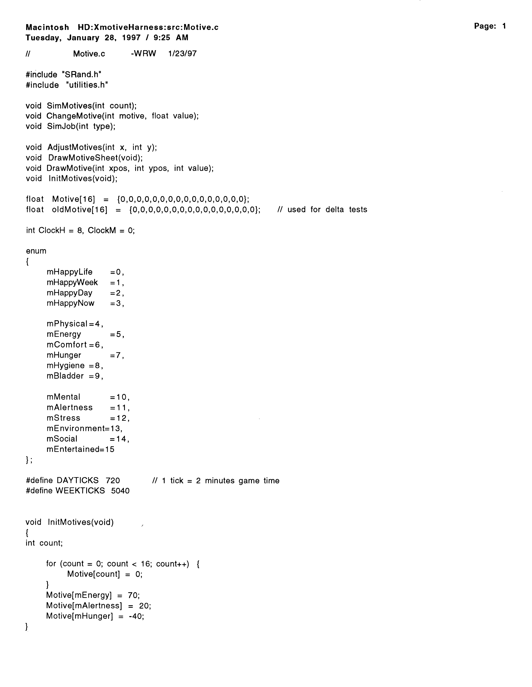
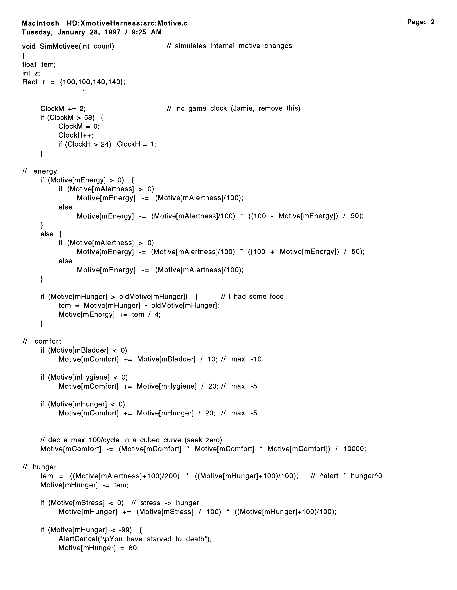
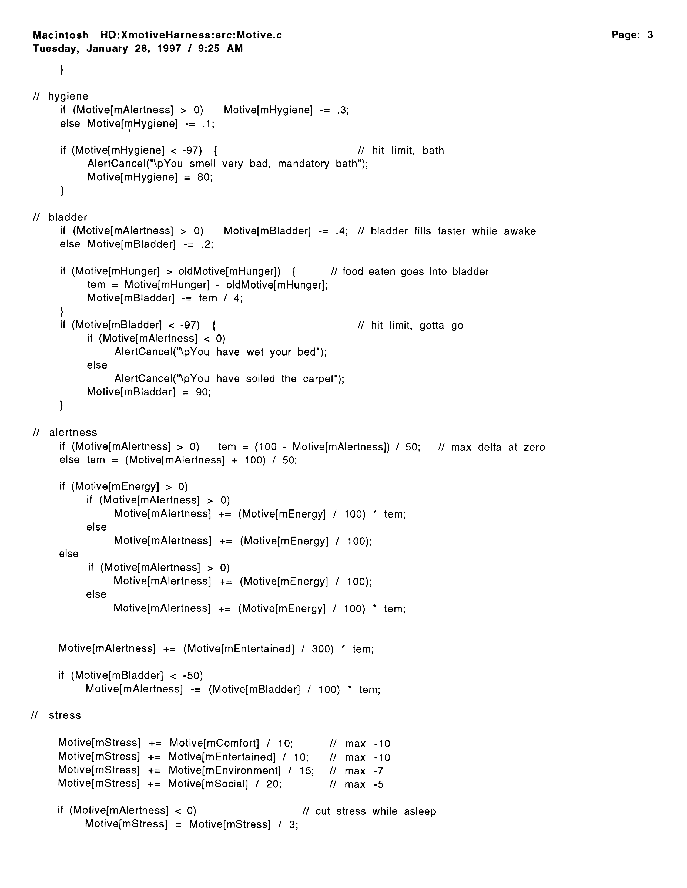
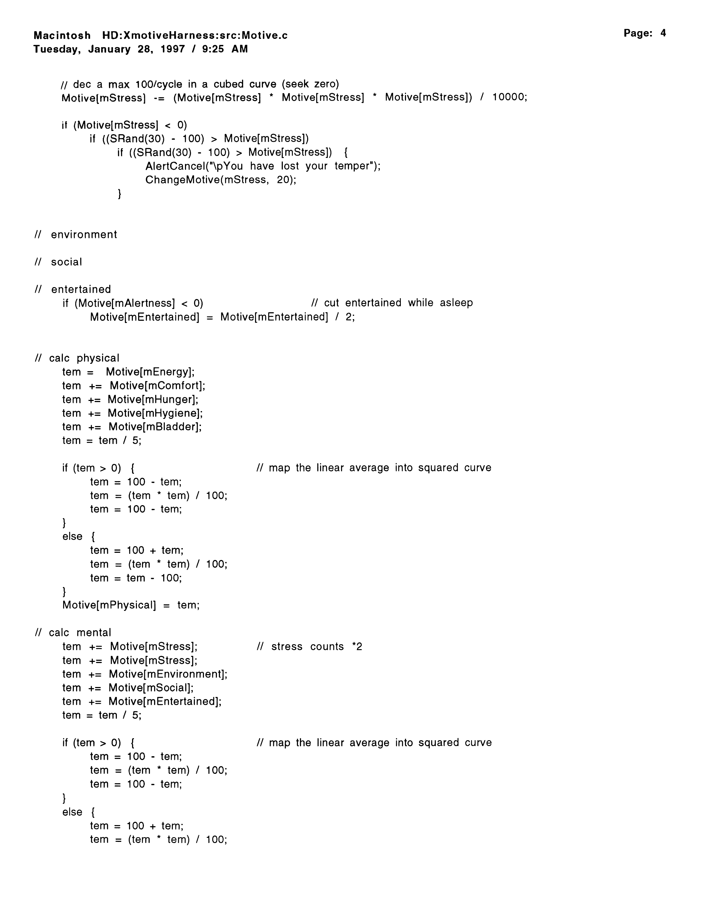
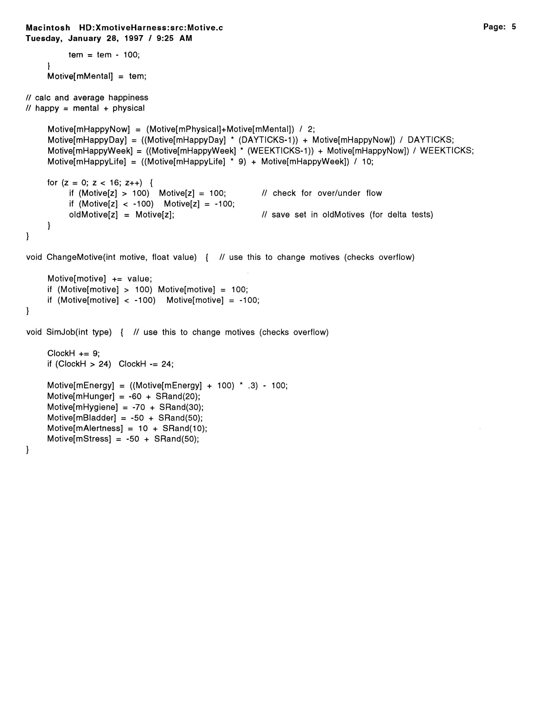

# The Soul of The Sims, by Will Wright

*Submitted by Don Hopkins · Sun, 2008-02-10 21:25*
*Tags: The Sims · C · Game Design · Downloadable Software*

*Republished in [WillWrightShowForFood](https://github.com/SimHacker/WillWrightShowForFood). Scans from [donhopkins.com/home/images/Sims/](https://www.donhopkins.com/home/images/Sims/).*

---

**The Soul of The Sims, by Will Wright**  
`Macintosh HD:XmotiveHarness:src/Motive.c`  
Tuesday, January 28, 1997 / 9:25 AM

This is the prototype for the soul of The Sims, which Will Wright wrote on January 23, 1997.

I had just started working at the Maxis Core Technology Group on "Project X" aka "Dollhouse", and Will Wright brought this code in one morning, to demonstrate his design for the motives, feedback loop and failure conditions of the simulated people. While going through old papers, I ran across this print-out that I had saved, so I scanned it and cleaned the images up, and got permission from Will to publish it.

This code is a interesting example of game design, programming and prototyping techniques. The Sims code has certainly changed a lot since Will wrote this original prototype code. For example, there is no longer any "stress" motive. And the game doesn't store motives in global variables, of course.

My hope is that this code will give you a glimpse of how Will Wright designs games, and what was going on in his head at the time!

— [Don Hopkins](https://www.donhopkins.com)

## Motive.c — transcribed source

Searchable transcription: [`Motive.c`](Motive.c) (OCR from scans, 2026-06-29). Compile check:

```bash
gcc -DMOTIVE_STANDALONE -std=c89 -o motive Motive.c && ./motive
```

## Motive.c — scanned pages











## Also published at

- **Primary (HTML + images):** https://www.donhopkins.com/home/images/Sims/
- **Drupal blog post:** http://www.donhopkins.com/drupal/node/79 (links to the page above)
- **Medium:** https://medium.com/@donhopkins/the-soul-of-the-sims-by-will-wright-8afdc225c936
- **Rock Paper Shotgun:** https://www.rockpapershotgun.com/2008/02/20/the-soul-of-the-sims/

## Related

- [1996 Winograd talk](../1996-04-26-winograd-interfacing-to-microworlds/medium-article.md) — Dollhouse preview, distributed AI
- [Jamie Doornbos show](../../../../characters/jamie-doornbos/) — SimAntics / motive system in shipping Sims
